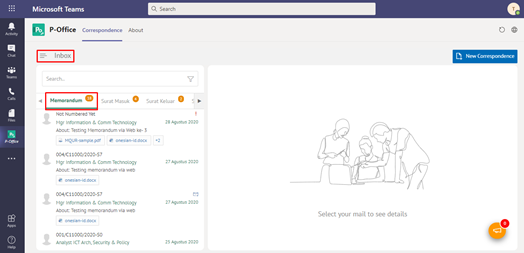
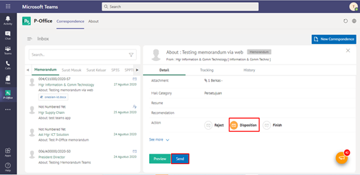
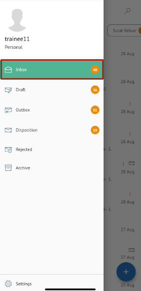

**Role yang sesuai**

- *Approver User*
- *Reviewer User*

*User* menerima memorandum yang sudah dikirimkan pejabat internal Pertamina pada menu **"Inbox - Memorandum"**. Memorandum dapat didisposisikan kepada pejabat yang dipilih atau pejabat yang ada dibawahnya. Disposisi memorandum dapat dilakukan dengan dua cara yaitu melalui menu **Inbox** jika memorandum yang diterima merupakan memorandum yang ditujukan kepada tujuan pejabat internal Pertamina dan telah disetujui atau ditanda tangani oleh pejabat pengirim atau melalui menu **Disposisi** jika memorandum sudah dilakukan tindak lanjut oleh pejabat pemilik KBO dan pemilik KBO akan mendisposisikan ke pejabat selanjutnya atau pejabat yang ada dibawahnya. 

## **P-Office Versi Web**

Langkah-langkah untuk mendisposisikan memorandum via Web adalah sebagai berikut

#### Disposisi melalui Menu Inbox

1. Klik menu **Inbox** dan pilih tab **Memorandum**

2. Pilih memorandum yang akan didisposisikan kemudian pilih tab **Detail**

3. Klik tombol **Disposition** dan pilih **Send**

4. Sistem menampilkan form disposisi. Isikan informasi disposisi dan perintah untuk masing-masing penerima disposisi.

5. Klik **Save** untuk menyimpan draft disposisi memorandum dan memorandum akan tersimpan di menu **"Draft - Memorandum"**. Klik **Send** untuk mengirim disposisi ketujuan dan disposisi memorandum akan tersimpan di menu **"Outbox - Disposisi"**.

####	Disposisi melalui Menu Inbox

1. Klik menu **Disposition** dan pilih tab **Memorandum**

2. Pilih memorandum yang akan didisposisikan kemudian pilih tab **Detail**

3. Klik tombol **Disposition** dan pilih **Send**

4. Sistem menampilkan form disposisi. Isikan informasi disposisi dan perintah untuk masing-masing penerima disposisi.

5. Klik **Simpan** untuk menyimpan draft disposisi memorandum dan memorandum akan tersimpan di menu **"Draft - Memorandum"**. Klik **Send** untuk mengirim disposisi ketujuan dan disposisi memorandum akan tersimpan di menu **"Outbox - Disposisi"**.

## **P-Office Versi Teams**

Langkah-langkah untuk mendisposisi Memorandum via Teams adalah sebagai berikut :

####	**Disposisi melalui Menu Inbox**

1. Klik menu **Inbox** dan pilih tab **Memorandum**

2. Pilih memorandum yang akan didisposisikan kemudian pilih tab **Detail**

3. Klik tombol **Disposition** dan pilih **Send**

4. Sistem menampilkan form disposisi. Isikan informasi disposisi dan perintah untuk masing-masing penerima disposisi.

5. Klik **Save** untuk menyimpan draft disposisi memorandum dan memorandum akan tersimpan di menu **"Draft - Memorandum"**. Klik **Send** untuk mengirim disposisi ketujuan dan disposisi memorandum akan tersimpan di menu **"Outbox - Disposisi"**.

####	**Disposisi melalui Menu Inbox**

1. Klik menu **Disposition** dan pilih tab **Memorandum**

2. Pilih memorandum yang akan didisposisikan kemudian pilih tab **Detail**

3. Klik tombol **Disposition** dan pilih **Send**

4. Sistem menampilkan form disposisi. Isikan informasi disposisi dan perintah untuk masing-masing penerima disposisi.

5. Klik **Save** untuk menyimpan draft disposisi memorandum dan memorandum akan tersimpan di menu **"Draft - Memorandum"**. Klik **Send** untuk mengirim disposisi ketujuan dan disposisi memorandum akan tersimpan di menu **"Outbox - Disposisi"**.

## **P-Office Versi Android**

Langkah-langkah untuk mendisposisikan Memorandum adalah sebagai berikut :

**Disposisi melalui Menu Inbox**

1. Klik menu **Inbox** dan pilih tab **Memorandum**

 

2. Pilih memorandum yang akan didisposisikan kemudian pilih ikon **tombol button**

 

3. Klik tombol **Disposisi** kemudian sistem akan menampilkan form disposisi. Isikan informasi disposisi dan perintah untuk masing-masing penerima disposisi.

 

4. Klik **Simpan** untuk menyimpan draft disposisi memorandum dan memorandum akan tersimpan di menu “**Draft – Memorandum**”. Klik **Send** untuk mengirim disposisi ketujuan dan disposisi memorandum akan tersimpan di menu “**Outbox – Disposisi**”.

## **P-Office Versi IOS**

**Mendisposisikan Memorandum**

Langkah-langkah untuk mendisposisikan memorandum adalah sebagai berikut:

**Disposisi melalui Menu Inbox**

1.	Klik menu **Inbox **dan pilih tab **Memorandum**

2.	Pilih memorandum yang akan didisposisikan kemudian pilih icon **Option **dan pilih **Disposition**

3.	Sistem menampilkan form disposisi. Isikan informasi disposisi dan perintah untuk masing-masing penerima disposisi

4.	Klik **Save** untuk menyimpan draft disposisi memorandum dan memorandum akan tersimpan di menu “**Draft – Memorandum**”. Klik **Send** untuk mengirim disposisi ketujuan dan disposisi memorandum akan tersimpan di menu “**Outbox – Disposisi**”

**Disposisi melalui Menu Disposisi**

1.	Klik menu **Disposisi **dan pilih tab **Memorandum**

2.	Pilih memorandum yang akan didisposisikan kemudian pilih tab **Option **dan pilih **Disposition**

3.	Sistem menampilkan form disposisi. Isikan informasi disposisi dan perintah untuk masing-masing penerima disposisi

4.	Klik **Save** untuk menyimpan draft disposisi memorandum dan memorandum akan tersimpan di menu “**Draft – Memorandum**”. Klik **Send** untuk mengirim disposisi ketujuan dan disposisi memorandum akan tersimpan di menu “**Outbox – Disposisi**”.

## **P-Office Versi IOS**

Langkah-langkah untuk mendisposisikan Memorandum via IOS adalah sebagai berikut :

#### **Disposisi melalui Menu Inbox**

1.	Klik menu **Inbox** dan pilih tab **Memorandum**

 

2.	Pilih memorandum yang akan didisposisikan kemudian pilih icon **Option** dan pilih **Disposition**

 

3.	Sistem menampilkan form disposisi. Isikan informasi disposisi dan perintah untuk masing-masing penerima disposisi

 
4.	Klik Save untuk menyimpan draft disposisi memorandum dan memorandum akan tersimpan di menu **“Draft – Memorandum”.** Klik **Send** untuk mengirim disposisi ketujuan dan disposisi memorandum akan tersimpan di menu **“Outbox – Disposisi”.**

##### **Disposisi melalui Menu Disposisi**

1.	Klik menu **Disposisi** dan pilih tab **Memorandum**

 

2.	Pilih memorandum yang akan didisposisikan kemudian pilih tab **Option** dan pilih **Disposition**

 

3.	Sistem menampilkan form disposisi. Isikan informasi disposisi dan perintah untuk masing-masing penerima disposisi

 

4.	Klik Save untuk menyimpan draft disposisi memorandum dan memorandum akan tersimpan di menu **“Draft – Memorandum”.** Klik **Send** untuk mengirim disposisi ketujuan dan disposisi memorandum akan tersimpan di menu **“Outbox – Disposisi”.**