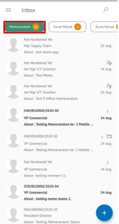
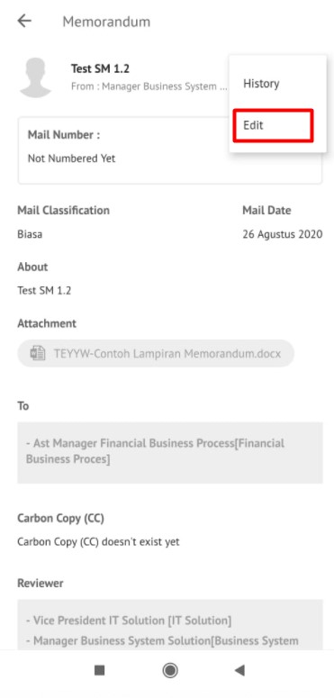
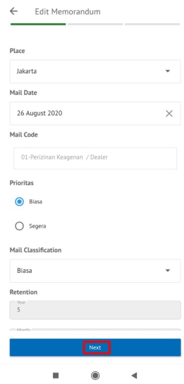
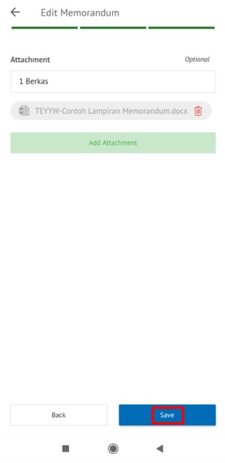
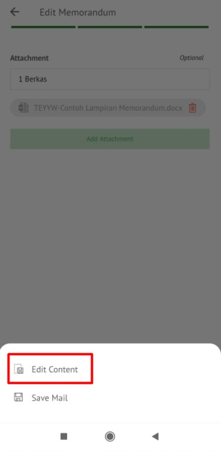
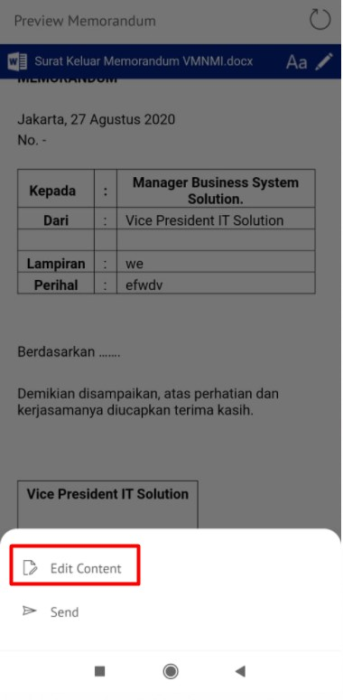
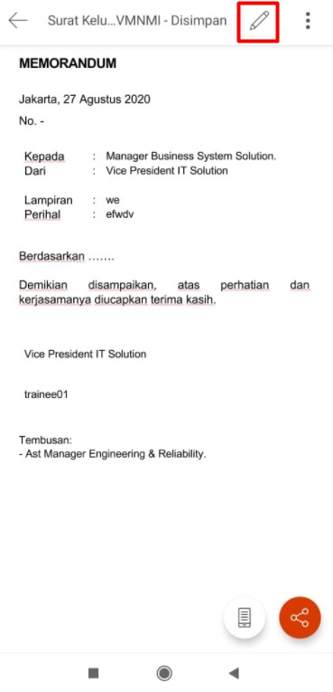
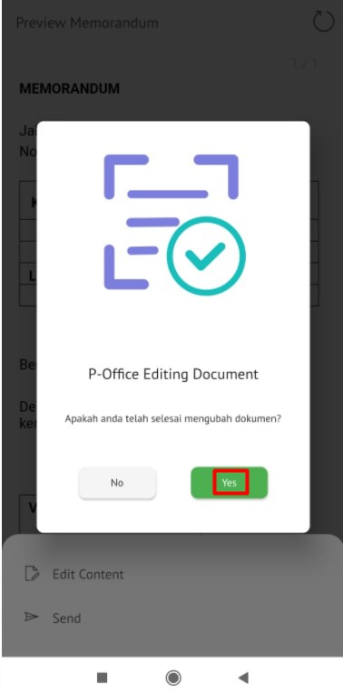
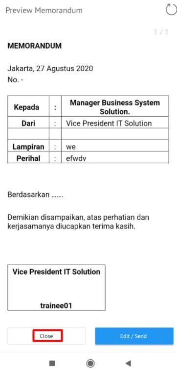

**Role yang sesuai**

- *Member User* (Pekerja)

*Member User* dapat melakukan *drafting* memorandum pada aplikasi P-Office. *Drafting* memorandum dilakukan jika *user* akan meneruskan dan melakukan perubahan pada memorandum yang sudah disimpan pada menu **Draft**. Langkah - langkah untuk melakukan *drafting* memorandum adalah sebagai berikut

1. Klik menu **Draft** dan pilih tab **Memorandum**

2. Pilih memorandum yang akan diubah. Pilih tab **Detail** kemudian klik **Edit**

3. Sistem akan menampilkan *form* **Edit Correspondence**

4. Lakukan perubahan pada *form*. Klik **Simpan** untuk menyimpan perubahan pada *form* memorandum. Surat yang disimpan akan tersimpan di menu **"Draft - Memorandum"**

5. Klik Ubah Isi untuk mengubah isi memorandum

6. Sistem menampilkan tampilan *preview* memorandum dalam bentuk Word yang dapat di edit. Untuk melakukan *editing* terhadap isi surat klik **Ubah Isi** kemudian sistem akan menampilkan *pop up* konfirmasi **Ubah Word Desktop** atau **Ubah Online**

##### [Edit] Word Desktop

Langkah - langkah untuk mengubah isi memorandum melalui Word Desktop adalah sebagai berikut

1. Klik **Ubah di Word** untuk mengubah melalui aplikasi Microsoft Word

2. Lakukan perubahan pada isi surat. Klik **Close** pada aplikasi dan isi surat akan otomatis tersimpan

##### [Edit] Ubah Online

Langkah - langkah untuk mengubah isi memorandum secara online adalah sebagai berikut

1. Klik **Ubah Online** untuk mengubah isi surat secara online

2. Lakukan perubahan pada isi surat. Klik **Close** pada aplikasi

3. Isi surat akan otomatis tersimpan. Jika surat akan disimpan sebagai draft, maka klik **Tutup**

4. Surat yang sudah selesai diubah maka akan tersimpan di menu **"Draft - Memorandum"**

#### Kirim Memorandum

Langkah - langkah untuk mengirim memorandum adalah sebagai berikut

1. Pada tampilan *preview* memorandum, klik **Kirim** untuk mengirim surat ke pejabat tujuan

2. Sistem menyimpan perubahan dan memorandum akan tersimpan di menu **"Outbox - Memorandum"**

## **P-Office Versi Android**

Langkah-langkah untuk Drafting Memorandum adalah sebagai berikut :

1. Klik menu **Draft** dan pilih tab **Memorandum**

 

2. Pilih memorandum yang akan diubah. Pilih ikon **tombol button** kemudian klik **Edit**

 

3. Lakukan perubahan pada _form _lalu klik **Next** sampai **Save** kemudian pilih **Save Mail** untuk menyimpan perubahan pada _form_ memorandum. Surat yang disimpan akan tersimpan di menu “**Draft – Memorandum”**

 

3. Klik **Edit Content** untuk mengubah isi memorandum
   

4. Sistem menampilkan tampilan _preview_ memorandum dalam bentuk Word yang dapat di edit. Untuk melakukan _editing_ terhadap isi surat klik **Edit/Send** kemudian sistem akan menampilkan _pop up_ konfirmasi **Word Online**

**[Edit] Ubah Online**

Langkah – langkah untuk mengubah isi memorandum secara _online_ adalah sebagai berikut.

1. 	Klik **Edit Content** untuk mengubah isi surat secara _online_

2. Lakukan perubahan pada isi surat.sistem akan menampilkan pop up P-Office Editing Document pilih **Yes**

 

1. Isi surat akan otomatis tersimpan. Jika surat akan disimpan sebagai draft, maka klik **Close**.

4. Surat yang sudah selesai diubah maka akan tersimpan di menu “**Draft – Memorandum”**

**Kirim Memorandum**

Langkah – langkah untuk mengirim memorandum adalah sebagai berikut.

1. Pada tampilan _preview_ memorandum, klik **Kirim** untuk mengirim surat ke pejabat tujuan

2. Sistem menyimpan perubahan dan memorandum akan tersimpan di menu “**Outbox - Memorandum**”