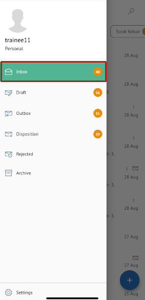

**Role yang sesuai**

- *Approver User*
- *Reviewer User*
- *Member User* (Pekerja)
- Sekretaris

*User* dapat melihat informasi lengkap disposisi memorandum pada detail disposisi

## **P-Office Versi Web**

langkah untuk melihat informasi disposisi memorandum via Web adalah sebagai berikut

1. Klik menu **Disposition** dan pilih tab **Memorandum**. Pilih salah satu disposisi memorandum yang akan dilihat informasinya

#### **Preview Memorandum**

Pada tab **Preview Surat**, ditampilkan preview memorandum yang sudah dibuat. Preview memorandum disesuaikan dengan template berdasarkan jenis surat

#### **Preview Lembar Penerus**

Pada tab Preview Lembar Penerus, ditampilkan informasi lembar penerus disposisi yang berisi informasi daftar nama pejabat dan perintah disposisi yang harus dilakukan oleh pejabat penerima disposisi

#### **Detail Memorandum**

Pada tab Detail, terdapat informasi asal surat, perihal, file lampiran, nomor surat, klasifikasi surat, tanggal surat dan tujuan surat serta informasi disposisi yang mencakup lampiran disposisi, tujuan, tindak lanjut dan disposisi permasing - masing pejabat penerima disposisi

#### **Tracking Memorandum**

Pada tab **Tracking**, ditampilkan informasi *tracking* memorandum dalam bentuk *chart*

#### **History Memorandum**

Pada tab **History**, ditampilkan riwayat memorandum yang terdapat informasi jabatan, tanggal, tindakan dan komentar

## **P-Office Versi Teams**

Langkah-langkah untuk melihat informasi disposisi memorandum via Teams adalah sebagai berikut :

1. Klik menu **Disposisi** dan pilih tab **Memorandum**. Pilih salah satu disposisi memorandum yang akan dilihat informasinya

#### **Preview Memorandum**

Pada tab **Mail**, ditampilkan preview memorandum yang sudah dibuat. Preview memorandum disesuaikan dengan template berdasarkan jenis surat

#### **Preview Lembar Penerus**

Pada tab **Preview** ditampilkan informasi lembar penerus disposisi yang berisi informasi daftar nama pejabat dan perintah disposisi yang harus dilakukan oleh pejabat penerima disposisi

#### **Detail Memorandum**

Pada tab Detail, terdapat informasi asal surat, perihal, file lampiran, nomor surat, klasifikasi surat, tanggal surat dan tujuan surat serta informasi disposisi yang mencakup lampiran disposisi, tujuan, tindak lanjut dan disposisi permasing - masing pejabat penerima disposisi

#### Memorandum

Pada tab **Tracking**, ditampilkan informasi *tracking* memorandum dalam bentuk *chart*

#### History Memorandum

Pada tab **History**, ditampilkan riwayat memorandum yang terdapat informasi jabatan, tanggal, tindakan dan komentar

## **P-Office Versi Android**

Langkah-langkah untuk melihat informasi disposisi memorandum via Android adalah sebagai berikut :

1. Klik menu **Disposisi** dan pilih tab **Memorandum**. Pilih salah satu disposisi memorandum yang akan dilihat informasinya

 

### **Detail Memorandum**

Pada tab Detail, terdapat informasi asal surat, perihal, file lampiran, nomor surat, klasifikasi surat, tanggal surat dan tujuan surat serta informasi disposisi yang mencakup lampiran disposisi, tujuan, tindak lanjut dan disposisi permasing-masing pejabat penerima disposisi

#### **Preview Memorandum**

Pada tab **Preview**, ditampilkan preview memorandum yang sudah dibuat. Preview memorandum disesuaikan dengan template berdasarkan jenis surat

#### **Preview Lembar Penerus**

Pada tab **Preview,** ditampilkan informasi lembar penerus disposisi yang berisi informasi daftar nama pejabat dan perintah disposisi yang harus dilakukan oleh pejabat penerima disposisi

 

#### **History Memorandum**

Pada tab **History**, ditampilkan riwayat memorandum yang terdapat informasi jabatan, tanggal, tindakan dan komentar

 

## **P-Office Versi IOS**

Langkah-langkah untuk melihat informasi disposisi memorandum via IOS adalah sebagai berikut :

1. 	Klik menu **Disposisi** dan pilih tab **Memorandum.** Pilih salah satu disposisi memorandum yang akan dilihat informasinya

 

##### **Preview Memorandum**

Pada tab **Surat**, ditampilkan preview memorandum yang sudah dibuat. Preview memorandum disesuaikan dengan template berdasarkan jenis surat

##### **Preview Lembar Penerus**

Pada tab **Preview** ditampilkan informasi lembar penerus disposisi yang berisi informasi daftar nama pejabat dan perintah disposisi yang harus dilakukan oleh pejabat penerima disposisi

 

##### **Detail Memorandum**

Pada tab **Detail**, terdapat informasi asal surat, perihal, file lampiran, nomor surat, klasifikasi surat, tanggal surat dan tujuan surat serta informasi disposisi yang mencakup lampiran disposisi, tujuan, tindak lanjut dan disposisi permasing-masing pejabat penerima disposisi

##### **History Memorandum**

Pada tab **History**, ditampilkan riwayat memorandum yang terdapat informasi jabatan, tanggal, tindakan dan komentar

 