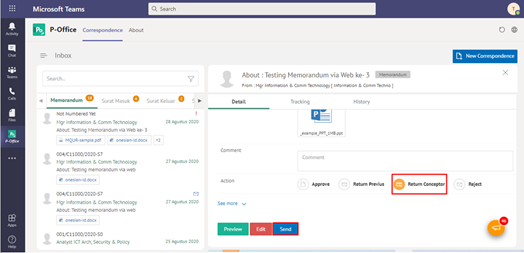
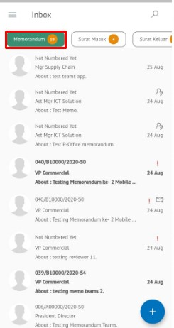
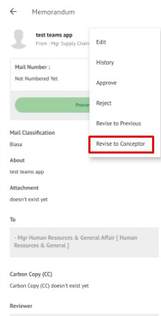
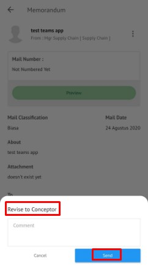
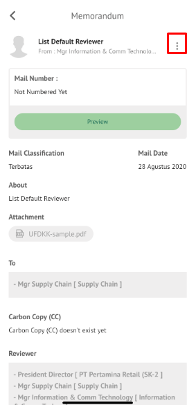
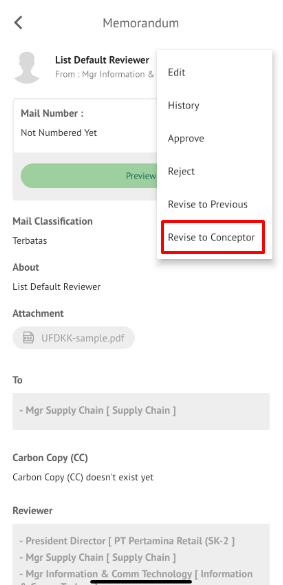
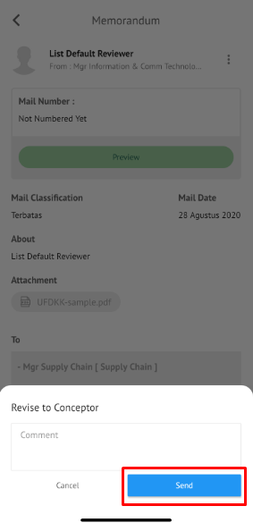

**Role yang sesuai**

- *Approver User*
- *Reviewer User*

*User* dapat mengembalikan memorandum ke konseptor jika hasil review belum/tidak sesuai. Langkah - langkah untuk mengembalikan memorandum ke konseptor adalah sebagai berikut

1. Klik menu **Inbox** dan pilih tab **Memorandum**

2. Pilih memorandum yang akan ditindak lanjuti kemudian pilih tab **Detail**

3. Klik tombol **Kembalikan ke Konseptor** dan pilih **Send**. Isikan komentar jika diperlukan

4. Sistem berhasil menyimpan perubahan. Memorandum yang sudah di kirim akan tersimpan di menu **Outbox- Memorandum** dan konseptor akan menerima memorandum di menu **Rejected - Memorandum**

## **P-Office Versi Teams**

Langkah-langkah untuk mengembalikan Memorandum ke konseptor via Teams adalah sebagai berikut :

1. Klik menu **Inbox** dan pilih tab **Memorandum**

2. Pilih memorandum yang akan ditindak lanjuti kemudian pilih tab **Detail**

3. Klik tombol **Return Conceptor** dan pilih **Send**. Isikan komentar jika diperlukan

4. Sistem berhasil menyimpan perubahan. Memorandum yang sudah di kirim akan tersimpan di menu **Outbox - Memorandum** dan penerima pengembalian memorandum akan menerima memorandum di menu **Rejected - Memorandum**

## **P-Office Versi Android**

Langkah-langkah untuk mengembalikan Memorandum ke konseptor adalah sebagai berikut :

1. Klik menu **Inbox** dan pilih tab **Memorandum**

 

2. Pilih memorandum yang akan ditindak lanjuti kemudian pilih ikon **tombol button**

 

3. Klik tombol **Revise to Conceptor** dan pilih **Send** Isikan komentar jika diperlukan

 

4. Sistem berhasil menyimpan perubahan. Memorandum yang sudah di kirim akan tersimpan di menu **Outbox- Memorandum** dan konseptor akan menerima memorandum di menu **Rejected – Memorandum**

## **P-Office Versi IOS**

**Mengembalikan Memorandum Ke Konseptor**

Langkah-langkah untuk mengembalikan memorandum ke konseptor adalah sebagai berikut

1.	Klik menu **Inbox **dan pilih tab **Memorandum**

2.	Pilih memorandum yang akan ditindak lanjuti kemudian pilih icon **Option **dan pilih **Revise to Previous**

3.	Isikan komentar jika diperlukan kemudian klik **Send **untuk menyimpan perubahan. Memorandum yang sudah di kirim akan tersimpan di menu **Outbox – Memorandum**

4.	Sistem berhasil menyimpan perubahan. Memorandum yang sudah di kirim akan tersimpan di menu **Outbox - Memorandum **dan penerima pengembalian memorandum akan menerima memorandum di menu **Rejected - Memorandum**
