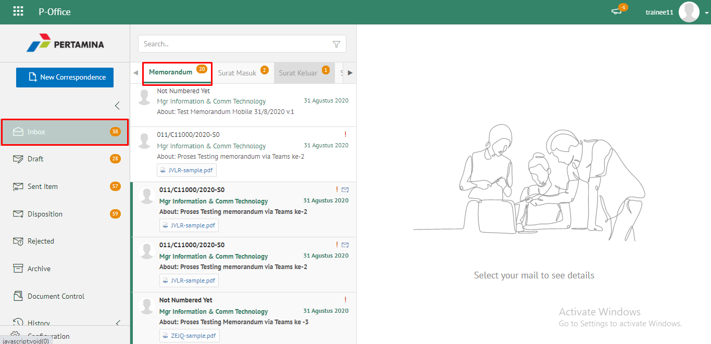
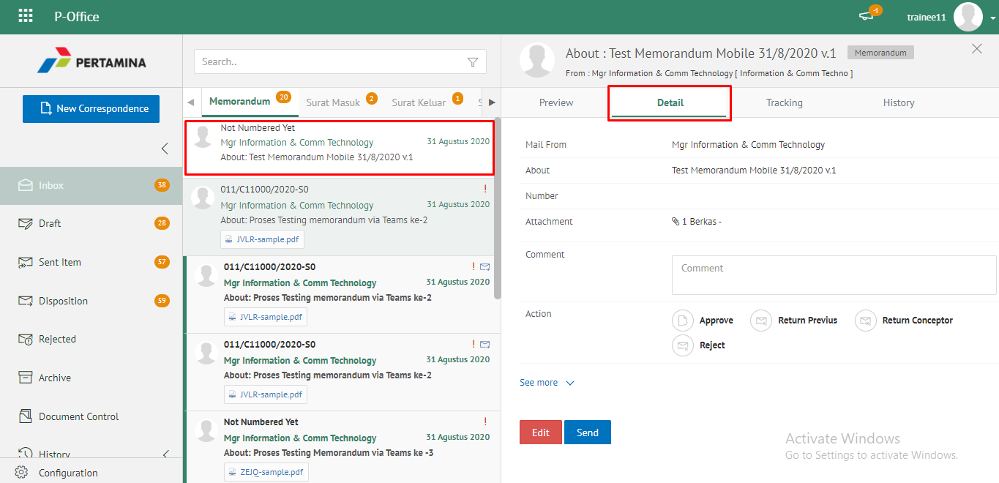
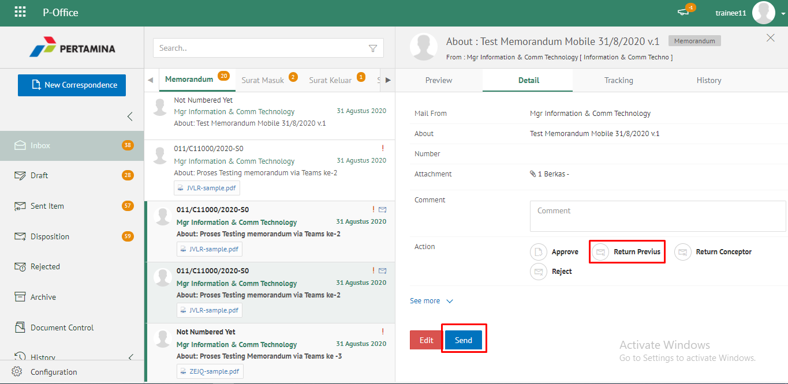
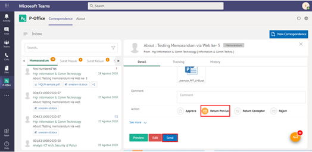
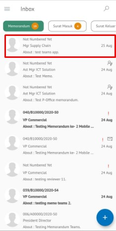
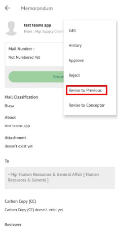
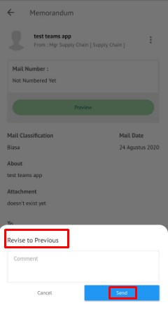

### Kembalikan Memorandum ke Sebelumnya

Role yang sesuai

- *Approver User*
- *Reviewer User*

*User* dapat mengembalikan memorandum ke sebelumnya jika hasil review belum / tidak sesuai. Surat akan dikembalikan ke satu level *reviewer* sebelumnya atau ke konseptor (apabila hanya ada satu *reviewer*). Langkah-langkah untuk mengembalikan memorandum ke sebelumnya adalah sebagai berikut

1. Klik menu **Inbox** dan pilih tab **Memorandum**

2. Pilih memorandum yang akan ditindak lanjuti kemudian pilih tab **Detail**

3. Klik tombol **Return Previus** dan pilih **Send**. Isikan komentar jika diperlukan

4. Sistem berhasil menyimpan perubahan. Memorandum yang sudah di kirim akan tersimpan di menu **Outbox - Memorandum** dan penerima pengembalian memorandum akan menerima memorandum di menu **Rejected - Memorandum**

## **P-Office Versi Teams**

Langkah-langkah untuk mengembalikan Memorandum kesebelumnya via Teams adalah sebagai berikut :

1. Klik menu **Inbox** dan pilih tab **Memorandum**

2. Pilih memorandum yang akan ditindak lanjuti kemudian pilih tab **Detail**

3. Klik tombol **Return Previus** dan pilih **Send**. Isikan komentar jika diperlukan

4. Sistem berhasil menyimpan perubahan. Memorandum yang sudah di kirim akan tersimpan di menu **Outbox - Memorandum** dan penerima pengembalian memorandum akan menerima memorandum di menu **Rejected - Memorandum**

## **P-Office Versi Android**

Langkah-langkah untuk mengembalikan memorandum ke sebelumnya adalah sebagai berikut :

1. Klik menu **Inbox** dan pilih tab **Memorandum**

 

2. Pilih memorandum yang akan ditindak lanjuti kemudian pilih ikon **tombol button**

 

3. Klik tombol **Revise to Pervious** dan pilih **Send**.Isikan komentar jika diperlukan

 

4. Sistem berhasil menyimpan perubahan. Memorandum yang sudah di kirim akan tersimpan di menu **Outbox- Memorandum** dan penerima pengembalian memorandum akan menerima memorandum di menu **Rejected - Memorandum**

