**Role yang sesuai**

- *Reviewer User*
- *Member User* (Pekerja)
- Sekretaris

*User* dapat mengirim tanggapan disposisi memorandum yang ditujukan untuk pejabat pengirim disposisi. Langkah-langkah untuk mengirim tanggapan disposisi memorandum adalah sebagai berikut

## **P-Office Versi Web**

Langkah-langkah untuk mengirim tangnggapan disposisi memorandum via Web adalah sebagai berikut :

1. Klik menu **Disposition** dan pilih tab **Memorandum**

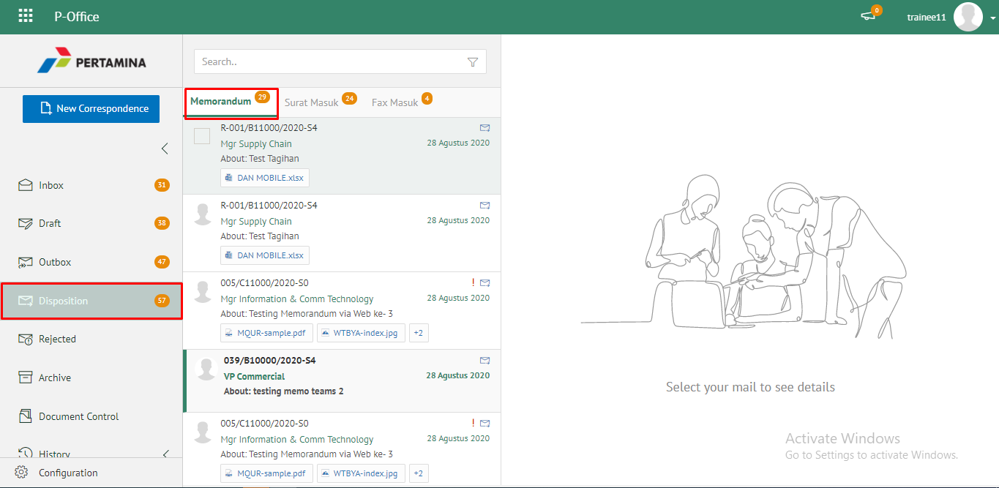

2. Pilih memorandum yang akan diselesaikan kemudian pilih tab **Detail**

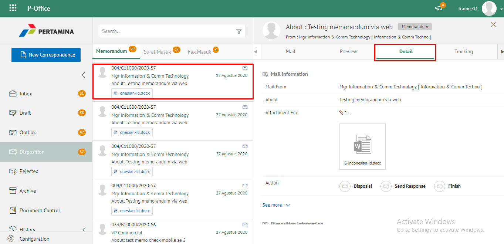

3. Pilih tombol **Send Response** kemudian klik **Send**

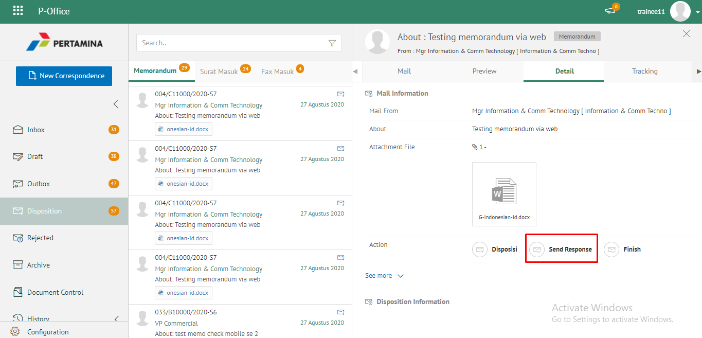

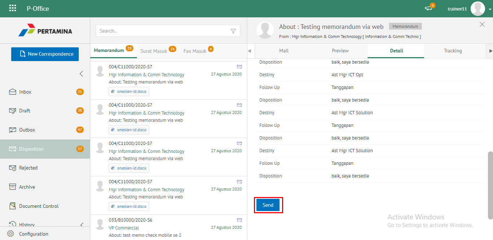

4. Sistem menampilkan pop up konfirmasi dan user harus mengisi keterangan kirim tanggapan disposisi kemudian klik **Save**.

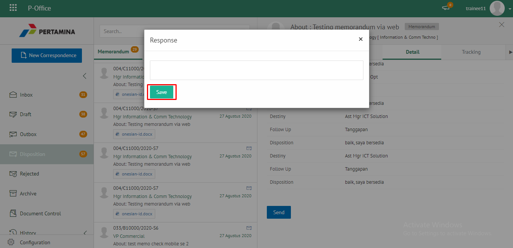

5. Sistem menyimpan perubahan dan informasi tanggapan disposisi akan tersimpan di detail disposisi.

## **P-Office Versi Teams**

Langkah-langkah untuk mengirim tangnggapan disposisi memorandum via Teams adalah sebagai berikut :

1. Klik menu **Disposition** dan pilih tab **Memorandum**

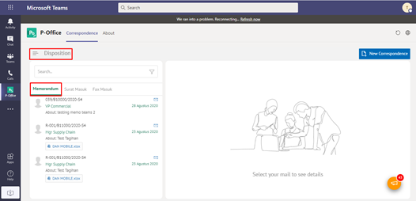

2. Pilih memorandum yang akan diselesaikan kemudian pilih tab **Detail**

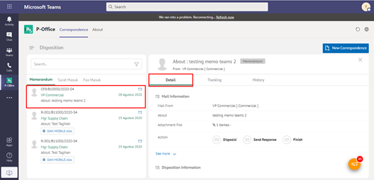

3. Pilih tombol **Send Response** kemudian klik **Send**

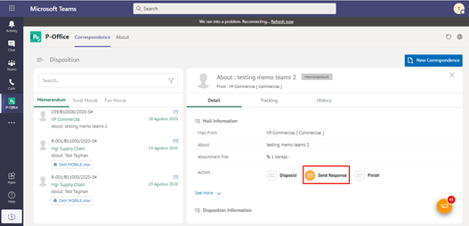

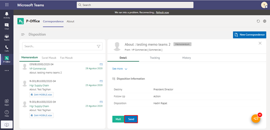

4. Sistem menampilkan pop up konfirmasi dan user harus mengisi keterangan kirim tanggapan disposisi kemudian klik **Save**.

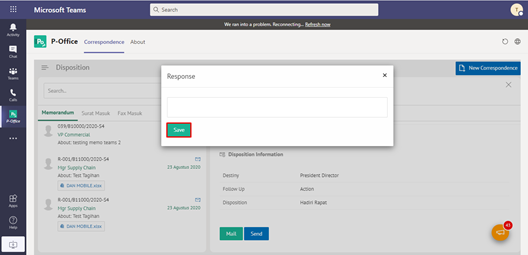

5. Sistem menyimpan perubahan dan informasi tanggapan disposisi akan tersimpan di detail disposisi.

## **P-Office Versi Android**

Langkah-langkah untuk Mengirim tanggapan disposisi memorandum via Teams adalah sebagai berikut :

1. Klik menu **Disposisi** dan pilih tab **Memorandum**

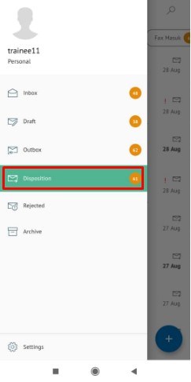 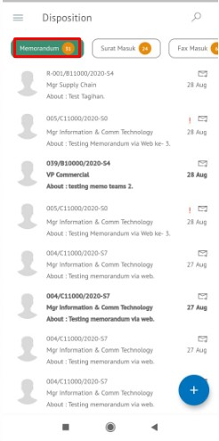

2. Pilih memorandum yang akan diselesaikan kemudian pilih icon **Option**

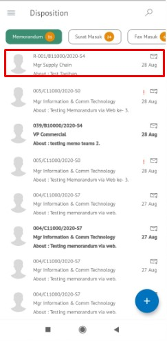 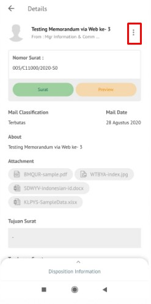

3. Pilih tombol **Send Response** kemudian Sistem menampilkan pop up konfirmasi dan _user_ harus mengisi keterangan kirim tanggapan disposisi kemudian klik **Send**.

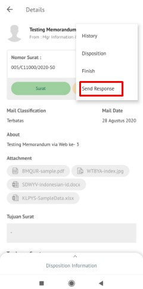 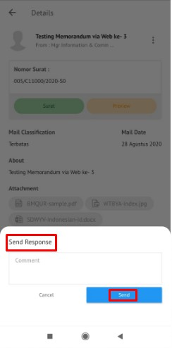

4. Sistem menyimpan perubahan dan informasi tanggapan disposisi akan tersimpan di detail disposisi.

## **P-Office Versi IOS**

Langkah-langkah untuk Mengirim tanggapan disposisi memorandum via IOS adalah sebagai berikut :

1. Klik menu **Disposisi** dan pilih tab **Memorandum**

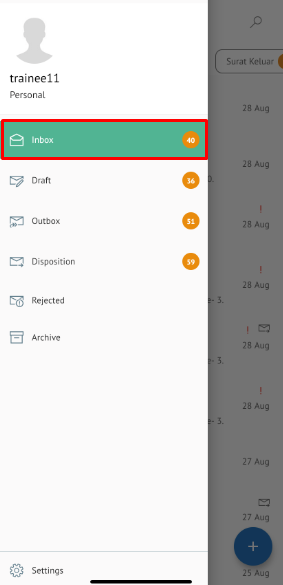 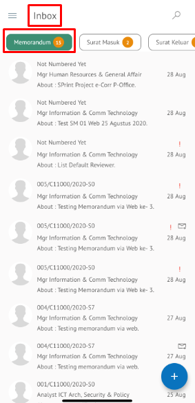

2. Pilih memorandum yang akan diselesaikan kemudian pilih icon **Option** dan pilih **Send Response**

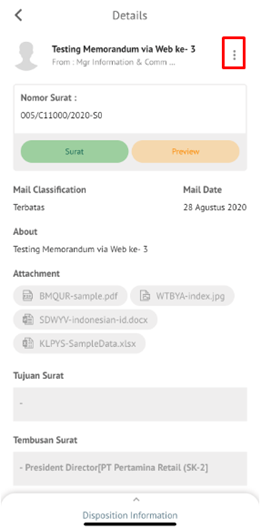 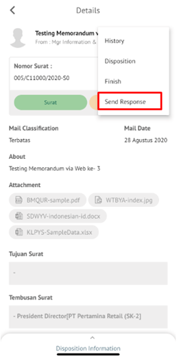

3.	Sistem menampilkan pop up konfirmasi dan user mengisi tanggapan disposisi kemudian klik **Send**

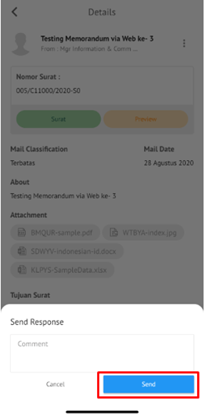

4.	Sistem menyimpan perubahan dan informasi kirim tanggapan akan tersimpan di detail disposisi