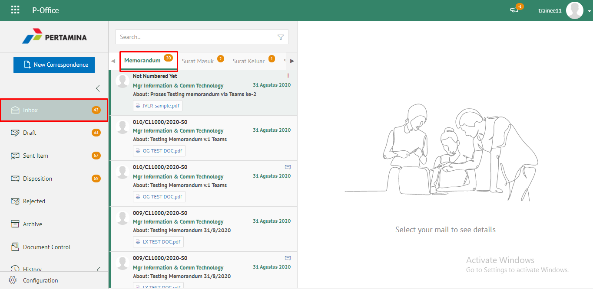
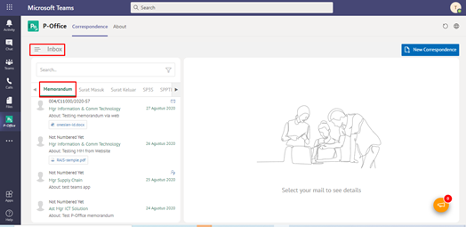
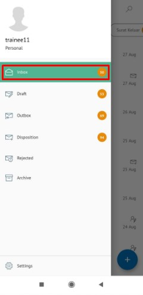
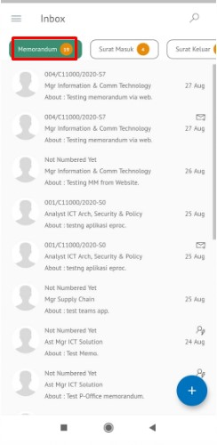
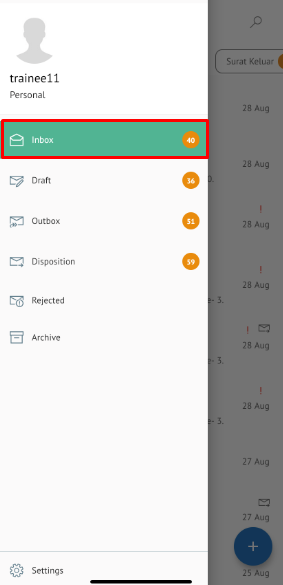
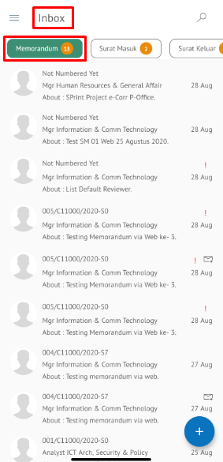

**Role yang sesuai**

- *Approver User*
- *Reviewer User*
- *Member User* (Pekerja)

*User* dapat melihat daftar memorandum pada pada menu **Inbox, Draft atau Outbox** pada masing - masing akun. 

## **P-Office Versi Web**

langkah untuk melihat daftar memorandum via Web adalah sebagai berikut

1. Klik menu **Inbox / Draft / Outbox** dan pilih tab **Memorandum**

## **P-Office Versi Teams**

Langkah-langkah untuk melihat daftar memorandum via Teams adalah sebagai berikut :

1. Klik menu **Inbox / Draft / Outbox** dan pilih tab **Memorandum**

## **P-Office Versi Android**

Langkah-langkah untuk melihat daftar memorandum via Android adalah sebagai berikut :

1. Klik menu **Inbox/Draft/Outbox** dan pilih tab **Memorandum**

  

## **P-Office Versi IOS**

Langkah – langkah untuk melihat daftar memorandum via IOS adalah sebagai berikut

1.	Klik menu **Inbox / Draft / Outbox** dan pilih tab **Memorandum**

 

