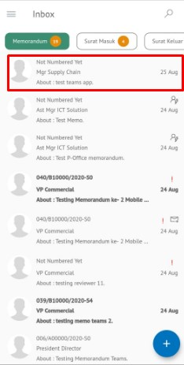

**Role yang sesuai**

- *Approver User*
- *Reviewer User*
- *Member User* (Pekerja)

_User_ dapat melihat informasi lengkap memorandum termasuk *preview* memorandum, detail memorandum, *tracking* memorandum dan *history* memorandum. Langkah - langkah untuk melihat informasi memorandum adalah sebagai berikut

1. Klik menu **Inbox/Draft/Outbox** dan pilih tab **Memorandum**. Pilih salah satu memorandum yang akan dilihat informasinya

#### Preview Memorandum

Pada tab Informasi *Preview* memorandum, ditampilkan *preview* memorandum yang sudah dibuat. *Preview* memorandum disesuaikan dengan template berdasarkan jenis surat

#### Detail Memorandum

Pada tab Detail memorandum, terdapat informasi asal surat, perihal, file lampiran, nomor surat, klasifikasi surat, tanggal surat, tujuan surat dan *reviewer*

#### Tracking Memorandum

Pada tab *tracking* memorandum, ditampilkan informasi *tracking* memorandum dalam bentuk *chart*

#### History Memorandum

Pada tab *History* memorandum, ditampilkan riwayat memorandum yang terdapat informasi jabatan, tanggal, tindakan dan komentar

## **P-Office Versi Android**

Langkah-langkah untuk melihat informasi Memorandum adalah sebagai berikut :

1. Klik menu **Inbox/Draft/Outbox** dan pilih tab **Memorandum**.

 

**Detail Memorandum**

Pilih salah satu memorandum yang akan dilihat informasinya kemudian  Detail memorandum, terdapat informasi asal surat, perihal, file lampiran, nomor surat, klasifikasi surat, tanggal surat, tujuan surat dan _reviewer_

  

**Preview Memorandum**

Pada tab Informasi _Preview_ memorandum, ditampilkan _preview_ memorandum yang sudah dibuat. _Preview_ memorandum disesuaikan dengan template berdasarkan jenis surat

 

**Tracking Memorandum**

Pada tab _tracking_ memorandum, ditampilkan informasi _tracking_ memorandum dalam bentuk _chart_

**History Memorandum**

Pada tab _History_ memorandum, ditampilkan riwayat memorandum yang terdapat informasi jabatan, tanggal, tindakan dan komentar

  