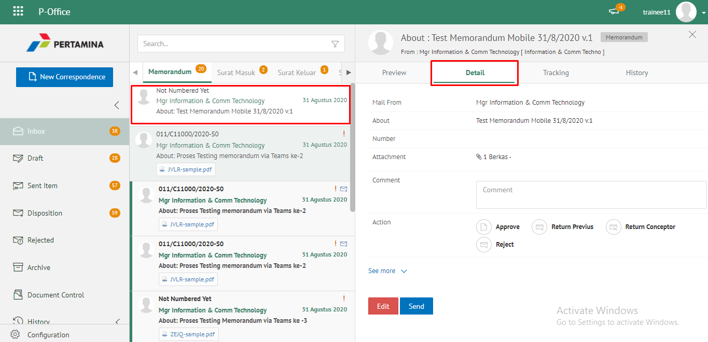
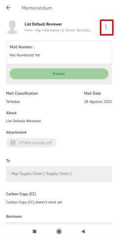

**Role yang sesuai**

- *Approver User*

*Approver User* dapat menambahkan reviewer kemudian memorandum akan diteruskan ke reviewer baru.

## **P-Office Versi Web**

Langkah - langkah untuk menambah reviewer memorandum vvia Web adalah sebagai berikut :

1. Klik menu **Inbox** dan pilih tab **Memorandum**

2. Pilih memorandum yang akan ditindak lanjuti kemudian pilih tab **Detail**

3. Klik tombol **Add Reviewer** dan pilih pejabat yang akan melakukan review dengan meng-klik tombol "+" pada field **Add Reviewer**

4. Sistem akan menampilkan pejabat untuk dijadikan reviewer baru

5. Pilih **Send** untuk mengirimkan kepada pejabat/reviewer yang dituju dan memorandum akan tersimpan di menu **"Outbox - Memorandum"**. Untuk pejabat/reviewer baru akan menerima memorandum di menu **"Inbox - Memorandum"**

## **P-Office Versi Teams**

Langkah-langkah untuk menambah reviewer Memorandum via Teams adalah sebagai berikut :

1. Klik menu **Inbox** dan pilih tab **Memorandum**

2. Pilih memorandum yang akan ditindak lanjuti kemudian pilih tab **Detail**

3. Klik tombol **Add Reviewer** dan pilih pejabat yang akan melakukan review dengan meng-klik tombol "+" pada field **Add Reviewer**

4. Sistem akan menampilkan pejabat untuk dijadikan reviewer baru

5. Pilih **Send** untuk mengirimkan kepada pejabat/reviewer yang dituju dan memorandum akan tersimpan di menu **"Outbox - Memorandum"**. Untuk pejabat/reviewer baru akan menerima memorandum di menu **"Inbox - Memorandum"**

## **P-Office Versi Android**

Berikut ini video yang menjelaskan langkah - langkah approver untuk menambah reviewer baru **via Mobile**

 

1. Klik menu **Inbox** dan pilih tab **Memorandum**

 

1. Pilih memorandum yang akan ditindak lanjuti kemudian pilih ikon **tombol button**

 

2. Klik tombol **Add Reviewer** dan pilih pejabat yang akan melakukan review dengan meng-klik **Add Reviewer**

 

3. Sistem akan menampilkan pejabat untuk dijadikan reviewer baru

 

4. Pilih **Send** untuk mengirimkan kepada pejabat/reviewer yang dituju dan memorandum akan tersimpan di menu “**Outbox - Memorandum**”. Untuk pejabat/reviewer baru akan menerima memorandum di menu “**Inbox – Memorandum**”

## **P-Office Versi IOS**

Langkah-langkah untuk menambah reviewer memorandum via IOS adalah sebagai berikut :

1. Klik menu **Inbox** dan pilih tab **Memorandum**

 

2. Pilih memorandum yang akan ditindak lanjuti kemudian pilih icon **Option** dan pilih **Add Reviewer**
   
 

3. Klik **Add Reviewer** untuk menampilkan daftar pejabat yang akan dipilih sebagai reviewer baru

4. Klik Submit untuk mengirimkan kepada pejabat/reviewer yang dituju dan surat keluar akan tersimpan di menu “**Outbox - Memorandum**”. Untuk pejabat/reviewer baru akan menerima surat keluar di menu “**Inbox – Memorandum**”

