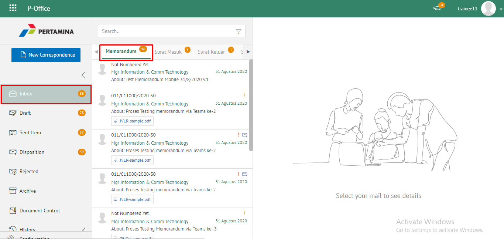
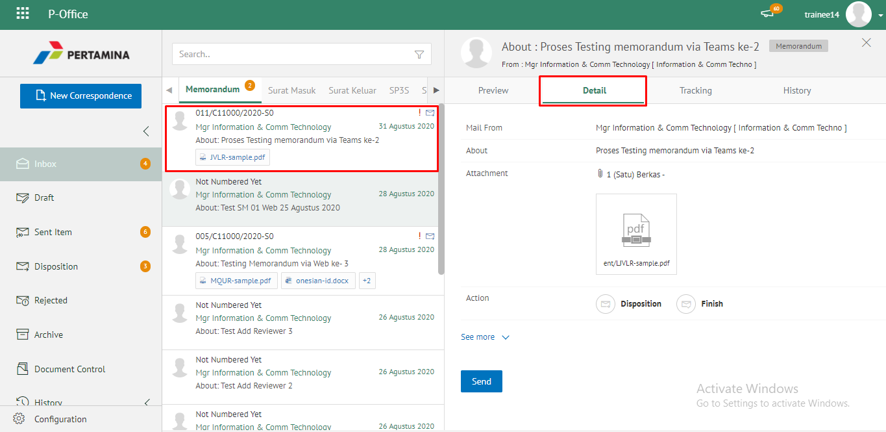
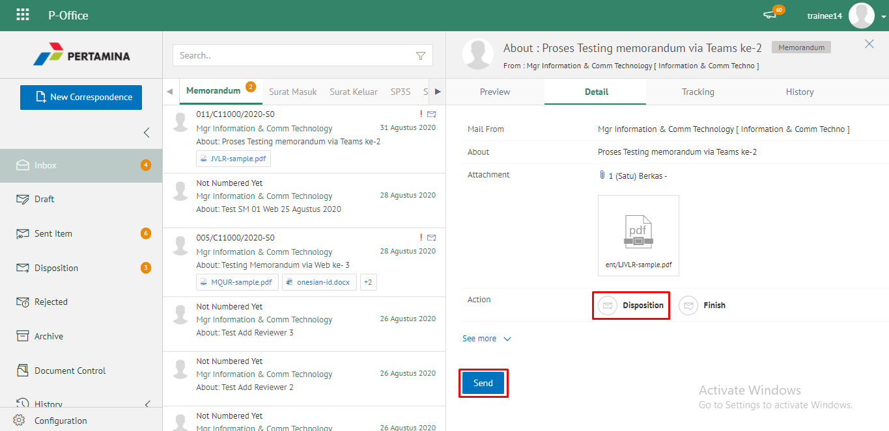

### Mengesahkan Nomor Memorandum

**Role yang sesuai**

- *Approver User*

*Approver User* dapat mengesahkan memorandum yang sudah dikirim dan direview oleh reviewer. Keluaran untuk tindak lanjut ini adalah untuk men-*generate* nomor memorandum kemudian memorandum dapat dikirimkan ke pejabat tujuan. Langkah - langkah untuk menambah reviewer memorandum adalah sebagai berikut

1. Klik menu **Inbox** dan pilih tab **Memorandum**

2. Pilih memorandum yang akan ditindak lanjuti kemudian pilih tab **Detail**. Pada tab **Detail** terdapat informasi nomor surat yang masih bersifat sementara. Nomor inilah yang akan ter-*generate* jika *user* menyetujui memorandum

3. Klik **Approve** kemudian pilih **Send**

4. Sistem menyimpan perubahan dan nomor memorandum akan ter-*generate* sesuai dengan nomor sementara pada detail. Memorandum yang sudah diseyujui akan tersimpan di menu **"Outbox - Memorandum"** pengirim sedangkan memorandum akan tersimpan di menu **"Inbox - Memorandum"** penerima

## **P-Office Versi Teams**

Langkah-langkah untuk mengesahkan nomor Memorandum via Teams adalah sebagai berikut :

1. Klik menu **Inbox** dan pilih tab **Memorandum**

2. Pilih memorandum yang akan ditindak lanjuti kemudian pilih tab **Detail**. Pada tab **Detail** terdapat informasi nomor surat yang masih bersifat sementara. Nomor inilah yang akan ter-*generate* jika *user* menyetujui memorandum

3. Klik **Approve** kemudian pilih **Send**

4. Sistem menyimpan perubahan dan nomor memorandum akan ter-*generate* sesuai dengan nomor sementara pada detail. Memorandum yang sudah diseyujui akan tersimpan di menu **"Outbox - Memorandum"** pengirim sedangkan memorandum akan tersimpan di menu **"Inbox - Memorandum"** penerima

## **P-Office Versi Android**

Langkah-langkah untuk Mengesahkan nomor Memorandum adalah sebagai berikut :

1. Klik menu **Inbox**dan pilih tab **Memorandum**

2. Pilih memorandum yang akan ditindak lanjuti kemudian **Detail** Pada tab **Detail** terdapat informasi nomor surat akan ter-_generate_ jika _user_ menyetujui memorandum.

 

3. Memorandum yang sudah diseyujui akan tersimpan di menu “**Outbox - Memorandum**” pengirim sedangkan memorandum akan tersimpan di menu “**Inbox - Memorandum**” penerima