**Role yang sesuai**

- *Approver User*
- *Reviewer User*

*User* dapat melakukan *recall* / tarik disposisi memorandum yang sudah dikirim kepada pejabat penerima disposisi. Memorandum yang sudah dikirim ke pejabat penerima disposisi akan tersimpan di menu **"Outbox Disposisi"**. 

## **P-Office Versi Web**

Langkah - langkah untuk melakukan recall disposisi memorandum via Web adalah sebagai berikut

1. Klik menu **Outbox** dan pilih tab **Disposisi**

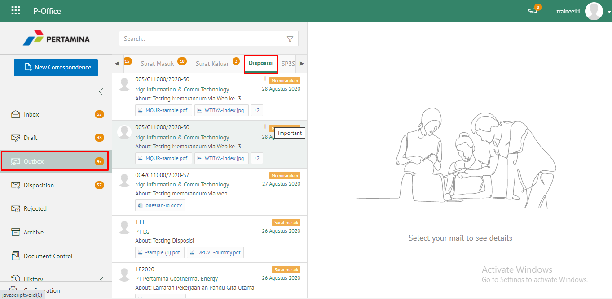

2. Pilih memorandum yang akan di-recall kemudian klik tab **Detail** kemudian klik ***Recall***. Memorandum yang sudah di-*recall* akan tersimpan di menu **"Draft - Disposisi"** penarik disposisi

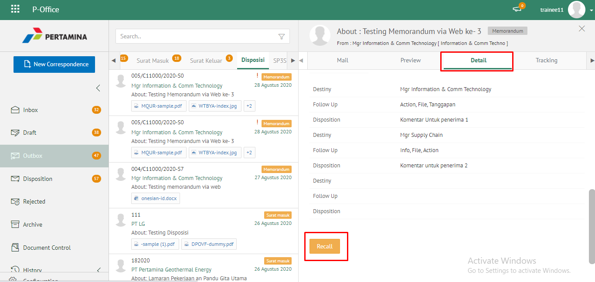

## **P-Office Versi Teams**

Langkah-langkah untuk recall Memorandum via Teams adalah sebagai berikut :

1. Klik menu **Outbox** dan pilih tab **Disposisi**

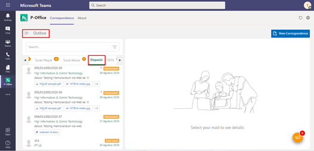

2. Pilih memorandum yang akan di-recall kemudian klik tab **Detail** kemudian klik ***Recall***. Memorandum yang sudah di-*recall* akan tersimpan di menu **"Draft - Disposisi"** penarik disposisi

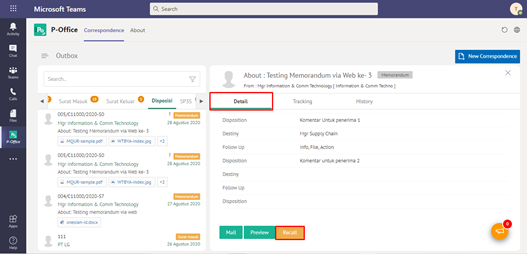

## **P-Office Versi Android**

Langkah-langkah untuk Recall Memorandum via Android adalah sebagai berikut :

1. Klik menu **Outbox** dan pilih tab **Disposisi**

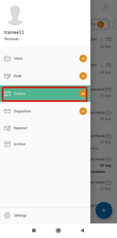 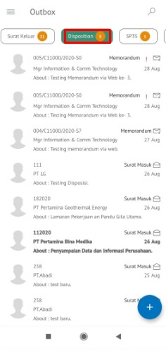

2. Pilih memorandum yang akan di-_recall_ kemudian klik ikon **tombol button** di **Detail** lalu **_Recall_**. Memorandum yang sudah di-_recall_ akan tersimpan di menu “**Draft - Disposisi**” penarik disposisi

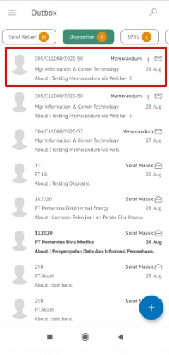 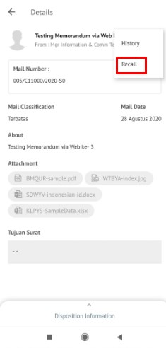 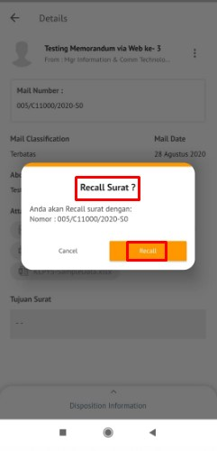

## **P-Office Versi IOS**

Langkah-langkah untuk Recall Memorandum via IOS adalah sebagai berikut :

1. Klik menu **Outbox** dan pilih tab **Disposisi**

 

2. Pilih memorandum yang akan di-_recall_ kemudian klik tab **Option** kemudian klik **_Recall_.** Memorandum yang sudah di-_recall_ akan tersimpan di menu “**Draft - Disposisi** penarik disposisi
   
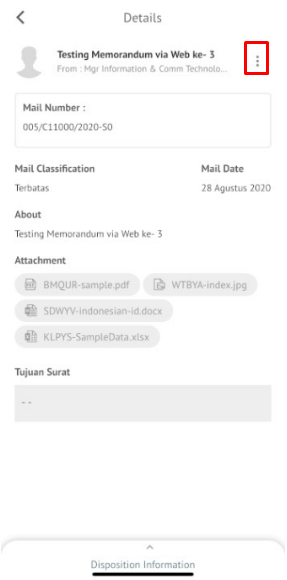 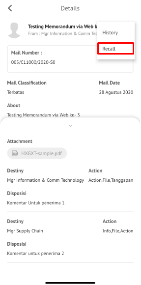