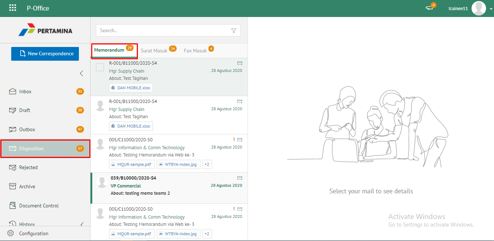
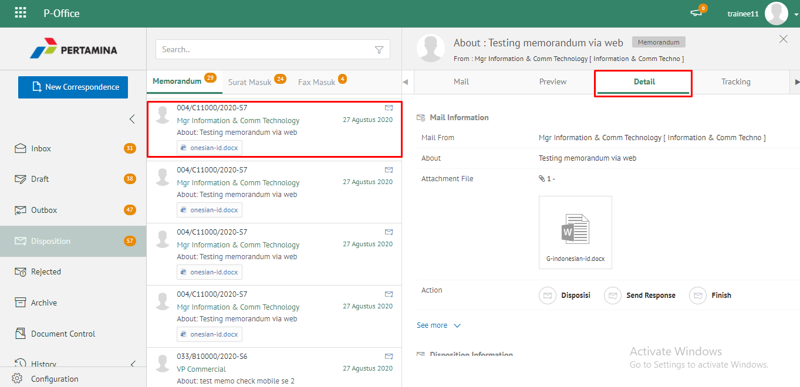
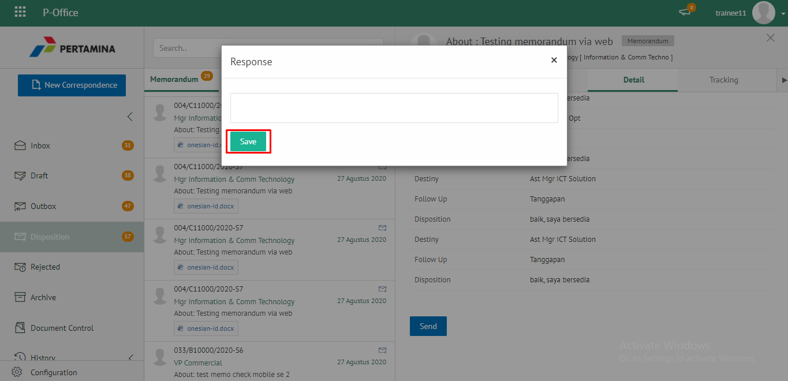
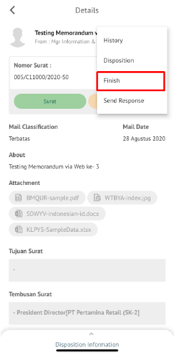
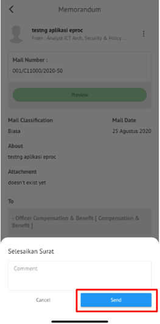

**Role yang sesuai**

- *Approver User*
- *Reviewer User*
- *Member User* (Pekerja)
- Sekretaris

*User* dapat menyelesaikan disposisi memorandum jika *user* tidak akan melanjutkan untuk mendisposisikan memorandum ke pejabat lain atau memorandum selesai pada *user* tersebut. Langkah-langkah untuk menyelesaikan memorandum adalah sebagai berikut

## **P-Office Versi Teams**

Langkah-langkah untuk menyelesaikan disposisi memorandum via Web adalah sebagai berikut :

1. Klik menu **Inbox** dan pilih tab **Memorandum**

2. Pilih memorandum yang akan diselesaikan kemudian pilih tab **Detail**

3. Pilih tombol **Finish** kemudian klik **Send**

4. Sistem menampilkan pop up konfirmasi dan user harus mengisi keterangan selesaikan disposisi kemudian klik **Save**.

5. Sistem menyimpan perubahan dan informasi selesai disposisi akan tersimpan di detail disposisi.

## **P-Office Versi Teams**

Langkah-langkah untuk menyelesaikan disposisi memorandum via Teams adalah sebagai berikut :

1. Klik menu **Inbox** dan pilih tab **Memorandum**

2. Pilih memorandum yang akan diselesaikan kemudian pilih tab **Detail**

3. Pilih tombol **Finish** kemudian klik **Send**

4. Sistem menampilkan pop up konfirmasi dan user harus mengisi keterangan selesaikan disposisi kemudian klik **Save**.

5. Sistem menyimpan perubahan dan informasi selesai disposisi akan tersimpan di detail disposisi.

## **P-Office Versi Android**

Langkah-langkah untuk menyelesaikan disposisi memorandum via Android adalah sebagai berikut :

1. Klik menu **Inbox** dan pilih tab **Memorandum**

 

2. Pilih memorandum yang akan diselesaikan kemudian pilih icon **Option**

 

3. Pilih tombol **Selesaikan** kemudian sistem menampilkan pop up konfirmasi dan _user_ harus mengisi keterangan selesaikan disposisi kemudian klik **Send**

 

4. Sistem menyimpan perubahan dan informasi selesai disposisi akan tersimpan di detail disposisi

## **P-Office Versi IOS**

Langkah-langkah untuk menyelesaikan disposisi memorandum via IOS adalah sebagai berikut :

1. Klik menu **Inbox** dan pilih tab **Memorandum**

 

2. Pilih memorandum yang akan diselesaikan kemudian pilih icon **Option** dan pilih **Finish**

 

3.	Sistem menampilkan pop up konfirmasi dan user harus mengisi keterangan selesaikan disposisi kemudian klik **Send**

4.	Sistem menyimpan perubahan dan informasi selesai disposisi akan tersimpan di detail disposisi
