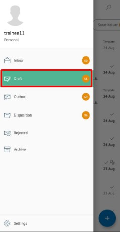
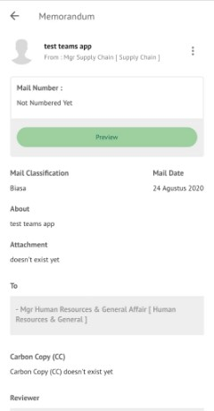
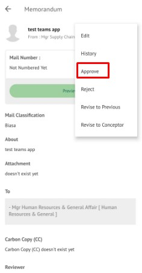
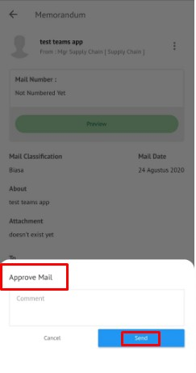

Role yang sesuai

- *Approver User*
- *Reviewer User*
- *Member User* (Pekerja)

*User* dapat menyetujui memorandum yang sudah dilakukan review dan memorandum akan dikirimkan ke *reviewer* selanjutnya atau *approver*. Langkah - langkah untuk menyetujui memorandum adalah sebagai berikut

1. Klik menu **Inbox** dan pilih tab **Memorandum**

2. Pilih memorandum yang akan ditindak lanjuti kemudian pilih tab **Detail**

3. Klik tombol **Setujui** dan pilih **Send**. Isikan komentar jika diperlukan

4. Sistem berhasil menyimpan perubahan. Memorandum yang sudah di kirim akan tersimpan di menu **Outbox - Memorandum**

## **P-Office Versi Android**

Langkah-langkah untuk menyetujui Memorandum adalah sebagai berikut :

1. Klik menu **Inbox** dan pilih tab **Memorandum**

 

2. Pilih memorandum yang akan ditindak lanjuti kemudian pilih ikon **tombol button**

 

3. Klik tombol **Approve** dan pilih **Send**. Isikan komentar jika diperlukan

 

4. Sistem berhasil menyimpan perubahan. Memorandum yang sudah di kirim akan tersimpan di menu **Outbox- Memorandum**
