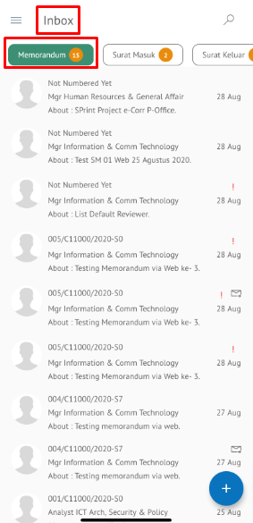

Role yang sesuai

- *Approver User*
- *Reviewer User*
- *Member User* (Pekerja)

*User* dapat menyetujui memorandum yang sudah dilakukan review dan memorandum akan dikirimkan ke *reviewer* selanjutnya atau *approver*. 

## **P-Office Versi Web**

Langkah - langkah untuk menyetujui memorandum via Web adalah sebagai berikut :

1. Klik menu **Inbox** dan pilih tab **Memorandum**

2. Pilih memorandum yang akan ditindak lanjuti kemudian pilih tab **Detail**

3. Klik tombol **Approve** dan pilih **Send**. Isikan komentar jika diperlukan

4. Sistem berhasil menyimpan perubahan. Memorandum yang sudah di kirim akan tersimpan di menu **Outbox - Memorandum**

## **P-Office Versi Teams**

Langkah-langkah untuk menyetujui Memorandum via Teams adalah sebagai berikut :

1. Klik menu **Inbox** dan pilih tab **Memorandum**

2. Pilih memorandum yang akan ditindak lanjuti kemudian pilih tab **Detail**

3. Klik tombol **Approve** dan pilih **Send**. Isikan komentar jika diperlukan

4. Sistem berhasil menyimpan perubahan. Memorandum yang sudah di kirim akan tersimpan di menu **Outbox - Memorandum**

## **P-Office Versi Android**

Langkah-langkah untuk menyetujui Memorandum via Android adalah sebagai berikut :

1. Klik menu **Inbox** dan pilih tab **Memorandum**

 

2. Pilih memorandum yang akan ditindak lanjuti kemudian pilih ikon **tombol button**

 

3. Klik tombol **Approve** dan pilih **Send**. Isikan komentar jika diperlukan

 

4. Sistem berhasil menyimpan perubahan. Memorandum yang sudah di kirim akan tersimpan di menu **Outbox- Memorandum**

## **P-Office Versi IOS**

Langkah-langkah untuk menyetujui Memorandum via IOS adalah sebagai berikut

1. Klik menu **Inbox** dan pilih tab **Memorandum**

 

2.	Pilih memorandum yang akan ditindak lanjuti kemudian pilih icon **Option** dan pilih **Approve**

 

3.	Isikan komentar jika diperlukan kemudian klik **Send** untuk menyimpan perubahan. Surat keluar yang sudah di kirim akan tersimpan di menu **Outbox - Surat Keluar**

