**Ditujukan kepada**

- *Approver User*
- *Reviewer User*

**Role yang sesuai**

- *Member User* (Pekerja)

Konseptor dapat menambah memorandum pada aplikasi P-Office. Langkah - langkah untuk menambah memorandum adalah sebagai berikut

1. Klik menu New **Correspondence**

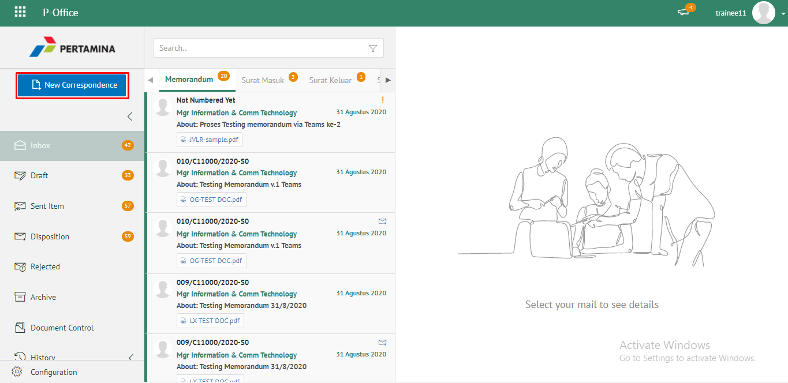

2. Pilih jenis surat **"Memorandum"**

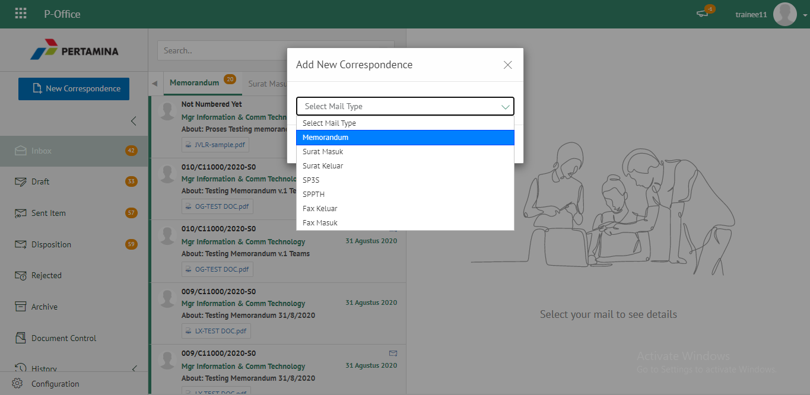

3. Isi *form* tambah memorandum. Terdapat bebarapa aksi untuk menindaklanjuti memorandum yang sudah diisi *form*nya yaitu **Simpan Memorandum**, **Kirim Memorandum** dan **Save as Template Memorandum**.

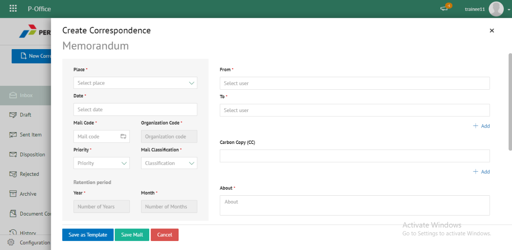

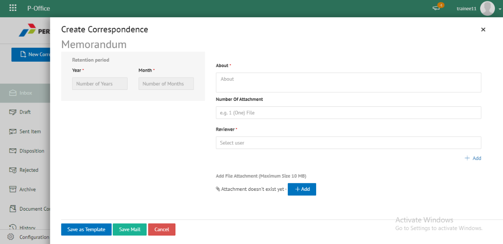

#### Simpan Memorandum

Langkah - langkah untuk menyimpan memorandum adalah sebagai berikut

1. Isi *form* memorandum kemudian klik **Save**

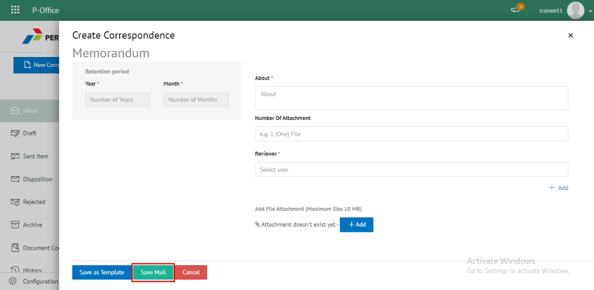

2. Sistem akan menampilkan tampilan *preview* memorandum dalam bentuk Word yang dapat di edit. Untuk melakukan *editing* terhadap isi surat klik **Ubah Isi** kemudian sistem akan menampilkan *pop up* konfirmasi **Ubah Word** Desktop atau **Ubah Online**

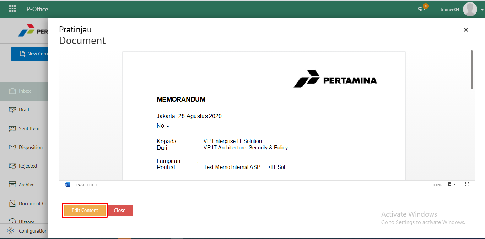

##### [Edit] Word Desktop

Langkah - langkah untuk mengubah isi memorandum melalui Word Desktop adalah sebagai berikut

1. Klik **Edit di Word** untuk mengubah melalui aplikasi Microsoft Word

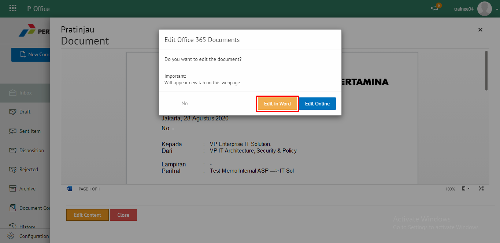

2. Lakukan perubahan pada isi surat. Klik Close pada aplikasi dan isi surat akan otomatis tersimpan

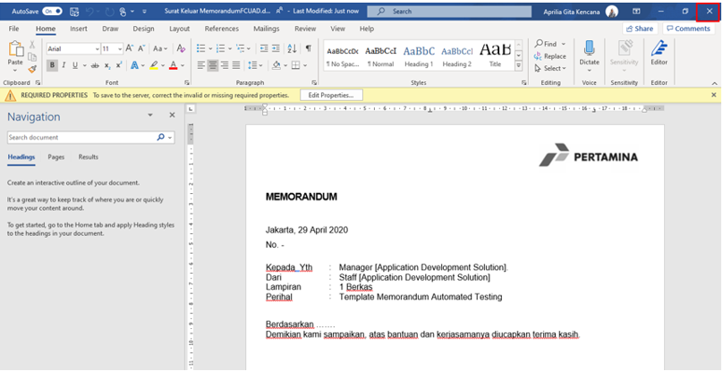

##### [Edit] Ubah Online

Langkah - langkah untuk mengubah isi memorandum secara online adalah sebagai berikut

1. Klik **Edit Online** untuk mengubah isi surat secara online

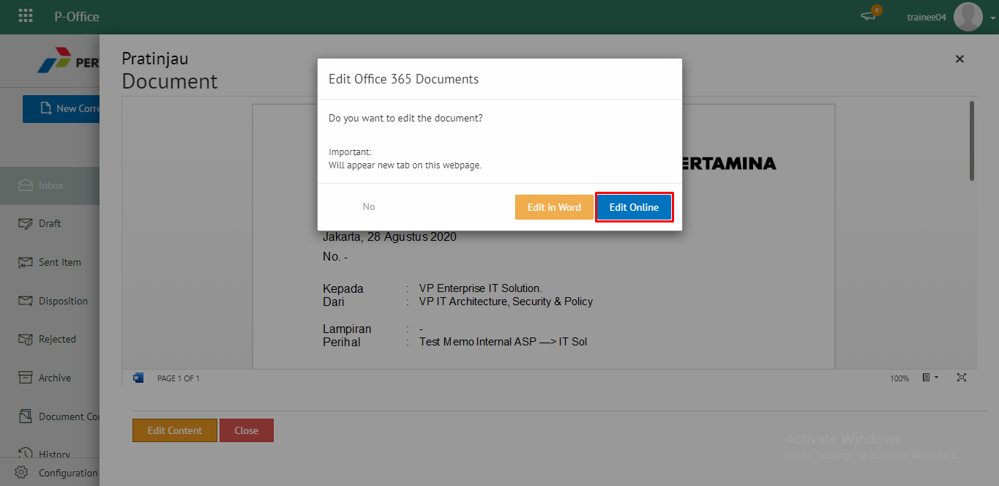

2. Lakukan perubahan pada isi surat. Klik **Close** pada aplikasi

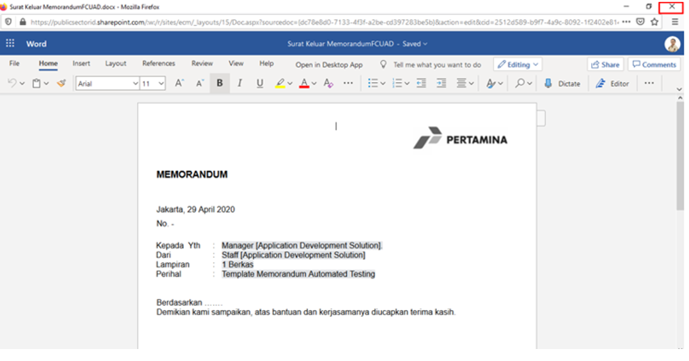

3. Isi surat akan otomatis tersimpan. Jika surat akan disimpan sebagai draft, maka klik **Close**  

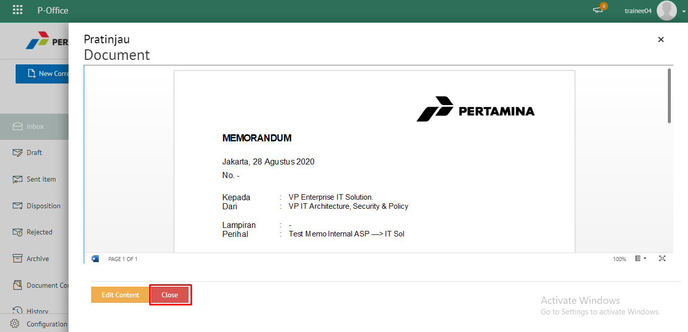

4. Surat yang sudah selesai diubah maka akan tersimpan di menu **"Draft - Memorandum"**

#### Kirim Memorandum

Langkah - langkah untuk mengirim memorandum adalah sebagai berikut

1. Pada tampilan *preview* memorandum, klik **Kirim** untuk mengirim surat ke pejabat tujuan

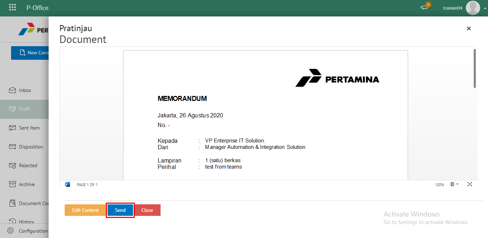

2. Sistem menyimpan perubahan dan memorandum akan tersimpan di menu **"Outbox - Memorandum"**

## **P-Office Versi Teams**

Langkah-langkah untuk menambahkan Memorandum via Teams adalah sebagai berikut :

1. Klik menu New **Correspondence**

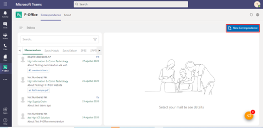

2. Pilih jenis surat **"Memorandum"**

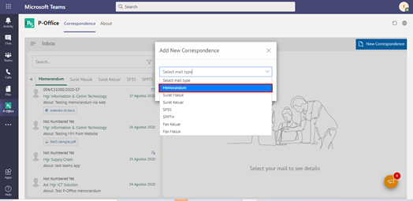

3. Isi *form* tambah memorandum. Terdapat bebarapa aksi untuk menindaklanjuti memorandum yang sudah diisi *form*nya yaitu **Save Memorandum**, **Cancel Memorandum** dan **Save as Template Memorandum**.

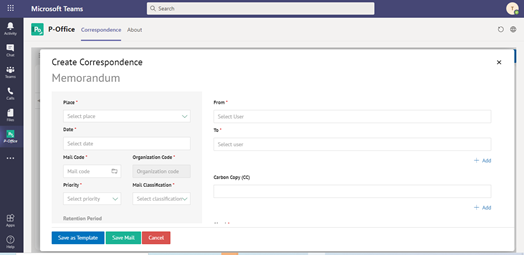

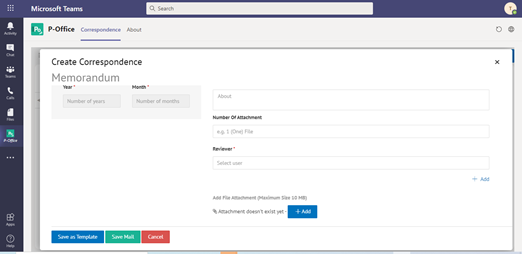

#### Simpan Memorandum

Langkah - langkah untuk menyimpan memorandum adalah sebagai berikut

1. Isi *form* memorandum kemudian klik **Save Mail**

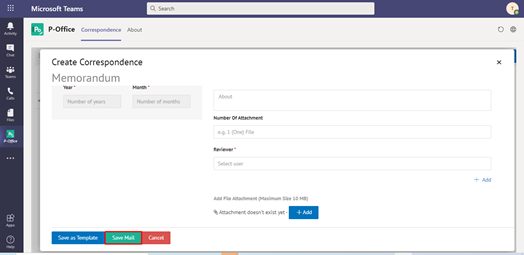

2. Sistem akan menampilkan tampilan *preview* memorandum dalam bentuk Word yang dapat di edit. Untuk melakukan *editing* terhadap isi surat klik **Edit Content** kemudian sistem akan menampilkan *pop up* konfirmasi **Ubah Word** Desktop atau **Ubah Online**

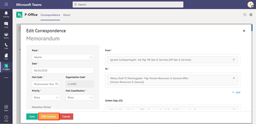

#### [Edit] Word Desktop

Langkah - langkah untuk mengubah isi memorandum melalui Word Desktop adalah sebagai berikut

1. Klik **Open in Desktop App** untuk mengubah melalui aplikasi Microsoft Word

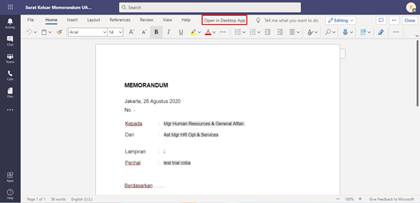

2. Lakukan perubahan pada isi surat. Klik Close pada aplikasi dan isi surat akan otomatis tersimpan

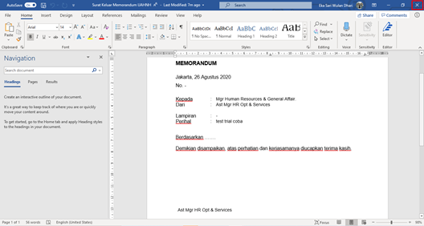

#### [Edit] Ubah Online

Langkah - langkah untuk mengubah isi memorandum secara online adalah sebagai berikut

1.	Ketika Klik *button* **Edit Content** maka secara otomatis akan membuka dokumen dan bisa mengubah isi surat secara *online*

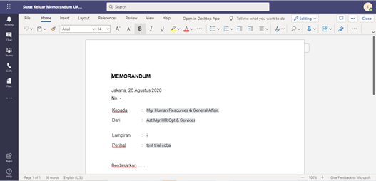

2. Lakukan perubahan pada isi surat.

3. Isi surat akan otomatis tersimpan. Jika surat akan disimpan sebagai draft, maka klik **Close**  

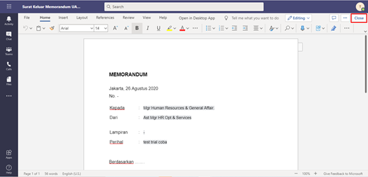

4. Surat yang sudah selesai diubah maka akan tersimpan di menu **"Draft - Memorandum"**

#### Kirim Memorandum

Langkah - langkah untuk mengirim memorandum adalah sebagai berikut

1. Pada tampilan *preview* memorandum, klik **Send** untuk mengirim surat ke pejabat tujuan

!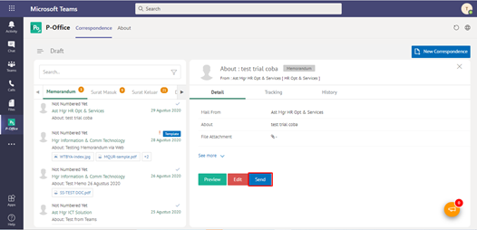

2. Sistem menyimpan perubahan dan memorandum akan tersimpan di menu **"Outbox - Memorandum"**

## **P-Office Versi Android**

Langkah-langkah untuk menambah Memorandum adalah sebagai berikut :

1. 	Klik ikon **(+)** untuk membuat memorandum

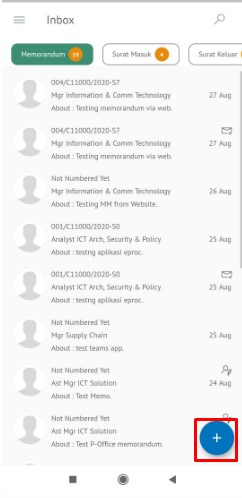

2. Pilih jenis surat “**Memorandum**”
   
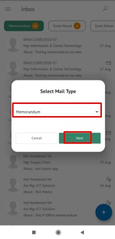

3. Isi _form_ tambah memorandum. Terdapat bebarapa aksi untuk menindaklanjuti memorandum yang sudah diisi _form_nya yaitu **Save memorandum**, **Send Memorandum**dan **Save as Template Memorandum.**

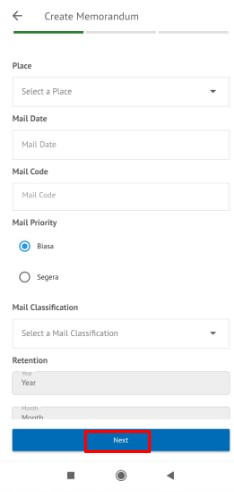 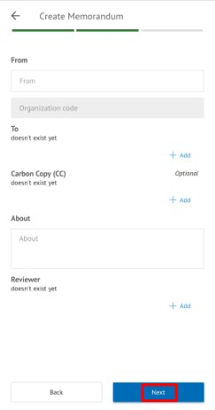 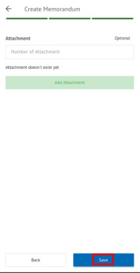

**Simpan Memorandum**

Langkah – langkah untuk menyimpan memorandum adalah sebagai berikut.

1. Isi _form_ memorandum kemudian klik **Save Mail**

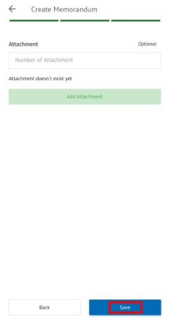 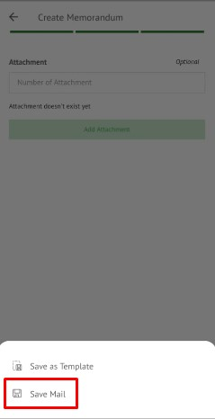

2. Sistem akan menyimoan perubahaan dan memorandum akan tersimpan di menu **Draft-Memorandum**

## **P-Office Versi IOS**

**Menambah Memorandum**

Langkah-langkah untuk menambah memorandum adalah sebagai berikut.

1.	Klik menu **New Correspondence**

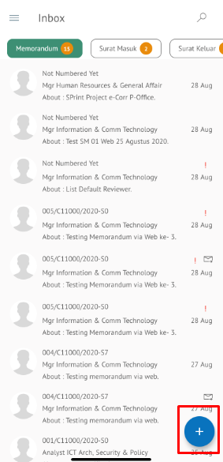

2.	Pilih jenis surat “**Memorandum**” kemudian klik **Next**

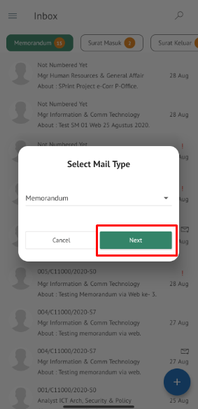

3.	Isi _form_ tambah memorandum. Terdapat bebarapa aksi untuk menindaklanjuti memorandum yang sudah diisi _form_nya yaitu **Simpan Memorandum**, **Kirim Memorandum **dan **Save as Template Memorandum.**

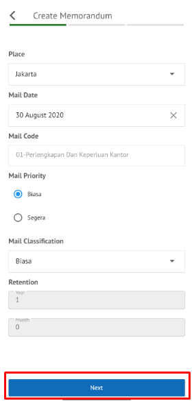
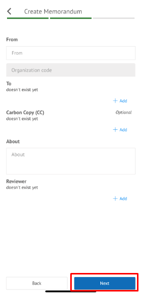
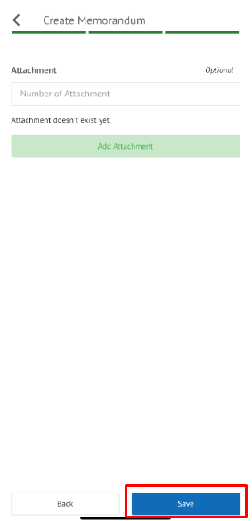

**Simpan Memorandum**

Langkah – langkah untuk menyimpan memorandum adalah sebagai berikut.

1.	Isi _form_ memorandum kemudian klik **Save**

2.	Setelah selesai, klik **Save Email** untuk menyimpan surat keluar sebagai draft

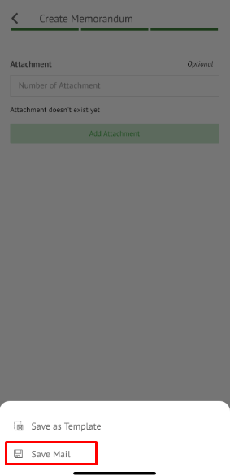

3.	Sistem akan menampilkan tampilan _preview_ surat keluar dalam bentuk Word yang dapat di edit. Untuk melakukan _editing_ terhadap isi surat klik **Edit/Send**

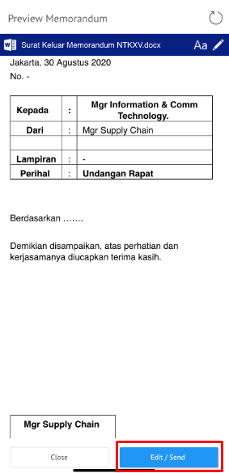

4.	Pilih **Edit Content,** kemudian aplikasi akan menampilkan editor Word Online. Lakukan perubahan pada isi konten, kemudian close editor Word Online. Sistem akan menampilkan _pop up _notifikasi editing dokumen, klik **Yes **untuk menutup _pop up_ notifikasi

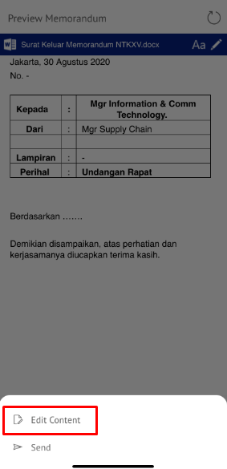
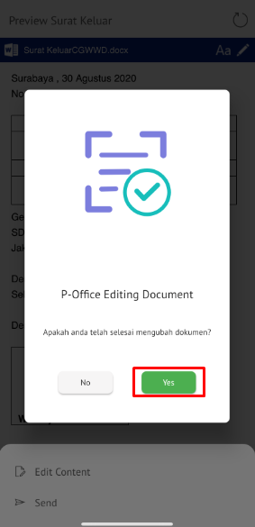

5.	Memorandum yang sudah di ubah akan tersimpan dimenu “**Draft –  Memorandum**”

**Kirim Memorandum**

Langkah – langkah untuk mengirim memorandum adalah sebagai berikut.

1.	Pada tampilan _preview_ memorandum, klik **Kirim **untuk mengirim surat ke pejabat tujuan

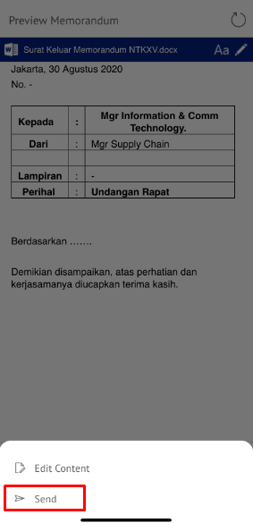

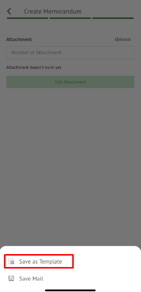

2.	Sistem menyimpan perubahan dan memorandum akan tersimpan di menu “**Outbox - Memorandum**”

