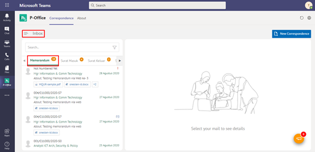
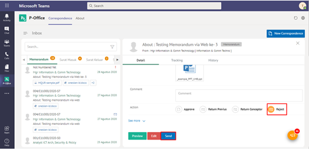
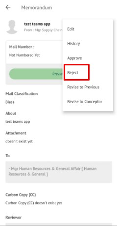
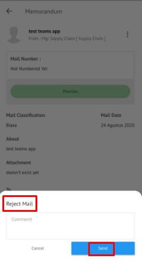

### Menolak Memorandum

**Role yang sesuai**

- *Reviewer User*
- *Approver User*

*User* dapat menolak memorandum yang akan dikembalikan ke konseptor jika hasil review memorandum belum / tidak sesuai. Langkah - langkah untuk menolak memorandum adalah sebagai berikut

1. Klik menu **Inbox** dan pilih tab **Memorandum**

2. Pilih memorandum yang akan ditindak lanjuti kemudian pilih tab **Detail**

3. Klik tombol **Tolak** dan pilih **Send**. Isikan komentar jika diperlukan

4. Sistem berhasil menyimpan perubahan. Memorandum yang sudah di tolak akan terhapus dari aplikasi secara *soft delete*.

## **P-Office Versi Teams**

Langkah-langkah untuk melihat menolak Memorandum via Teams adalah sebagai berikut :

1. Klik menu **Inbox** dan pilih tab **Memorandum**

2. Pilih memorandum yang akan ditindak lanjuti kemudian pilih tab **Detail**

3. Klik tombol **Reject** dan pilih **Send**. Isikan komentar jika diperlukan

4.	Sistem berhasil menyimpan perubahan. Memorandum yang sudah di tolak akan terhapus dari aplikasi akan tersimpan di menu **“Rejected – Memorandum”** user penolak dengan label **Rejected**.

## **P-Office Versi Android**

Langkah-langkah untuk menolak Memorandum adalah sebagai berikut :

1. Klik menu **Inbox** dan pilih tab **Memorandum**

 

2. Pilih memorandum yang akan ditindak lanjuti kemudian pilih ikon **tombol button**

 

3. Klik tombol **Reject** dan pilih **Send**.Isikan komentar jika diperlukan
   
 

4. Sistem berhasil menyimpan perubahan. Memorandum yang sudah di tolak akan tersimpan dimenu “**Rejected- Memorandum**” user penolak pada label “**Rejected**”
