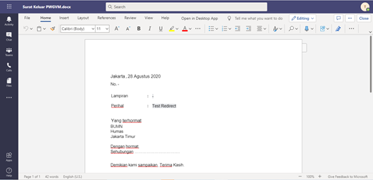
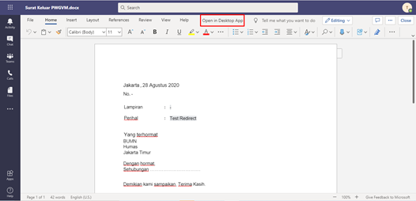
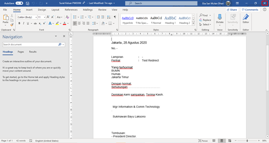
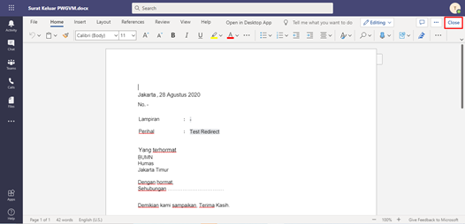
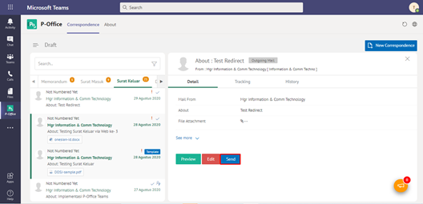

**Role yang sesuai**

- *Approver User*
- *Reviewer User*
- *Member User* (Pekerja)

*User* dapat melakukan *drafting* surat keluar pada aplikasi P-Office. *Drafting* surat keluar dilakukan jika *user* akan meneruskan dan melakukan perubahan pada surat keluar yang sudah disimpan pada menu **Draft**.

## **P-Office Versi Web**

Langkah - langkah untuk melakukan **Drafting** surat keluar via Web adalah sebagai berikut :

1. Klik menu **Draft** dan pilih tab **Surat Keluar**

2. Pilih surat keluar yang akan diubah. Pilih tab **Detail** kemudian klik **Edit**

3. Sistem akan menampilkan *form* **Edit Correspondence**

4. Lakukan perubahan pada *form*. Klik **Simpan** untuk menyimpan perubahan pada *form* surat keluar. Surat yang disimpan akan tersimpan di menu **"Draft - Surat Keluar"**

5. Klik **Ubah Isi** untuk mengubah isi surat keluar

6. Sistem menampilkan tampilan **preview** surat keluar dalam bentuk Word yang dapat di edit. Untuk melakukan *editing* terhadap isi surat klik **Ubah Isi** kemudian sistem akan menampilkan *pop up* konfirmasi **Ubah Word Desktop** atau **Ubah Online**

#### [Edit] Word Desktop

Langkah - langkah untuk mengubah isi surat keluar melalui Word Desktop adalah sebagai berikut.

1. Klik **Ubah di Word** untuk mengubah melalui aplikasi Microsoft Word

2. Lakukan perubahan pada isi surat. Klik **Close** pada aplikasi dan isi surat akan otomatis tersimpan

#### [Edit] Ubah Online

Langkah - langkah untuk mengubah isi surat keluar secara *online* adalah sebagai berikut

1. Klik **Ubah Online** untuk mengubah isi surat secara *online*

2. Lakukan perubahan pada isi surat. Klik Close pada aplikasi

3. Isi surat akan otomatis tersimpan. Jika surat akan disimpan sebagai draft, maka klik **Tutup**

4. Surat yang sudah selesai diubah maka akan tersimpan di menu **"Draft - Surat Keluar"**

## **P-Office Versi Teams**

Langkah - langkah untuk **Drafting** surat keluar via Teams adalah sebagai berikut :

1. Klik menu **Draft** dan pilih tab **Surat Keluar**

2. Pilih surat keluar yang akan diubah. Pilih tab **Detail** kemudian klik **Edit**

3. Sistem akan menampilkan form **Edit Correspondence**

4. Lakukan perubahan pada form. Klik **Save** untuk menyimpan perubahan pada form surat keluar. Surat yang disimpan akan tersimpan di menu **“Draft – Surat keluar”**

5. Klik **Edit Content** untuk mengubah isi surat keluar

6. Sistem menampilkan tampilan preview surat keluar dalam bentuk Word yang dapat di edit. Untuk melakukan editing terhadap isi surat klik **Edit Content** kemudian sistem akan menampilkan pop up konfirmasi Ubah Word Desktop atau Ubah Online

#### **[Edit] Word Desktop**

Langkah – langkah untuk mengubah isi surat keluar melalui Word Desktop adalah sebagai berikut :

1.	Klik **Open In Desktop App** untuk mengubah melalui aplikasi Microsoft Word

2.	Lakukan perubahan pada isi surat. Klik **Close** pada aplikasi Isi surat akan otomatis tersimpan

#### **[Edit] Ubah Online**

Langkah – langkah untuk mengubah isi surat keluar secara online adalah sebagai berikut :

1. Ketika Klik button **Edit Content** maka secara otomatis akan membuka dokumen dan bisa mengubah isi surat secara online

2. Lakukan perubahan pada isi surat

3. Isi surat akan otomatis tersimpan. Jika surat akan disimpan sebagai draft, maka klik **Close**

4. Surat yang sudah selesai diubah maka akan tersimpan di menu **“Draft – Surat Keluar”**

#### **Kirim Surat Keluar**

Langkah – langkah untuk mengirim surat keluar adalah sebagai berikut : 

1.	Pada tampilan preview surat keluar, klik **Send** untuk mengirim surat ke pejabat tujuan

2.	Sistem menyimpan perubahan dan surat keluar akan tersimpan di menu **“Outbox - Surat Keluar”**

## **P-Office Versi Android**

Langkah - langkah untuk **Drafting** surat keluar via Android adalah sebagai berikut :

1. Klik menu **Draft** dan pilih tab **Surat Keluar**

  

2. Pilih surat keluar yang akan diubah.pada tab **Detail** kemudian klik **tombol button** lalu **Edit**

 

3. Sistem akan menampilkan _form_ **Edit Correspondence**
   

4. Lakukan perubahan pada _form_. Klik **Save Mail** untuk menyimpan perubahan pada _form_ surat keluar. Surat yang disimpan akan tersimpan di menu “**Draft – Surat keluar”**
   

5. Klik **Edit Content** untuk mengubah isi surat keluar

6. Sistem menampilkan tampilan _preview_ surat keluar dalam bentuk Word yang dapat di edit. Untuk melakukan _editing_ terhadap isi surat klik **Edit /Send** kemudian sistem akan menampilkan _pop up_ konfirmasi **Ubah Online**

**[Edit] Ubah Online**

Langkah – langkah untuk mengubah isi surat keluar secara _online_ adalah sebagai berikut.

1. Klik **Edit/Send** untuk mengubah isi surat secara _online_

2. Lakukan perubahan pada isi surat lalu sistem akan menampilkan pop up  P-Office Editing Document pilih **Yes**

3. Isi surat akan otomatis tersimpan. Jika surat akan disimpan sebagai draft, maka klik **Close**
   

4. Surat yang sudah selesai diubah maka akan tersimpan di menu “**Draft – Surat Keluar”**

**Kirim Surat Keluar**

1. Pada tampilan _preview_ surat keluar, klik **Kirim** untuk mengirim surat ke pejabat tujuan

2. Sistem menyimpan perubahan dan surat keluar akan tersimpan di menu “**Outbox - Surat Keluar**”

## **P-Office Versi IOS**

Langkah-langkah untuk melakukan **Drafting** surat keluar via IOS adalah sebagai berikut :

1.	Klik menu **Draft** dan pilih tab **Surat Keluar**

 

2.	Pilih surat keluar yang akan diubah. Pilih icon **Option** kemudian pilih **Edit**

 

3.	Sistem akan menampilkan _form_ **Edit Surat Keluar.** Lakukan perubahan pada _form_ kemudian klik **Save** untuk menyimpan perubahan pada _form_ surat keluar

 

4.	Setelah selesai, klik **Edit Content** untuk melakukan perubahan pada isi konten surat keluar.

5.	Sistem akan menampilkan tampilan _preview_ surat keluar dalam bentuk Word yang dapat di edit. Untuk melakukan _editing_ terhadap isi surat klik **Edit/Send**

6.	Sistem akan menampilkan _pop up _notifikasi editing dokumen, klik **Yes** untuk menutup _pop up_ notifikasi

7.	Surat keluar yang sudah di ubah akan tersimpan dimenu “**Draft – Surat Keluar**”