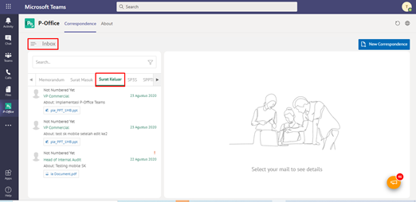

**Role yang sesuai**

- *Approver User*
- *Reviewer User*

*User* dapat mengembalikan surat keluar ke sebelumnya jika hasil review belum / tidak sesuai. Surat akan dikembalikan ke satu level *reviewer* sebelumnya atau ke konseptor (apabila hanya ada satu *reviewer*). Langkah - langkah untuk mengembalikan surat keluar ke sebelumnya adalah sebagai berikut

1. Klik menu **Inbox** dan pilih tab **Surat Keluar**

2. Pilih surat keluar yang akan ditindak lanjuti kemudian pilih tab **Detail**

3. Klik tombol **Revise Previous** dan pilih **Send**. Isikan komentar jika diperlukan

4. Sistem berhasil menyimpan perubahan. Surat keluar yang sudah di kirim akan tersimpan di menu **Outbox- Surat keluar** dan penerima pengembalian surat keluar akan menerima surat keluar di menu **Draft - Surat keluar**

## **P-Office Versi Teams**

Langkah - langkah untuk Kembalikan kesebelumnya via Teams yaitu :

 1.    Klik menu **Inbox** dan pilih tab **Surat Keluar**
 

 2.    Pilih surat keluar yang akan ditindak lanjuti kemudian pilih tab **Detail**
 

 3.    Klik tombol **Return Previus** dan pilih **Send**. Isikan komentar jika diperlukan
 

 4.    Sistem berhasil menyimpan perubahan. Surat keluar yang sudah di kirim akan tersimpan di menu **Outbox - Surat keluar** dan penerima pengembalian surat keluar akan menerima surat keluar di menu **Draft - Surat keluar**
