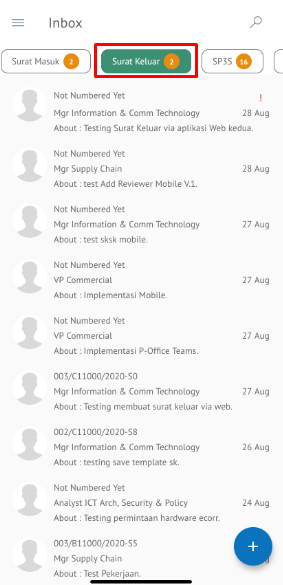

Role yang sesuai

- *Approver User*
- *Reviewer User*

*User* dapat mengembalikan surat keluar ke konseptor jika hasil review belum / tidak sesuai. 

## **P-Office Versi Web**

Langkah - langkah untuk mengembalikan surat keluar ke konseptor via Web adalah sebagai berikut

1. Klik menu **Inbox** dan pilih tab **Surat Keluar**

2. Pilih surat keluar yang akan ditindak lanjuti kemudian pilih tab **Detail**

3. Klik tombol **Revise Conceptor** dan pilih **Send**. Isikan komentar jika diperlukan

4. Sistem berhasil menyimpan perubahan. Surat keluar yang sudah di kirim akan tersimpan di menu **Outbox- Surat Keluar** dan konseptor akan menerima surat keluar di menu **Draft - Surat Keluar**

## **P-Office Versi Teams**

Langkah - langkah untuk kembalikan konseptor via Teams adalah sebagai berikut :

1. Klik menu **Inbox** dan pilih tab **Surat Keluar**

2. Pilih surat keluar yang akan ditindak lanjuti kemudian pilih tab **Detail**

3. Klik tombol **Return Conceptor** dan pilih **Send**. Isikan komentar jika diperlukan
 

4. Sistem berhasil menyimpan perubahan. Surat keluar yang sudah di kirim akan tersimpan di menu **Outbox - Surat keluar** dan penerima pengembalian surat keluar akan menerima surat keluar di menu **Draft - Surat keluar**

## **P-Office Versi Android**

Langkah-langkah untuk melihat informasi surat keluar via Android adalah sebagai berikut :

1. Klik menu **Inbox **dan pilih tab **Surat keluar**

 

2. Pilih surat keluar yang akan ditindak lanjuti kemudian pilih icon **Option**

 

3. Klik tombol **Revise to Conceptor** dan pilih **Send** Isikan komentar jika diperlukan

4. Sistem berhasil menyimpan perubahan. Surat keluar yang sudah di kirim akan tersimpan di menu **Outbox- Surat Keluar**dan konseptor akan menerima surat keluar di menu **Draft – Surat Keluar**

## **P-Office Versi IOS**

Langkah-langkah untuk mengembalikan surat keluar ke konseptor via IOS adalah sebagai berikut

1.	Klik menu **Inbox** dan pilih tab **Surat keluar**

 

2.	Pilih surat keluar yang akan ditindak lanjuti kemudian pilih icon **Option** dan pilih **Revise to Conceptor**

 

3.	Isikan komentar jika diperlukan kemudian klik **Send** untuk menyimpan perubahan. Surat keluar yang sudah di kirim akan tersimpan di menu **Rejected - Surat Keluar**

