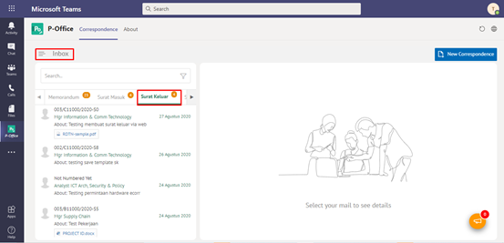

**Role yang sesuai**

- *Approver User*
- *Reviewer User*
- *Member User* (Pekerja)

*User* dapat melihat daftar surat keluar pada pada menu **Inbox, Draft atau Outbox** pada masing - masing akun. Langkah - langkah untuk melihat daftar surat keluar adalah sebagai berikut

1. Klik menu **Inbox / Draft / Outbox** dan pilih tab **Surat Keluar**

## **P-Office Versi Teams**

Langkah - langkah untuk daftar surat keluar via Teams yaitu :

 1.	Klik menu **Inbox / Draft / Outbox** dan pilih tab **Surat Keluar**

 
