**Role yang sesuai**

- *Approver User*
- *Reviewer User*
- *Member User* (Pekerja)

*User* dapat melihat informasi lengkap surat keluar termasuk *preview* surat keluar, detail surat keluar, *tracking* surat keluar dan *history* surat keluar. Langkah - langkah untuk melihat informasi surat keluar adalah sebagai berikut

1. Klik menu **Inbox/Draft/Outbox** dan pilih tab **Surat Keluar**. Pilih salah satu surat keluar yang akan dilihat informasinya

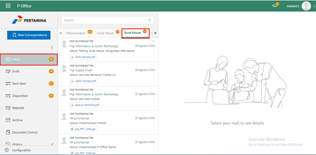

#### Preview Surat Keluar

Pada tab informasi *Preview* surat keluar, ditampilkan *preview* surat keluar yang sudah dibuat. *Preview* surat keluar disesuaikan dengan template berdasarkan jenis surat

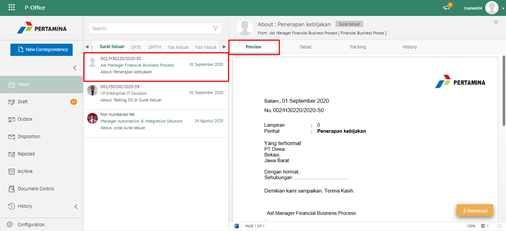

#### Detail Surat Keluar

Pada tab Detail surat keluar, terdapat informasi asal surat, perihal, file lampiran, nomor surat, klasifikasi surat, tanggal surat, tujuan surat dan *reviewer*

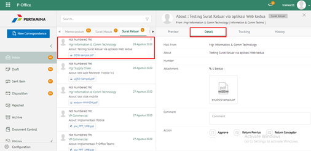

#### Tracking Surat Keluar

Pada tab *Tracking* surat keluar, ditampilkan informasi *tracking* surat keluar dalam bentuk *chart*

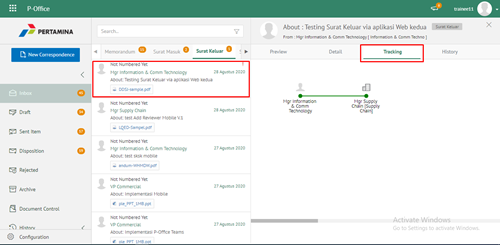

#### History Surat Keluar

Pada tab *History* surat keluar, ditampilkan riwayat surat keluar yang terdapat informasi jabatan, tanggal, tindakan dan komentar

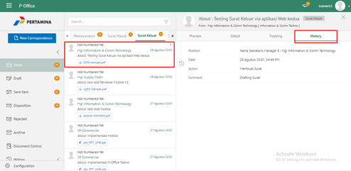

## **P-Office Versi Teams**

Langkah - langkah untuk melihat informasi surat keluar via Teams yaitu :

1. Klik menu **Inbox/Draft/Outbox** dan pilih tab Surat Keluar. Pilih salah satu surat keluar yang akan dilihat informasinya

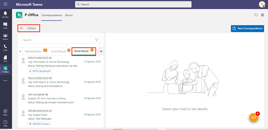

#### **Preview Surat Keluar**

  Pada button **Preview** surat keluar, ditampilkan preview surat keluar yang sudah dibuat. Preview surat keluar disesuaikan dengan template berdasarkan jenis surat.
  
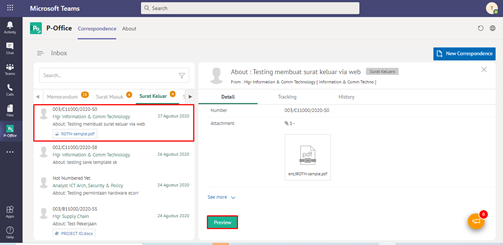
  
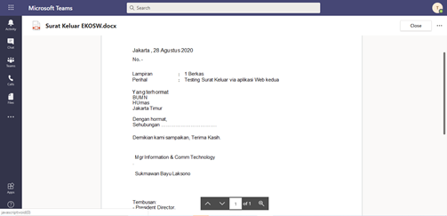

#### **Detail Surat Keluar**

  Pada tab Detail surat keluar, terdapat informasi asal surat, perihal, file lampiran, nomor surat, klasifikasi surat, tanggal surat, tujuan surat dan reviewer
  
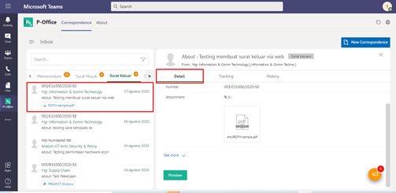

  
#### **Tracking Surat Keluar**

  Pada tab tracking surat keluar, ditampilkan informasi tracking surat keluar dalam bentuk chart
  
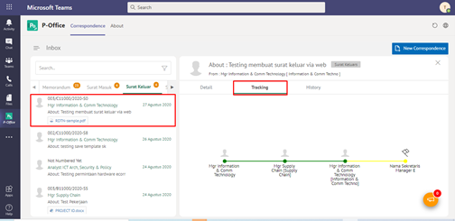

#### **History Surat Keluar**

  Pada tab History surat keluar, ditampilkan riwayat surat keluar yang terdapat informasi jabatan, tanggal, tindakan dan komentar
  
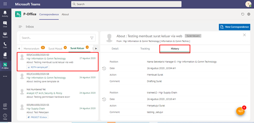

## **P-Office Versi Android**

Langkah-langkah untuk melihat informasi surat keluar adalah sebagai berikut :

1. 	Klik menu **Inbox/Draft/Outbox **dan pilih tab **Surat Keluar.**
   
 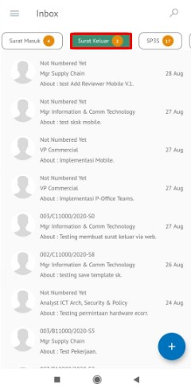

**Detail Surat Keluar**

Klik pada salah satu surat untuk melihat Detail surat keluar, terdapat informasi asal surat, perihal, file lampiran, nomor surat, klasifikasi surat, tanggal surat, tujuan surat dan _reviewer_

 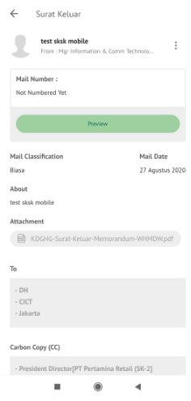

**Preview Surat Keluar**

Pada tab informasi _Preview_ surat keluar, ditampilkan _preview_ surat keluar yang sudah dibuat. _Preview_ surat keluar disesuaikan dengan template berdasarkan jenis surat.

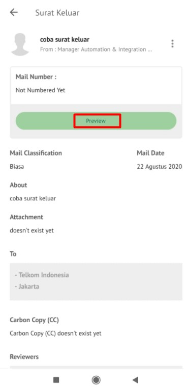 

**Tracking Surat Keluar**

Pada tab _tracking_ surat keluar, ditampilkan informasi _tracking_ surat keluar dalam bentuk _chart_

**History Surat Keluar**

Pada tab _History_ surat keluar, ditampilkan riwayat surat keluar yang terdapat informasi jabatan, tanggal, tindakan dan komentar

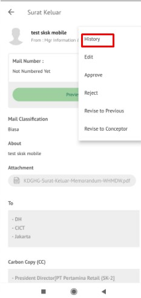 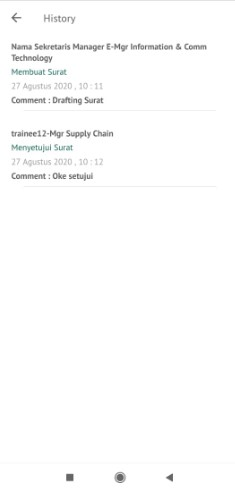

## **P-Office Versi IOS**

**Melihat Informasi Lengkap Surat Keluar**

Langkah-langkah untuk melihat informasi surat keluar adalah sebagai berikut.

1.	Klik menu **Inbox/Draft/Outbox **dan pilih tab **Surat Keluar. **Pilih salah satu surat keluar yang akan dilihat informasinya

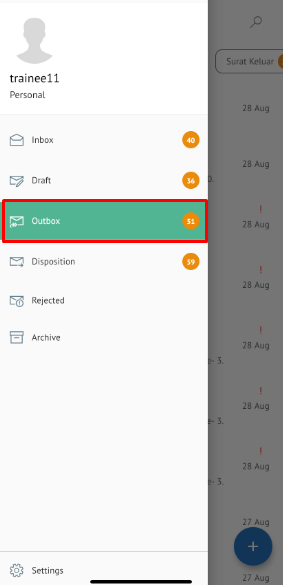
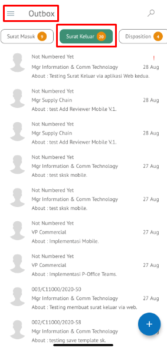

**Preview Surat Keluar**

Pada tab informasi _Preview_ surat keluar, ditampilkan _preview_ surat keluar yang sudah dibuat. _Preview_ surat keluar disesuaikan dengan template berdasarkan jenis surat.

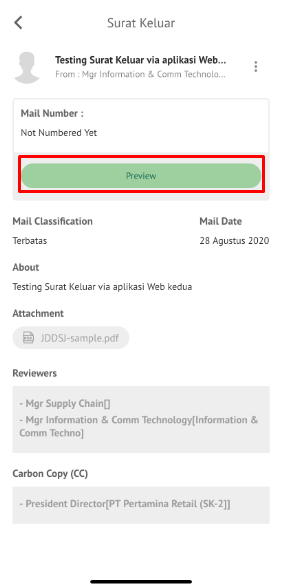

**Detail Surat Keluar**

Pada tab Detail surat keluar, terdapat informasi asal surat, perihal, file lampiran, nomor surat, klasifikasi surat, tanggal surat, tujuan surat dan _reviewer_

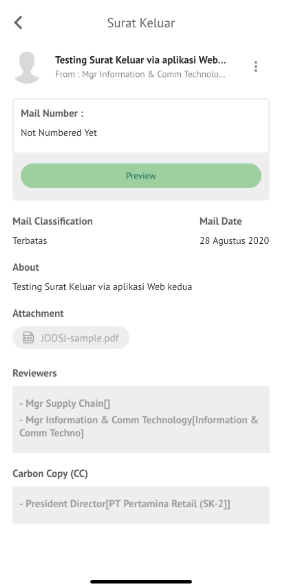

**History Surat Keluar**

Pada tab _History_ surat keluar, ditampilkan riwayat surat keluar yang terdapat informasi jabatan, tanggal, tindakan dan komentar

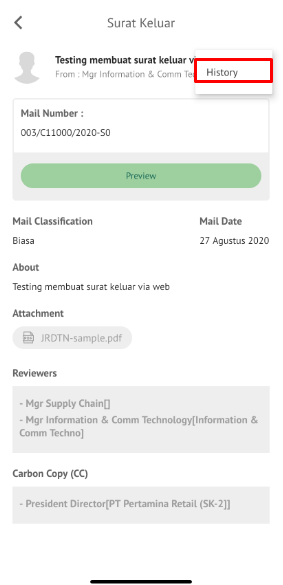
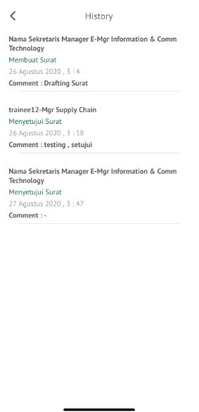
