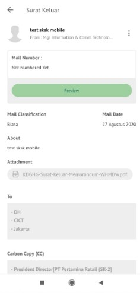

**Role yang sesuai**

- *Approver User*

*User* dapat mengesahkan surat keluar yang sudah dikirim dan direview oleh reviewer. Keluaran untuk tindak lanjut ini adalah untuk men-*generate* nomor surat keluar kemudian surat keluar dapat dikirimkan ke pejabat tujuan. 

## **P-Office Versi Web**

Langkah - langkah untuk menambah reviewer surat keluar via Web adalah sebagai berikut:

1. Klik menu **Inbox** dan pilih tab **Surat Keluar**

2. Pilih surat keluar yang akan ditindak lanjuti kemudian pilih tab **Detail**. Pada tab **Detail** terdapat informasi nomor surat yang masih bersifat sementara. Nomor inilah yang akan ter-*generate* jika user menyetujui surat keluar

3. Klik **Approve** kemudian pilih **Send**

4. Sistem menampilkan *form* Validation of Digital Signature kemudian isikan alamat email untuk mengirim kode OTP validasi digital signature

5. Buka email dan salin kode OTP pada form P-Office kemudian klik **Sign**
 

6. Surat keluar yang sudah disetujui akan tersimpan di menu **"Outbox - Surat Keluar"** pengirim sedangkan surat keluar akan tersimpan di menu **"Inbox - Surat Keluar"** penerima

## **P-Office Versi Teams**

Langkah - langkah untuk mengesahkan surat keluar via Teams adalah sebagai berikut :

1. Klik menu **Inbox** dan pilih tab **Surat Keluar**

2. Pilih surat keluar yang akan ditindak lanjuti kemudian pilih tab **Detail**. Pada tab **Detail** terdapat informasi nomor surat yang masih bersifat sementara. Nomor inilah yang akan tergenerate jika user menyetujui surat keluar
 

3. Klik **Approve** kemudian pilih **Send**
 

4.	Sistem akan menampilkan form Validation of Digital Signature

 
5.	Kemudian isikan NIK dan PassPhrase pada form P-Office kemudian klik **Sign**
 

6.	Surat keluar yang sudah disetujui akan tersimpan di menu **“Outbox – Surat keluar”** pengiriman sedangkan surat keluar akan tersimpan di menu **“Inbox – Surat keluar”** penerima

## **P-Office Versi Android**

Langkah-langkah untuk mengesahkan surat keluar via Android adalah sebagai berikut :

1. Klik menu **Inbox** dan pilih tab **Surat Keluar**

 

2. Pilih surat keluar yang akan ditindak lanjuti kemudian pilih tab **Detail**. Pada tab **Detail** terdapat informasi nomor surat yang masih bersifat sementara. Nomor inilah yang akan tergenerate jika user menyetujui surat keluar

 !

3.pilih tombol **button** kemudian **Approve** 

 

4. Sistem akan menampilkan form Approve Mail & Signing Documents
   

5. Kemudian isikan **NIK** dan **PassPhrase** pada form P-Office kemudian klik **Send**
   

. Surat keluar yang sudah disetujui akan tersimpan di menu “**Outbox - Surat Keluar**” pengirim sedangkan surat keluar akan tersimpan di menu “**Inbox - Surat Keluar**” penerima.

## **P-Office Versi IOS**

Langkah-langkah untuk mengesahkan surat keluar via IOS adalah sebagai berikut :

1.	Klik menu **Inbox** dan pilih tab **Surat Keluar**

 

2.	Pilih surat keluar yang akan ditindak lanjuti, pada detail surat keluar terdapat informasi nomor surat yang masih bersifat sementara. Nomor inilah yang akan ter-_generate_ jika _user_ menyetujui surat keluar.

 

3. Sistem menampilkan *form* Approve Mail & Signing Documents. Isikan komentar, NIK dan Pass Phrase kemudian klik **Send**

4. Nomor surat keluar akan ter-_generate_ sesuai dengan nomor sementara pada detail. Surat keluar yang sudah disetujui akan tersimpan di menu “**Outbox - Surat Keluar**” pengirim sedangkan surat keluar akan tersimpan di menu “**Inbox - Surat Keluar**” penerima.
