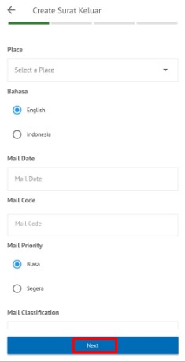
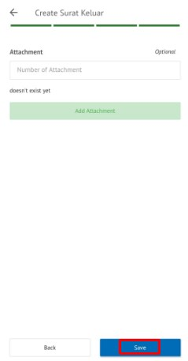

**Role yang sesuai**

- *Member User* (Pekerja)

*User* dapat menyimpan surat sebagai *template*. *Template* ini digunakan jika sewaktu - waktu *user* akan melanjutkan surat keluar yang sudah dibuat dan diubah kembali kemudian dikirimkan kepejabat tujuan tanpa harus mengisi *form* surat keluar. 

## **P-Office Versi Web**

Langkah - langkah untuk Save as template via Web adalah sebagai berikut :

1. Isi *form* surat keluar dan klik **Save as Template**

2. Surat keluar yang disimpan menjadi *template* akan tersimpan di menu **"Draft - Surat Keluar"**. Untuk melanjutkan *template* yang sudah dibuat *user* dapat memilih menu **"Draft - Surat Keluar"** kemudian pilih *template* yang akan digunakan

3. Pilih tombol **Use Template** untuk melanjutkan edit surat

4. Sistem akan menampilkan form **Edit Correspondence**, klik **Save** untuk menyimpan perubahan

5. Lakukan perubahan pada surat, klik **Save** untuk menyimpan perubahan dan surat akan tersimpan di menu **"Draft - Surat Keluar"** sebagai draft atau klik **Send** untuk mengirimkan ke pejabat tujuan dan tersimpan di menu **"Outbox - Surat Keluar"**.

## **P-Office Versi Teams**

Langkah - langkah untuk save as template via Teams adalah sebagai berikut :

1.	Isi form surat keluar dan klik **Save Template**
 

2.	Surat keluar yang disimpan menjadi template akan tersimpan di menu **“Draft – Surat Keluar”**. Untuk melanjutkan template yang sudah dibuat user dapat memilih menu **“Draft – Surat Keluar”** kemudian pilih template yang akan digunakan
 

3.	Pilih tombol **Use Template** untuk melanjutkan edit surat
 

4.	Sistem akan menampilkan form Edit Correspondence, klik **Save** untuk menyimpan perubahan
 

5.	Lakukan perubahan pada surat, klik **Save** untuk menyimpan perubahan dan surat akan tersimpan di menu **“Draft – Surat Keluar”** sebagai draft atau klik **Send** untuk mengirimkan ke pejabat tujuan dan tersimpan di menu **“Outbox – Surat Keluar”**.

## **P-Office Versi Android**

Langkah – langkah untuk save as template via Android adalah sebagai berikut : 

1. 	Isi _form_ surat keluar dan klik **Save as Template**

   

2. Surat keluar yang disimpan menjadi _template_ akan tersimpan di menu “**Draft – Surat Keluar”** Untuk melanjutkan _template_ yang sudah dibuat _user_ dapat memilih menu “**Draft – Surat Keluar**” kemudian pilih _template_ yang akan digunakan
   
 

3. Pilih tombol **Use Template** untuk melanjutkan edit surat
   
  

4. Sistem akan menampilkan form **use template,** klik **Save Mail** untuk menyimpan perubahan

 

5. Lakukan perubahan pada surat, klik **Simpan** untuk menyimpan perubahan dan surat akan tersimpan di menu **“Draft – Surat Keluar”** sebagai draft atau klik **Send** untuk mengirimkan ke pejabat tujuan dan tersimpan di menu **“Outbox – Surat Keluar”.**

## **P-Office Versi IOS**

Langkah – langkah untuk Save as Template via IOS adalah sebagai berikut :

1.	Isi _form_ surat keluar dan klik **Save as Template**

 

2.	Surat keluar yang disimpan menjadi _template_ akan tersimpan di menu “**Draft – Surat Keluar”.** Untuk melanjutkan _template_ yang sudah dibuat _user_ dapat memilih menu “**Draft – Surat Keluar**” kemudian pilih _template _yang akan digunakan

 

3.	Pilih icon **Option** kemudian pilih **Use Template** untuk melanjutkan edit surat

 

4.	Sistem akan menampilkan form **Edit Surat Keluar**, klik **Save** untuk menyimpan perubahan

5.	Lakukan perubahan pada surat, klik **Save** untuk menyimpan perubahan dan surat akan tersimpan di menu **“Draft – Surat Keluar”** sebagai draft atau klik **Send** untuk mengirimkan ke pejabat tujuan dan tersimpan di menu **“Outbox – Surat Keluar”.**