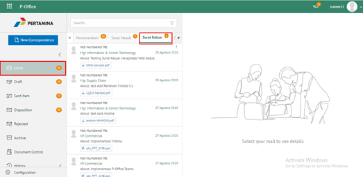
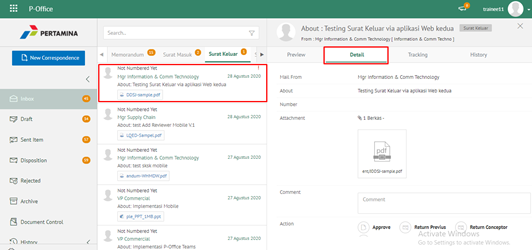
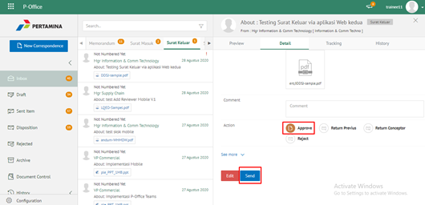
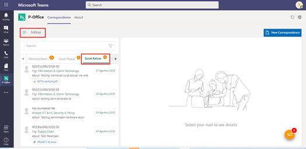
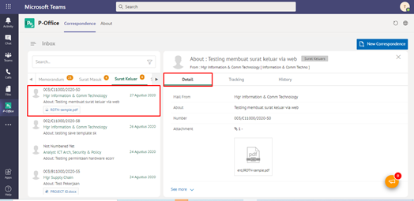
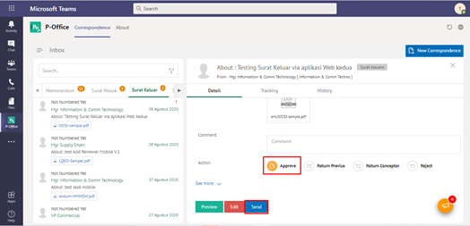

**Role yang sesuai**

- *Approver User*
- *Reviewer User*

*User* dapat menyetujui surat keluar yang sudah dilakukan review dan surat keluar akan dikirimkan ke *reviewer* selanjutnya atau *approver*. Langkah - langkah untuk menyetujui surat keluar adalah sebagai berikut

1. Klik menu **Inbox** dan pilih tab **Surat Keluar**

2. Pilih surat keluar yang akan ditindak lanjuti kemudian pilih tab **Detail**

3. Klik tombol **Setujui** dan pilih **Send**. Isikan komentar jika diperlukan

4. Sistem berhasil menyimpan perubahan. Surat keluar yang sudah di kirim akan tersimpan di menu **Outbox - Surat Keluar**

## **P-Office Versi Teams**

Langkah - langkah untuk setujui surat keluar via Teams yaitu :

 1.    Klik menu **Inbox** dan pilih tab **Surat Keluar**
 

 2.    Pilih surat keluar yang akan ditindak lanjuti kemudian pilih tab **Detail**
 

 3.    Klik tombol **Approve** dan pilih **Send**. Isikan komentar jika diperlukan
 

 4. Sistem berhasil menyimpan perubahan. Surat keluar yang sudah di kirim akan tersimpan di menu **Outbox- Surat Keluar**
