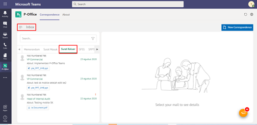
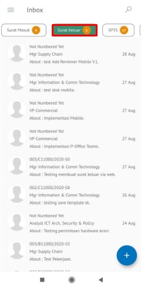
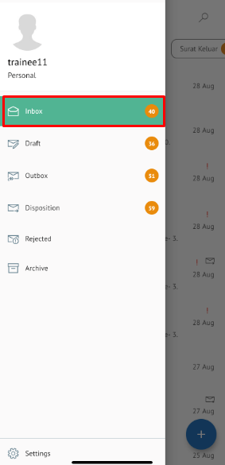

**Role yang sesuai**

- *Approver User*

*User* dapat menambahkan reviewer kemudian surat keluar akan diteruskan ke reviewer baru.

## **P-Office Versi Web**

Langkah - langkah untuk menambah reviewer surat keluar via Web adalah sebagai berikut :

1. Klik menu **Inbox** dan pilih tab **Surat Keluar**

2. Pilih surat keluar yang akan ditindak lanjuti kemudian pilih tab **Detail**

3. Klik tombol **Add Reviewer** dan pilih pejabat yang akan melakukan review dengan meng-klik tombol "+" pada field **Add Reviewer**

4. Sistem akan menampilkan pejabat untuk dijadikan reviewer baru

5. Pilih **Send** untuk mengirimkan kepada pejabat/reviewer yang dituju dan surat keluar akan tersimpan di menu **"Outbox - Surat Keluar"**. Untuk pejabat/reviewer baru akan menerima surat keluar di menu **"Inbox - Surat Keluar"**

## **P-Office Versi Teams**

Langkah - langkah untuk tambah reviwer baru via Teams adalah sebagai berikut :

1. Klik menu **Inbox** dan pilih tab **Surat Keluar**
 

2. Pilih surat keluar yang akan ditindak lanjuti kemudian pilih tab **Detail**
 

1. Klik tombol **Add Reviewer** dan pilih pejabat yang akan melakukan review dengan meng-klik tombol “+” pada field **Add Reviewer**
 

4. Sistem akan menampilkan pejabat untuk dijadikan reviewer baru
 

1. Pilih **Send** untuk mengirimkan kepada pejabat/reviewer yang dituju dan surat keluar akan tersimpan di menu **“Outbox - Surat Keluar”**. Untuk pejabat/reviewer baru akan menerima surat keluar di menu **“Inbox – Surat Keluar”**
 

## **P-Office Versi Android**

Langkah-langkah untuk menambahkan Reviewer baru surat keluar via Android adalah sebagai berikut :

1. Klik menu **Inbox** dan pilih tab **Surat Keluar**

 

2. Pilih surat keluar yang akan ditindak lanjuti kemudian icon **Option**
   
 

3. Klik tombol **Add Reviewer** dan pilih pejabat yang akan melakukan review dengan meng-klik tombol **Add Reviewer**
   
 

4. Sistem akan menampilkan pejabat untuk dijadikan reviewer baru

 

5. Pilih **Send** untuk mengirimkan kepada pejabat/reviewer yang dituju dan surat keluar akan tersimpan di menu “**Outbox - Surat Keluar**”. Untuk pejabat/reviewer baru akan menerima surat keluar di menu “**Inbox – Surat Keluar**”

## **P-Office Versi IOS**

Langkah-langkah untuk menambah reviewer surat keluar via IOS adalah sebagai berikut

1.	Klik menu **Inbox** dan pilih tab **Surat Keluar**

 

2.	Pilih surat keluar yang akan ditindak lanjuti kemudian pilih icon **Option** dan pilih **Add Reviewer**

 

3.	Klik **Add Reviewer** untuk menampilkan daftar pejabat yang akan dipilih sebagai reviewer baru

4.	Klik Submit untuk mengirimkan kepada pejabat/reviewer yang dituju dan surat keluar akan tersimpan di menu “**Outbox - Surat Keluar**”. Untuk pejabat/reviewer baru akan menerima surat keluar di menu “**Inbox – Surat Keluar**”

