### Menambah Surat Keluar

**Ditujukan kepada**

- *Approver User*
- *Reviewer User*

**Role yang sesuai**

- *Member User* (Pekerja)

Konseptor dapat menambah surat keluar pada aplikasi P-Office.

## **P-Office Versi Web**

Langkah-langkah untuk menambah surat keluar via Web adalah sebagai berikut:

1. Klik menu **New Correspondence**

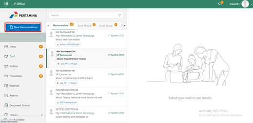

2. Pilih jenis surat **"Surat Keluar"**

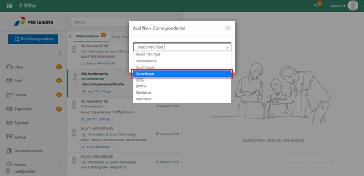

3. Isi *form* tambah surat keluar. Terdapat bebarapa aksi untuk menindaklanjuti surat keluar yang sudah diisi *form*nya yaitu **Send**, **Save** dan **Save as Template**

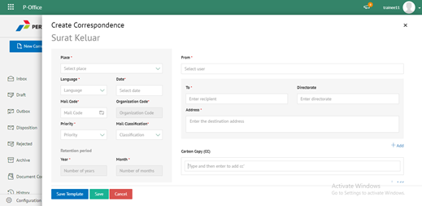

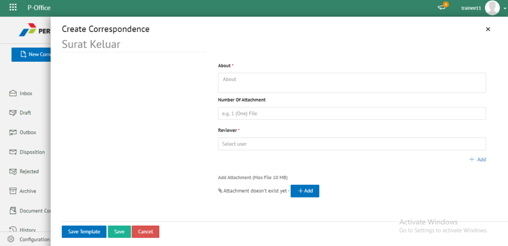

#### Simpan Surat Keluar

Langkah - langkah untuk menyimpan surat keluar adalah sebagai berikut

1. Isi *form* surat keluar kemudian klik **Simpan**

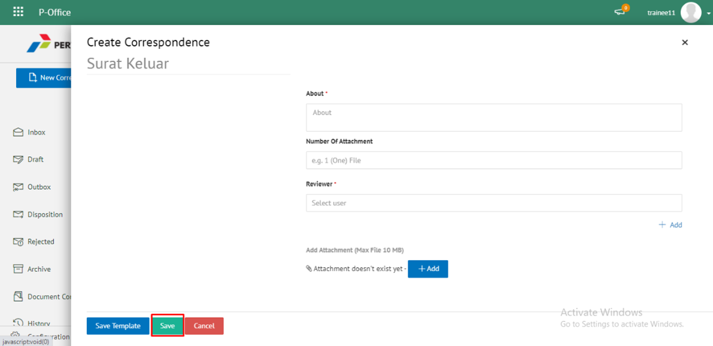

2. Sistem akan menampilkan tampilan *preview* surat keluar dalam bentuk Word yang dapat di edit. Untuk melakukan *editing* terhadap isi surat klik **Ubah Isi** kemudian sistem akan menampilkan *pop up* konfirmasi **Ubah Word Desktop** atau **Ubah Online**

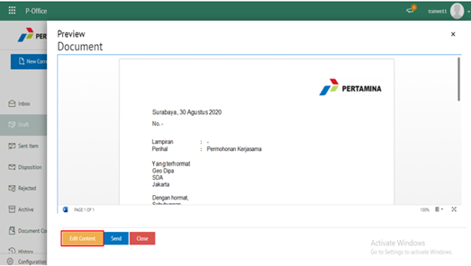

##### [Edit] Word Desktop

Langkah - langkah untuk mengubah isi surat keluar melalui Word Desktop adalah sebagai berikut

1. Klik **Ubah di Word** untuk mengubah melalui aplikasi Microsoft Word

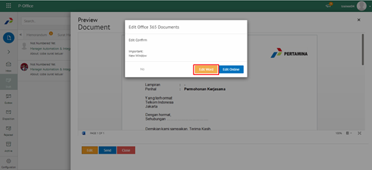

2. Lakukan perubahan pada isi surat. Klik **Close** pada aplikasi Isi surat akan otomatis tersimpan

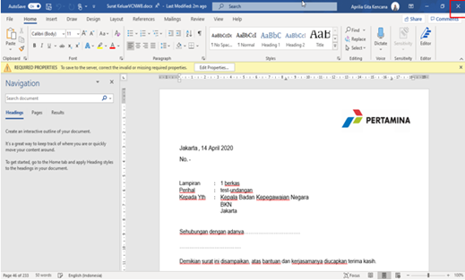

##### [Edit] Ubah Online

Langkah - langkah untuk mengubah isi surat keluar secara *online* adalah sebagai berikut

1. Klik **Ubah Online** untuk mengubah isi surat secara *online*

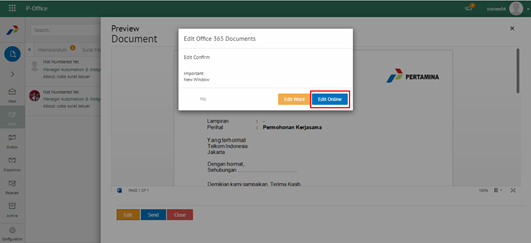

2. Lakukan perubahan pada isi surat. Klik **Close** pada aplikasi

3. Isi surat akan otomatis tersimpan. Jika surat akan disimpan sebagai draft, maka klik **Tutup**  

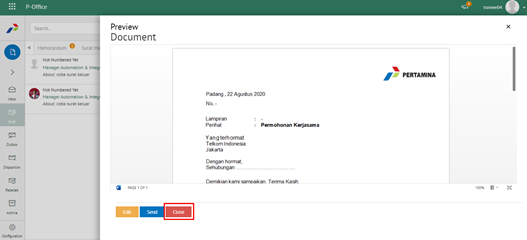

4. Surat yang sudah selesai diubah maka akan tersimpan di menu **"Draft - Surat Keluar"**

#### Kirim Surat Keluar

Langkah - langkah untuk mengirim surat keluar adalah sebagai berikut

1. Pada tampilan *preview* surat keluar, klik **Kirim** untuk mengirim surat ke pejabat tujuan

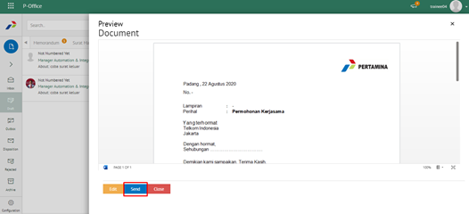

2. Sistem menyimpan perubahan dan surat keluar akan tersimpan di menu **"Outbox - Surat Keluar"**

## **P-Office Versi Teams**

Langkah - langkah untuk tambah surat keluar via Teams yaitu :

1. Klik menu **New Correspondence**

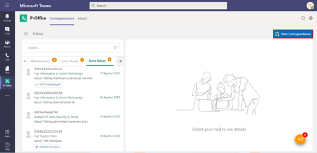

2. Pilih jenis surat **“Surat Keluar”**

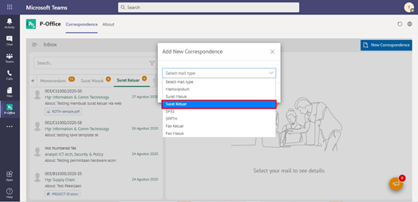

3. Isi form tambah surat keluar. Terdapat bebarapa aksi untuk menindaklanjuti surat keluar yang sudah diisi formnya yaitu **Save Surat Keluar, Cancel Surat Keluar** dan **Save Template Surat Keluar**

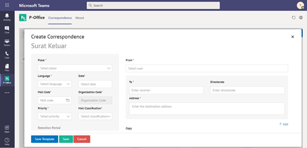

#### **Simpan Surat Keluar**

Langkah – langkah untuk menyimpan surat keluar adalah sebagai berikut :
 
1.	Isi form surat keluar kemudian klik **Save**

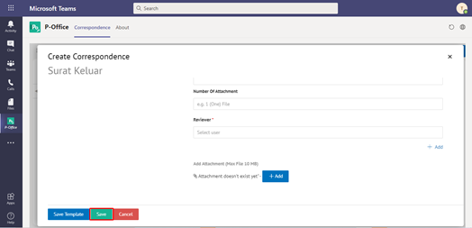

2.	Sistem akan menampilkan tampilan preview surat keluar dalam bentuk Word yang dapat di edit. Untuk melakukan editing terhadap isi surat klik **Edit Content** kemudian sistem akan menampilkan pop up konfirmasi Ubah Word Desktop atau Ubah Online

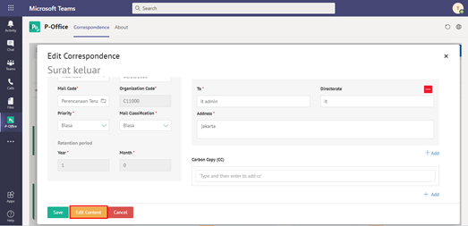

#### **[Edit] Word Desktop**

Langkah – langkah untuk mengubah isi surat keluar melalui Word Desktop adalah sebagai berikut :

1.	Klik **Open In Desktop App** untuk mengubah melalui aplikasi Microsoft Word

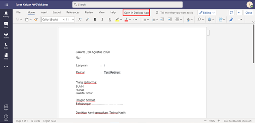

2.	Lakukan perubahan pada isi surat. Klik **Close** pada aplikasi Isi surat akan otomatis tersimpan

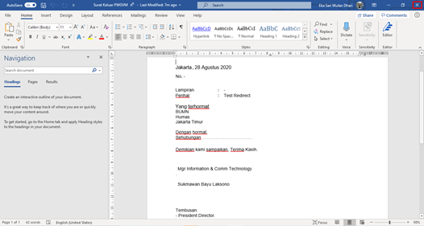

#### **[Edit] Ubah Online**

Langkah – langkah untuk mengubah isi surat keluar secara online adalah sebagai berikut :

1. Ketika Klik button **Edit Content** maka secara otomatis akan membuka dokumen dan bisa mengubah isi surat secara online

2. Lakukan perubahan pada isi surat.**

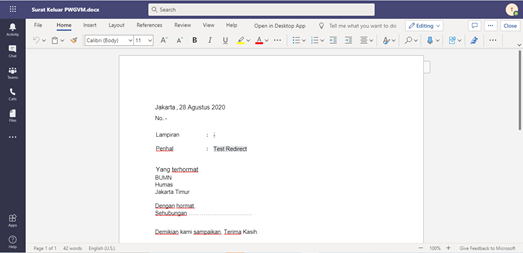

3. Isi surat akan otomatis tersimpan. Jika surat akan disimpan sebagai draft, maka klik **Close**

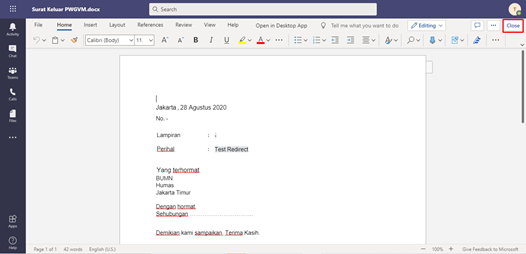

4. Surat yang sudah selesai diubah maka akan tersimpan di menu **“Draft – Surat Keluar”**

#### **Kirim Surat Keluar**

Langkah – langkah untuk mengirim surat keluar adalah sebagai berikut : 

 1.	Pada tampilan preview surat keluar, klik **Send** untuk mengirim surat ke pejabat tujuan

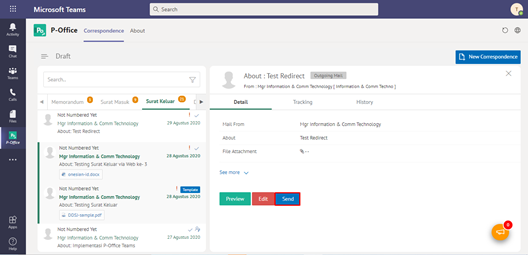

2.	Sistem menyimpan perubahan dan surat keluar akan tersimpan di menu **“Outbox - Surat Keluar”**

## **P-Office Versi Android**

Langkah - langkah untuk menambah surat keluar via Android yaitu:

1. Klik **ikon (+)** pada surat keluar
   
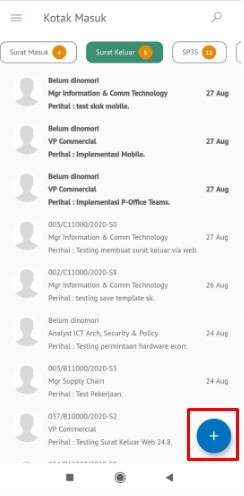

2. Pilih jenis surat “**Surat Keluar**” lalu klik **Selanjutnya**

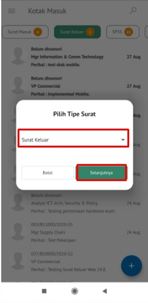 

3. Isi _form_ tambah surat keluar. Terdapat bebarapa aksi untuk menindaklanjuti surat keluar yang sudah diisi _form_nya yaitu **Simpan Surat Keluar**, **Kirim Surat Keluar**dan **Save as Template** Surat Keluar

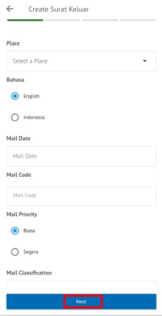  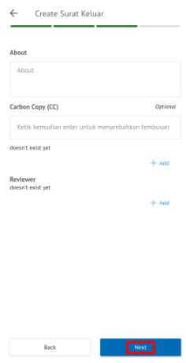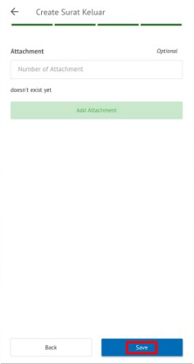

**Simpan Surat Keluar**

 Langkah – langkah untuk menyimpan surat keluar adalah sebagai berikut.
1. Isi _form_ surat keluar kemudian klik **Simpan**

 

2. Surat keluar akan tersimpan di menu **Draft - Surat Keluar** 

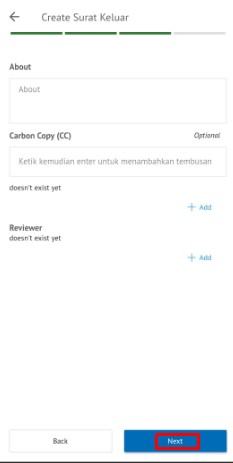 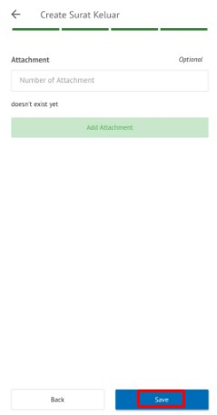 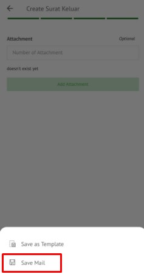

## **P-Office Versi IOS**

**Menambah Surat Keluar**

Langkah-langkah untuk menambah surat keluar adalah sebagai berikut.

1.	Klik menu **New Correspondence**

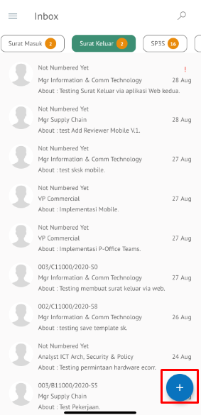

2.	Pilih jenis surat “**Surat Keluar**” kemudian pilih **Next**

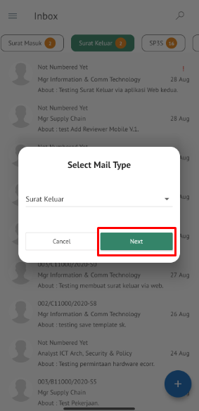

3.	Isi _form_ tambah surat keluar. Terdapat bebarapa aksi untuk menindaklanjuti surat keluar yang sudah diisi _form_nya yaitu **Simpan Surat Keluar**, **Kirim Surat Keluar **dan **Save as Template Surat Keluar.**

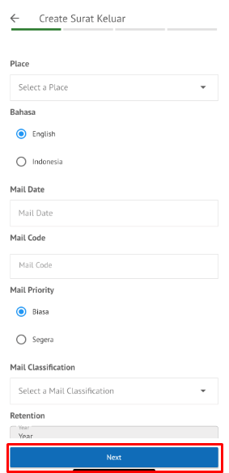

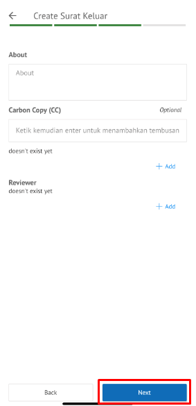
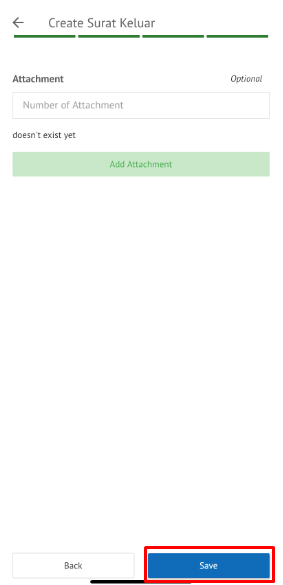