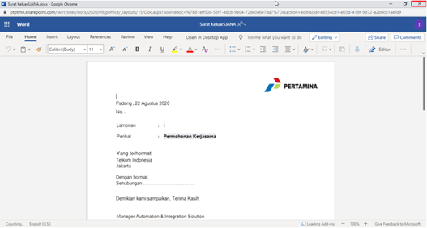

### Menambah Surat Keluar

**Ditujukan kepada**

- *Approver User*
- *Reviewer User*

**Role yang sesuai**

- *Member User* (Pekerja)

Konseptor dapat menambah surat keluar pada aplikasi P-Office.

## **P-Office Versi Web**

Langkah-langkah untuk menambah surat keluar via Web adalah sebagai berikut:

1. Klik menu **New Correspondence**

2. Pilih jenis surat **"Surat Keluar"**

3. Isi *form* tambah surat keluar. Terdapat bebarapa aksi untuk menindaklanjuti surat keluar yang sudah diisi *form*nya yaitu **Send**, **Save** dan **Save as Template Surat Keluar**

#### Simpan Surat Keluar

Langkah - langkah untuk menyimpan surat keluar adalah sebagai berikut

1. Isi *form* surat keluar kemudian klik **Simpan**

2. Sistem akan menampilkan tampilan *preview* surat keluar dalam bentuk Word yang dapat di edit. Untuk melakukan *editing* terhadap isi surat klik **Ubah Isi** kemudian sistem akan menampilkan *pop up* konfirmasi **Ubah Word Desktop** atau **Ubah Online**

##### [Edit] Word Desktop

Langkah - langkah untuk mengubah isi surat keluar melalui Word Desktop adalah sebagai berikut

1. Klik **Ubah di Word** untuk mengubah melalui aplikasi Microsoft Word

2. Lakukan perubahan pada isi surat. Klik **Close** pada aplikasi Isi surat akan otomatis tersimpan

##### [Edit] Ubah Online

Langkah - langkah untuk mengubah isi surat keluar secara *online* adalah sebagai berikut

1. Klik **Ubah Online** untuk mengubah isi surat secara *online*

2. Lakukan perubahan pada isi surat. Klik **Close** pada aplikasi

3. Isi surat akan otomatis tersimpan. Jika surat akan disimpan sebagai draft, maka klik **Tutup**  

4. Surat yang sudah selesai diubah maka akan tersimpan di menu **"Draft - Surat Keluar"**

#### Kirim Surat Keluar

Langkah - langkah untuk mengirim surat keluar adalah sebagai berikut

1. Pada tampilan *preview* surat keluar, klik **Kirim** untuk mengirim surat ke pejabat tujuan

2. Sistem menyimpan perubahan dan surat keluar akan tersimpan di menu **"Outbox - Surat Keluar"**
