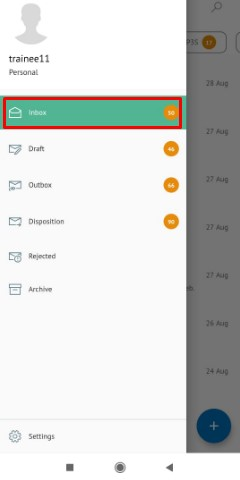

**Role yang sesuai**

- *Approver User*
- *Reviewer User*

*User* dapat menolak surat keluar yang akan dikemnbalikan ke konseptor jika hasil review surat keluar belum / tidak sesuai. 

## **P-Office Versi Web**
-langkah untuk menolak surat keluar via Web adalah sebagai berikut

1. Klik menu **Inbox** dan pilih tab **Surat Keluar**

2. Pilih surat keluar yang akan ditindak lanjuti kemudian pilih tab **Detail**

3. Klik tombol **Reject** dan pilih **Send**. Isikan komentar jika diperlukan

4. Sistem berhasil menyimpan perubahan. Surat keluar yang sudah ditolak akan otomatis terhapus akan tersimpan di menu **“Rejected – Memorandum”** user penolak dengan label **Rejected**

## **P-Office Versi Teams**

Langkah - langkah untuk tolak surat keluar via Teams adalah sebagai berikut :

1. Klik menu **Inbox** dan pilih tab **Surat Keluar**

2. Pilih surat keluar yang akan ditindak lanjuti kemudian pilih tab **Detail**

3. Klik tombol **Reject** dan pilih **Send**. Isikan komentar jika diperlukan

 
4. Sistem berhasil menyimpan perubahan. Surat keluar yang sudah ditolak akan otomatis terhapus akan tersimpan di menu **“Rejected – Memorandum”** user penolak dengan label **Rejected**

## **P-Office Versi Android**

Langkah-langkah untuk menolak surat keluar via Android adalah sebagai berikut :

1. Klik menu **Inbox** dan pilih tab **Surat Keluar**

 

2. Pilih surat keluar yang akan ditindaklanjuti kemudian pilih icon **Option**
   
 

3. Klik tombol **Reject** dan pilih **Send** Isikan komentar jika diperlukan

 

4. Sistem berhasil menyimpan perubahan surat keluar yang sudah di tolak akan tersimpan dimenu “**Rejected- Surat keluar”** user penolak pada label “**Rejected**”

## **P-Office Versi IOS**

Langkah-langkah untuk menolak surat keluar via IOS adalah sebagai berikut

1.	Klik menu **Inbox** dan pilih tab **Surat Keluar**

 

2.	Pilih surat keluar yang akan ditindak lanjuti kemudian pilih icon **Option** dan pilih **Reject**

 

3.	Isikan komentar jika diperlukan kemudian klik **Send** untuk menyimpan perubahan. Surat keluar yang sudah ditolak akan otomatis terhapus akan tersimpan di menu **“Rejected – Memorandum”** user penolak dengan label **Rejected**

