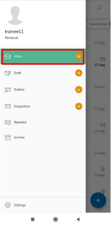

**Role yang sesuai**

- *Approver User*
- *Reviewer User*

_User_ menerima surat masuk baru di menu "**Inbox - Surat Masuk**" atau menu "**Disposisi - Surat Masuk**". Surat masuk dapat didisposisikan kepada pejabat yang dipilih atau pejabat yang ada dibawahnya. Disposisi surat masuk dapat dilakukan dengan dua cara yaitu melalui menu **Inbox** jika surat masuk yang diterima merupakan surat masuk yang ditujukan langsung dari sekretaris ke pejabat pemilik KBOnya atau melalui menu **Disposisi** jika surat masuk sudah dilakukan tindak lanjut oleh pejabat pemilik KBO dan pemilik KBO akan mendisposisikan ke pejabat selanjutnya atau pejabat yang ada dibawahnya.

## **P-Office Versi Web**

Langkah - langkah untuk mendisposisikan surat masuk via Web adalah sebagai berikut :

####   **Disposisi melalui Menu Inbox**

1.    Klik menu **Inbox** dan pilih tab **Surat Masuk**

2.    Pilih surat masuk yang akan didisposisikan kemudian pilih tab **Detail**

3.    Klik tombol **Disposition** dan pilih **Send**

4.    Sistem menampilkan form disposisi. Isikan informasi disposisi dan perintah untuk masing-masing penerima disposisi.

5.    Klik **Save** untuk menyimpan draft disposisi surat masuk dan surat masuk akan tersimpan di menu "**Draft - Surat masuk**". Klik **Send** untuk mengirim disposisi ketujuan dan disposisi surat masuk akan tersimpan di menu "**Outbox - Disposisi**".

####   **Disposisi melalui Menu Disposisi**

1.    Klik menu **Disposisi** dan pilih tab **Surat Masuk**

2.    Pilih surat masuk yang akan didisposisikan kemudian pilih tab **Detail**

3.    Klik tombol **Disposition** dan pilih **Send**

4.    Sistem menampilkan form disposisi. Isikan informasi disposisi dan perintah untuk masing-masing penerima disposisi.

5.    Klik **Save** untuk menyimpan draft disposisi surat masuk dan surat masuk akan tersimpan di menu "**Draft - Surat masuk**". Klik **Send** untuk mengirim disposisi ketujuan dan disposisi surat masuk akan tersimpan di menu "**Outbox - Disposisi**".

## **P-Office Versi Teams**

Langkah - langkah untuk disposisi surat masuk via Teams adalah sebagai berikut :

- **Disposisi melalui Menu Inbox**

1.  Klik menu **Inbox** dan pilih tab **Surat Masuk**

2.  Pilih surat masuk yang akan didisposisikan kemudian pilih tab **Detail**

3.  Klik tombol **Disposition** dan pilih **Send**

4.  Sistem menampilkan form disposisi. Isikan informasi disposisi dan perintah untuk masing-masing penerima disposisi.

5.  Klik **Save** untuk menyimpan draft disposisi surat masuk dan surat masuk akan tersimpan di menu **“Draft – Surat masuk”**. Klik **Send** untuk mengirim disposisi ketujuan dan disposisi surat masuk akan tersimpan di menu **“Outbox – Disposisi”**.

- **Disposisi melalui Menu Disposisi**

1. Klik menu **Disposition** dan pilih tab **Surat Masuk**

2. Pilih surat masuk yang akan didisposisikan kemudian pilih tab **Detail**

3. Klik tombol **Disposition** dan pilih **Send**

4. Sistem menampilkan form disposisi. Isikan informasi disposisi dan perintah untuk masing-masing penerima disposisi

5. Klik **Save** untuk menyimpan draft disposisi surat masuk dan surat masuk akan tersimpan di menu **“Draft – Surat masuk”**. Klik **Send** untuk mengirim disposisi ketujuan dan disposisi surat masuk akan tersimpan di menu **“Outbox – Disposisi”**

## **P-Office Via Android**

Langkah - langkah untuk mendisposisikan surat masuk via Android adalah sebagai berikut :

**Disposisi melalui Menu Inbox**

1. Klik menu **Inbox** dan pilih tab **Surat Masuk**

 

2. Pilih surat masuk yang akan didisposisikan kemudian pilih icon **Option**

3. Klik tombol **Disposition** maka sistem menampilkan form disposisi. Isikan informasi disposisi dan perintah untuk masing-masing penerima disposisi

 

4.Klik **Save** untuk menyimpan draft disposisi surat masuk dan surat masuk akan tersimpan di menu “**Draft – Surat masuk**”. Klik **Send** untuk mengirim disposisi ketujuan dan disposisi surat masuk akan tersimpan di menu “**Outbox – Disposisi**”
   
## **P-Office Via IOS**

Langkah - langkah untuk mendisposisikan surat masuk via IOS adalah sebagai berikut:

**Disposisi melalui Menu Inbox**

1. Klik menu **Inbox** dan pilih tab **Surat Masuk**
   
 

2. Pilih surat masuk yang akan didisposisikan, kemudian pilih tab **Option** dan pilih **Disposition**
   
 

3. Sistem menampilkan form disposisi. Isikan informasi disposisi dan perintah untuk masing-masing penerima disposisi
   

1. Klik **Save** untuk menyimpan draft disposisi surat masuk dan surat masuk akan tersimpan di menu “**Draft – Surat masuk**”. Klik **Send** untuk mengirim disposisi ketujuan dan disposisi surat masuk akan tersimpan di menu “**Outbox – Disposisi**”

**Disposisi melalui Menu Disposisi**

1. Klik menu **Disposisi** dan pilih tab **Surat Masuk**
   
 

2. Pilih surat masuk yang akan didisposisikan kemudian pilih icon **Option** dan pilih **Disposition**
   
 

3. Sistem menampilkan form disposisi. Isikan informasi disposisi dan perintah untuk masing-masing penerima disposisi.
   
 

4. Klik **Save** untuk menyimpan draft disposisi surat masuk dan surat masuk akan tersimpan di menu “**Draft – Surat masuk**”. Klik **Send** untuk mengirim disposisi ketujuan dan disposisi surat masuk akan tersimpan di menu “**Outbox – Disposisi**”.