**Role yang sesuai**

- Sekretaris

Sekretaris dapat melakukan _drafting_ surat masuk pada aplikasi P-Office. _Drafting_ surat masuk dilakukan jika _user_ akan meneruskan dan melakukan perubahan pada surat masuk yang sudah disimpan pada menu **Draft.**

## **P-Office Versi Web**

Langkah - langkah untuk drafting surat masuk via Web yaitu:

1.    Klik menu **Draft** dan pilih tab **Surat Masuk**

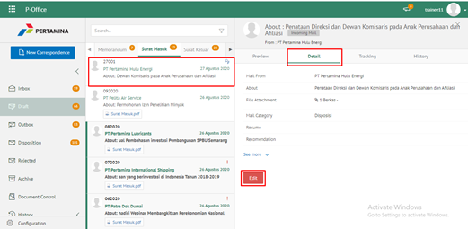

2.    Pilih surat masuk yang akan diubah. Pilih tab **Detail** kemudian klik **Edit**

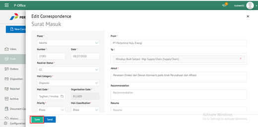

3.    Sistem akan menampilkan _form_ **Edit Correspondence**

4.	  Lakukan perubahan pada _form_. Klik **Send** untuk mengirim surat masuk ke pejabat tujuan. Surat yang terkirim akan tersimpan di menu "**Outbox - Surat Masuk"**

## **P-Office Versi Teams**

Langkah - langkah untuk drafting surat masuk via Teams yaitu:

1. Klik menu _**Draft**_ dan pilih tab **Surat Masuk**

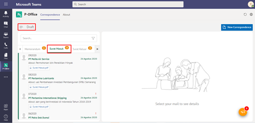

2. Pilih surat masuk yang akan diubah. Pilih tab **Detail** kemudian klik **Edit**

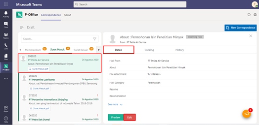

3. Sistem akan menampilkan _form_**Edit Correspondence**_

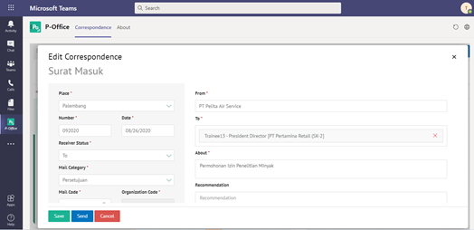

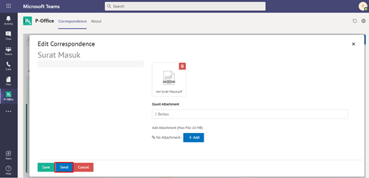

4. Lakukan perubahan pada _form_. Klik **Send** untuk mengirim surat masuk ke pejabat tujuan. Surat yang terkirim akan tersimpan di menu “**_Outbox_ – Surat Masuk”**

## **P-Office Versi Android**

Langkah-langkah untuk Drafting surat masuk adalah sebagai berikut.

1. Klik menu **Draft** dan pilih tab **Surat Masuk**

  

2. Pilih surat masuk yang akan diubah. Pilih **ikon tombol button ** kemudian klik **Edit**

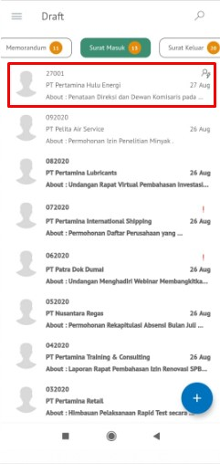

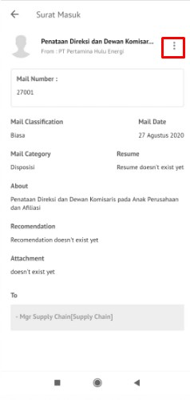

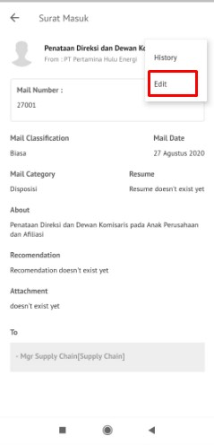

3. Sistem akan menampilkan _form_ **Edit**

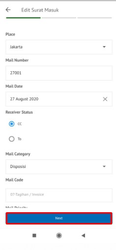

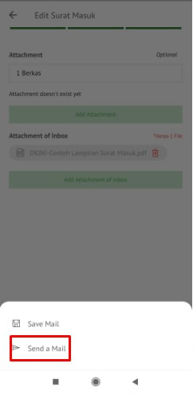

4. Lakukan perubahan pada _form_. Klik **Send Mail **untuk mengirim surat masuk ke pejabat tujuan. Surat yang terkirim akan tersimpan di menu “**Outbox – Surat Masuk”**
