**Role yang sesuai**

- *Approver User*
- *Reviewer User*
- *Member User* (Pekerja)

_User_ dapat melihat informasi lengkap surat masuk termasuk _preview_ surat masuk, detail surat masuk, _tracking_ surat masuk dan _history_ surat masuk. Langkah-langkah untuk melihat informasi surat masuk adalah sebagai berikut.

1.    Klik menu **Inbox/Draft/Outbox** dan pilih tab **Surat Masuk.** Pilih salah satu surat masuk yang akan dilihat informasinya

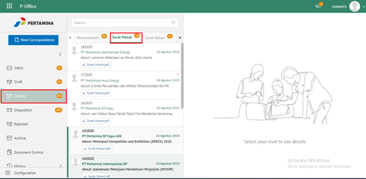

####   **Preview Surat Masuk**

Pada tab **Preview Surat Masuk**, ditampilkan _preview_ surat masuk yang merupakan hasil unggahan yang diinputkan oleh sekretaris/konseptor.

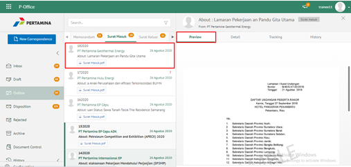

####   **Detail Surat Masuk**

Pada tab **Detail Surat Masuk**, terdapat informasi asal surat, perihal, file lampiran, kategori surat, resume, rekomendasi, nomor surat, klasifikasi surat, tanggal surat dan tujuan.

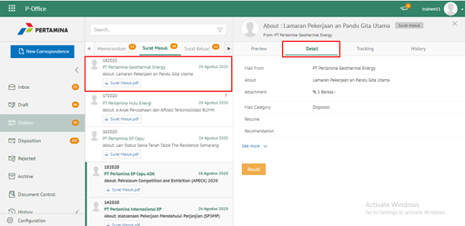

####   **Tracking Surat Masuk**

Pada tab **Tracking Surat Masuk**, ditampilkan informasi _tracking_ surat masuk dalam bentuk _chart_

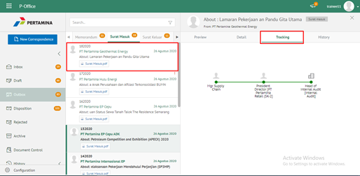

####   **History Surat Masuk**

Pada tab **History Surat Masuk**, ditampilkan riwayat surat masuk yang terdapat informasi jabatan, tanggal, tindakan dan komentar

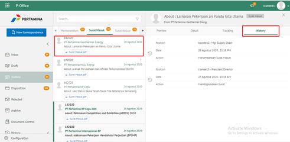

## **P-Office Versi Teams**

Langkah - langkah untuk Informasi surat masuk via Teams yaitu :

1. Klik menu **Inbox/Draft/Outbox** dan pilih tab **Surat Masuk**. Pilih salah satu surat masuk yang akan dilihat informasinya
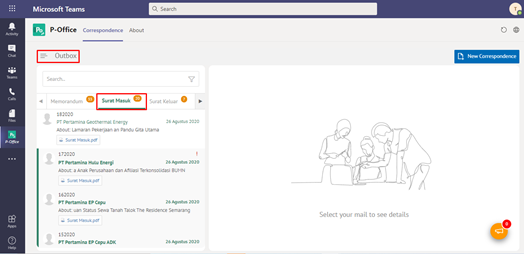

**Preview Surat Masuk**

Pada button **Preview Surat Masuk**, ditampilkan preview surat masuk yang merupakan hasil unggahan yang diinputkan oleh sekretaris/konseptor.

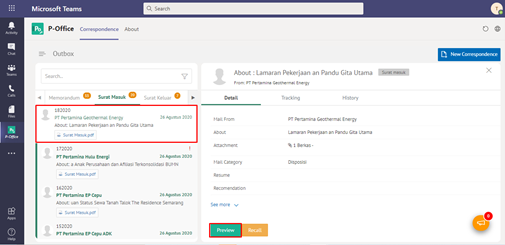
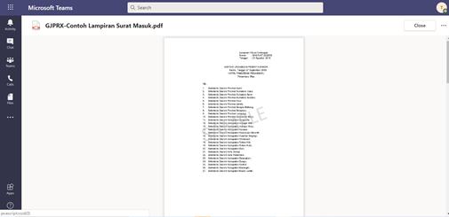

**Detail Surat Masuk**

Pada tab **Detail Surat Masuk**, terdapat informasi asal surat, perihal, file lampiran, kategori surat, resume, rekomendasi, nomor surat, klasifikasi surat, tanggal surat dan tujuan.

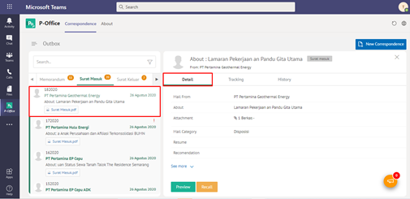

**Tracking Surat Masuk**

Pada tab **Tracking Surat Masuk**, ditampilkan informasi tracking surat masuk dalam bentuk chart

 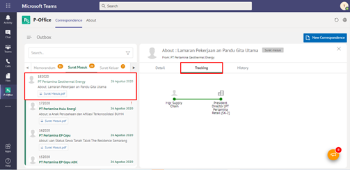

 - **History Surat Masuk**

 Pada tab **History Surat Masuk**, ditampilkan riwayat surat masuk yang terdapat informasi jabatan, tanggal, tindakan dan komentar

 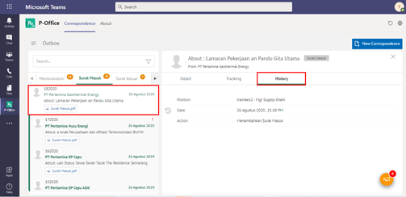

## **P-Office Versi Android**

Langkah - langkah untuk melakukan pengelolaan akses menu via Android yaitu:

1. Klik menu **Inbox/Draft/Outbox** dan pilih tab **Surat Masuk** pilih salah satu surat masuk yang akan dilihat informasinya

 **Detail Surat Masuk**

Pada tab **Detail Surat Masuk**, terdapat informasi asal surat, perihal, file lampiran, kategori surat, resume, rekomendasi, nomor surat, klasifikasi surat, tanggal surat dan tujuan

**Preview Surat Masuk**

 Pada tab **Preview Surat Masuk**, ditampilkan _preview_ surat masuk yang merupakan hasil unggahan yang diinputkan oleh sekretaris/konseptor.

**Tracking Surat Masuk**

Pada tab **Tracking Surat Masuk**, ditampilkan informasi _tracking_ surat masuk dalam bentuk _chart_

 **History Surat Masuk**

Pada tab **History Surat Masuk**, ditampilkan riwayat surat masuk yang terdapat informasi jabatan, tanggal, tindakan dan komentar

 **Recall Surat Masuk**

 Pada tab **Recall Surat Masuk**, ditampilkan tindakan menarik surat masuk yaitu klik menu **recall** kemudian klik recall

