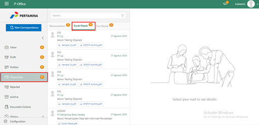
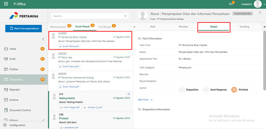
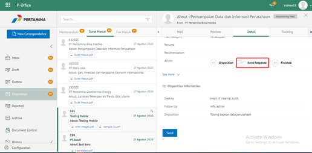
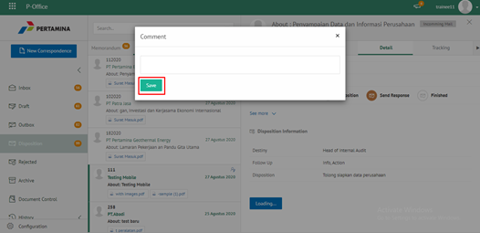
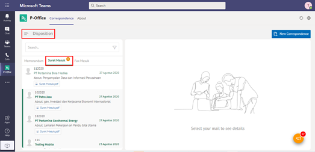
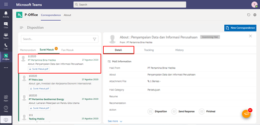
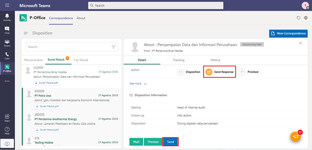
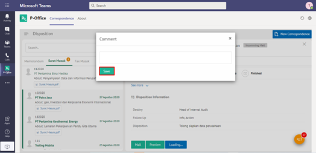

**Role yang sesuai**

- *Reviewer User*
- *Member User* (Pekerja)

 _User_ dapat mengirim tanggapan disposisi surat masuk yang ditujukan untuk pejabat pengirim disposisi. Langkah-langkah untuk mengirim tanggapan disposisi surat masuk adalah sebagai berikut

1.    Klik menu **Disposition** dan pilih tab **Surat Masuk**

2.    Pilih disposisi yang akan dikirim tanggapan kemudian pilih tab **Detail**

3.    Pilih tombol **Send Response** kemudian klik **Send**

4.    Sistem menampilkan _pop up_ konfirmasi dan _user_ harus mengisi keterangan kirim tanggapan disposisi kemudian klik **Save**.

5.    Sistem menyimpan perubahan dan informasi tanggapan disposisi akan tersimpan di detail disposisi.

## **P-Office Versi Teams**

Langkah - langkah untuk kirim tanggapan via Teams yaitu :

1. Klik menu **Disposition** dan pilih tab **Surat Masuk**

2. Pilih disposisi yang akan dikirim tanggapan kemudian pilih tab **Detail**

3. Pilih tombol **Send Response** kemudian klik **Send**

4. Sistem menampilkan pop up konfirmasi dan _user_ harus mengisi keterangan kirim tanggapan disposisi kemudian klik **Save**

5. Sistem menyimpan perubahan dan informasi tanggapan disposisi akan tersimpan di detail disposisi.