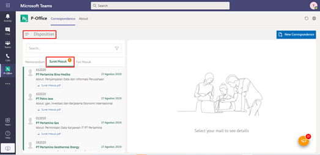

**Role yang sesuai**

- *Approver User* (Pemilik KBO)
- *Reviewer User*
- *Member User* (Pekerja) 

User dapat melihat daftar disposisi surat masuk pada pada menu **Disposisi**. 

## **P-Office Versi Web**

Langkah - langkah untuk melihat daftar disposisi surat masuk via Web adalah sebagai berikut

1.	Klik menu **Disposition** dan pilih tab **Surat Masuk**

## **P-Office Versi Teams**

Langkah - langkah untuk melihat daftar disposisi via Teams yaitu :

1.	Klik menu **Disposition** dan pilih tab **Surat Masuk**

## **P-Office Versi Android**

Langkah - langkah untuk melakukan pengelolaan akses menu via Android yaitu:
 
 1. Klik menu **Disposition** dan pilih tab **Surat Masuk**

