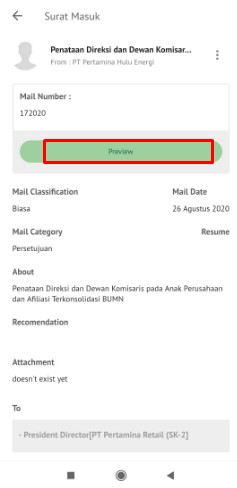

**Role yang sesuai**

- *Approver User*
- *Reviewer User*
- *Member User* (Pekerja) 
- Sekretaris

_User_ dapat melihat informasi lengkap disposisi surat masuk pada detail disposisi

## **P-Office Versi Web**

Langkah - langkah untuk melihat informasi lengkap disposisi surat masuk via Web adalah sebagai berikut :

1. Klik menu **Disposisi** dan pilih tab **Surat Masuk.** Pilih salah satu disposisi surat masuk yang akan dilihat informasinya

#### **Preview Surat Masuk**

Pada tab **Mail,** ditampilkan surat masuk fisik yang sudah diunggah oleh sekretaris / konseptor

#### **Preview Lembar Penerus**

Pada tab **Preview**, ditampilkan informasi lembar penerus disposisi yang berisi informasi daftar nama pejabat dan perintah disposisi yang harus dilakukan oleh pejabat penerima disposisi

#### **Detail Disposisi Surat Masuk**

Pada tab **Detail,** terdapat informasi asal surat, perihal, file lampiran, kategori surat, resume, rekomendasi serta informasi disposisi yang mencakup lampiran disposisi, tujuan, tindak lanjut dan disposisi permasing-masing pejabat penerima disposisi

#### **Tracking Surat Masuk**

Pada tab **Tracking**, ditampilkan informasi _tracking_ surat masuk dalam bentuk _chart_

#### **History Surat Masuk**

Pada tab **History**, ditampilkan riwayat surat masuk yang terdapat informasi jabatan, tanggal, tindakan dan komentar.

## **P-Office Versi Teams**

Langkah - langkah untuk melihat informasi disposisi surat masuk via Teams adalah sebagai berikut :

1. Klik menu **Disposition**, dan pilih tab **Surat Masuk**. Pilih salah satu disposisi surat masuk yang akan dilihat informasinya

#### **Preview Disposisi Surat Masuk**

Pada button **Mail**, ditampilkan surat masuk fisik yang sudah diunggah oleh sekretaris/konseptor.

#### **Preview Lembar Penerus**

Pada button **Preview**, ditampilkan informasi lembar penerus disposisi yang berisi informasi daftar nama pejabat dan perintah disposisi yang harus dilakukan oleh pejabat penerima disposisi

#### **Detail Disposisi Surat Masuk**

Pada tab **Detail**, terdapat informasi asal surat, perihal, file lampiran, kategori surat, resume, rekomendasi serta informasi disposisi yang mencakup lampiran disposisi, tujuan, tindak lanjut dan disposisi permasing-masing pejabat penerima disposisi

#### **Tracking Disposisi Surat Masuk**

Pada tab **Tracking**, ditampilkan informasi tracking disposisi surat masuk dalam bentuk chart

#### **History Disposisi Surat Masuk**

Pada tab **History**, ditampilkan riwayat surat masuk yang terdapat informasi jabatan, tanggal, tindakan dan komentar.

## **P-Office Versi Android**

Langkah - langkah untuk melihat informasi disposisi surat masuk via Android adalah sebagai berikut :

1. Klik menu **Disposisi** dan pilih tab **Surat Masuk** pilih salah satu disposisi surat masuk yang akan dilihat informasinya

 

#### **Preview Disposisi Surat Masuk**

Pada tab **Surat**, ditampilkan detail surat masuk yang sudah diunggah oleh sekretaris / konseptor.

 

#### **Detail Disposisi Surat Masuk**

Pada tab **Detail**, terdapat informasi asal surat, perihal, file lampiran, kategori surat, resume, rekomendasi serta informasi disposisi yang mencakup lampiran disposisi, tujuan, tindak lanjut dan disposisi permasing-masing pejabat penerima disposisi

 

#### **Preview Lembar Penerus**

Pada tab **Preview**, ditampilkan informasi lembar penerus disposisi yang berisi informasi daftar nama pejabat dan perintah disposisi yang harus dilakukan oleh
pejabat penerima disposisi

 

#### **Informasi Disposisi Surat Masuk**

Pada tab **Informasi Disposisi**, ditampilkan  surat masuk yang terdapat lampiran, tujuan, tindakan dan disposisi.

 

## **P-Office Versi IOS**

Langkah-langkah untuk melihat informasi disposisi surat masuk via IOS adalah sebagai berikut.

1.	Klik menu **Disposisi** dan pilih tab **Surat Masuk** Pilih salah satu disposisi surat masuk yang akan dilihat informasinya

 

**Preview Disposisi Surat Masuk**

Pada tab **Surat,** ditampilkan surat masuk fisik yang sudah diunggah oleh sekretaris / konseptor.

**Preview Lembar Penerus**

Pada tab **Preview,** ditampilkan informasi lembar penerus disposisi yang berisi informasi daftar nama pejabat dan perintah disposisi yang harus dilakukan oleh pejabat penerima disposisi

 

**Detail Disposisi Surat Masuk**

Pada tab **Detail**, terdapat informasi asal surat, perihal, file lampiran, kategori surat, resume, rekomendasi serta informasi disposisi yang mencakup lampiran disposisi, tujuan, tindak lanjut dan disposisi permasing-masing pejabat penerima disposisi

 

**History Disposisi Surat Masuk**

Pada tab **History**, ditampilkan riwayat surat masuk yang terdapat informasi jabatan, tanggal, tindakan dan komentar.

 