**Role yang sesuai**

- *Approver User*
- *Reviewer User*

_User_ dapat melakukan _recall_ / tarik disposisi surat masuk yang sudah dikirim kepada pejabat penerima disposisi. Surat masuk yang sudah dikirim ke pejabat penerima disposisi akan tersimpan di menu "**Outbox - Disposisi**"

## **P-Office Versi Web**

Langkah - langkah untuk merecall disposisi via Web yaitu :

1.    Klik menu **Outbox** dan pilih tab **Disposisi**

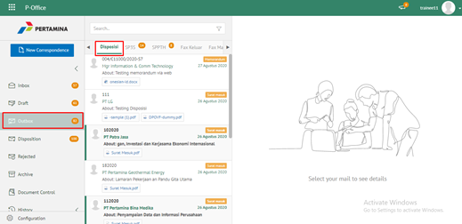

2.    Pilih surat masuk yang akan di-_recall_ kemudian klik tab **Detail** kemudian klik **Recall**

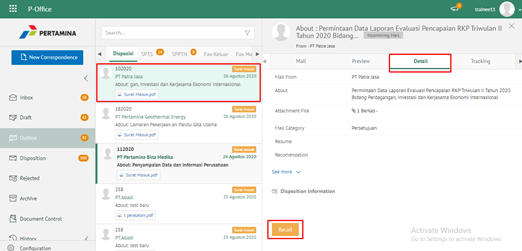

3.    Surat masuk yang sudah di-_recall_ akan tersimpan di menu "**Draft - Disposisi**" penerima fax masuk / pendisposisi

## **P-Office Versi Teams**

Langkah - langkah untuk recall disposisi via Teams yaitu :

1. Klik menu **Outbox** dan pilih tab **Disposisi**

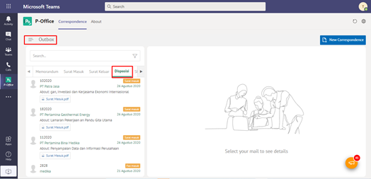

2. Pilih surat masuk yang akan direcall kemudian klik tab **Detail** kemudian klik **Recall**

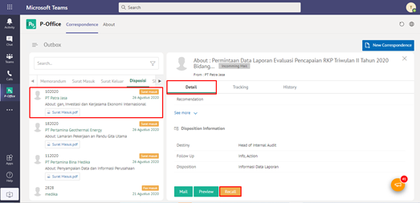

## **P-Office Versi Android**

Langkah - langkah untuk recall surat masuk via Android yaitu:

1. Klik menu **Outbox** dan pilih tab **Disposisi**
   
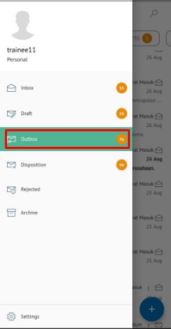 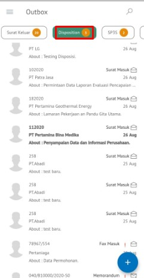

2. Pilih surat masuk yang akan di-_recall_ kemudian klik ikon **tombol button** kemudian klik **Recall**

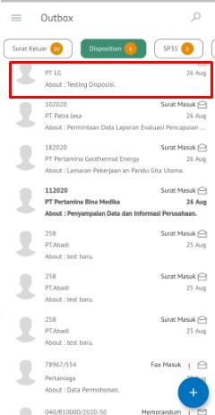 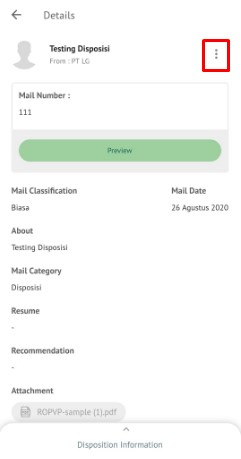 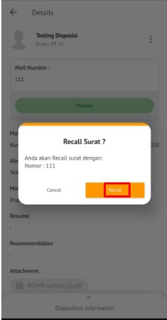

3. Surat masuk yang sudah di-_recall_ akan tersimpan di menu “**Draft - Disposisi**” penerima surat masuk/ pendisposisi.
   

## **P-Office Versi IOS**

**Melakukan Recall Disposisi Surat Masuk**

Langkah-langkah untuk melakukan _recall_ disposisi surat masuk adalah sebagai berikut:

1.	Klik menu **Outbox **dan pilih tab **Disposisi**

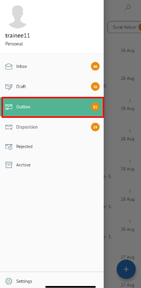
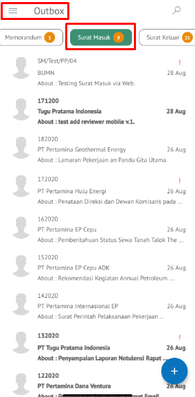

2.	Pilih surat masuk yang akan di-_recall_ kemudian klik tab **Option **kemudian klik **Recall**

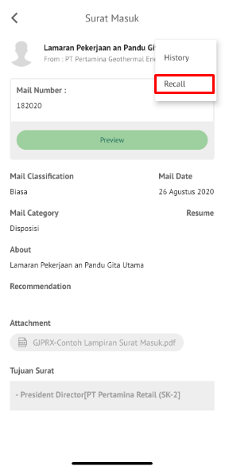

3.	Surat masuk yang sudah di-_recall_ akan tersimpan di menu “**Draft - Disposisi**” penerima fax masuk / pendisposisi.