### **Menyelesaikan Disposisi Surat Masuk**

**Role yang sesuai**

- *Approver User*
- *Reviewer User*
- *Member User* (Pekerja) 

_User_ dapat menyelesaikan disposisi surat masuk jika _user_ tidak akan melanjutkan untuk mendisposisikan surat masuk ke pejabat lain

## **P-Office Versi Web**

Langkah - langkah untuk menyelesaikan disposisi via Web yaitu :

1.    Klik menu **Disposition** dan pilih tab **Surat Masuk**

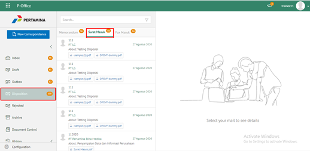

2.    Pilih disposisi yang akan diselesaikan kemudian pilih tab **Detail**

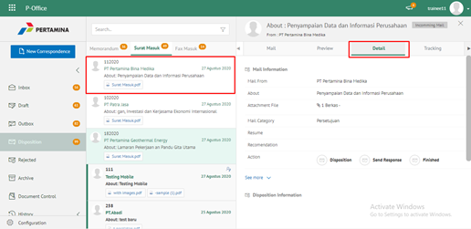

3.    Pilih tombol **Finish** kemudian klik **Send**

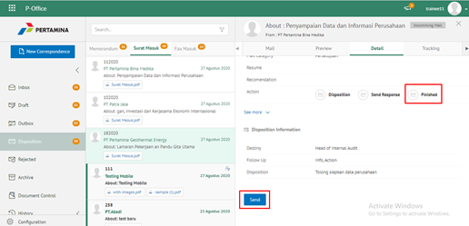

4.    Sistem menampilkan _pop up_ konfirmasi dan _user_ harus mengisi keterangan selesaikan disposisi kemudian klik **Save**.

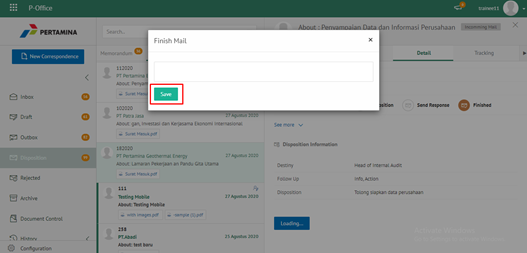

5.    Sistem menyimpan perubahan dan informasi selesai disposisi akan tersimpan di detail disposisi

## **P-Office Versi Teams**

Langkah - langkah untuk selesaikan disposisi via Teams yaitu :

1. Klik menu **Disposition** dan pilih tab **Surat Masuk**

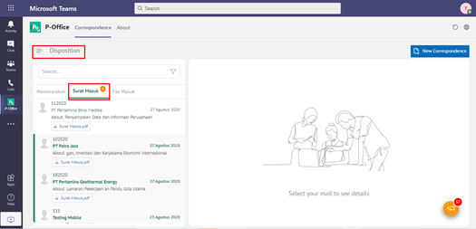

2. Pilih disposisi yang akan diselesaikan kemudian pilih tab **Detail**

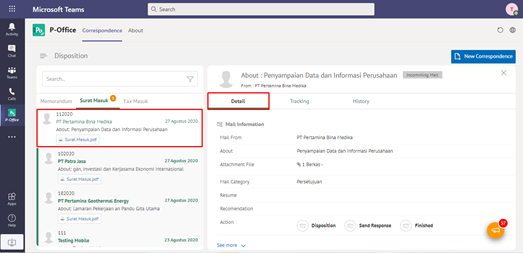

3. Pilih tombol **Finished** kemudian klik **Send**

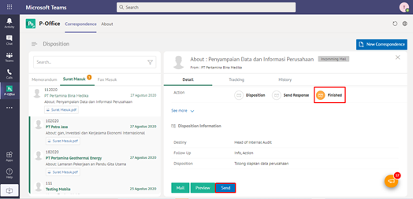

4. Sistem menampilkan pop up konfirmasi dan _user_ harus mengisi keterangan selesaikan disposisi kemudian klik **Save**

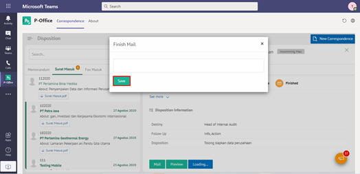

 5.    Sistem menyimpan perubahan dan informasi selesai disposisi akan tersimpan di detail disposisi.

## **P-Office Versi Android**

Langkah - langkah untuk menyelesaikan disposisi surat masuk via Android yaitu:

1. Klik menu **Disposisi** dan pilih tab **Surat Masuk** Pilih salah satu disposisi surat masuk yang akan dilihat informasinya

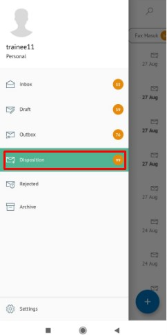  

1. Pilih disposisi yang akan diselesaikan kemudian pilih tombol **button**

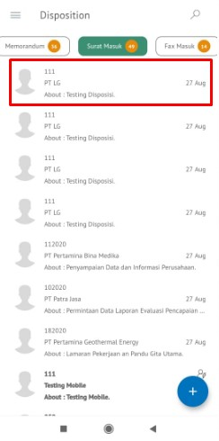 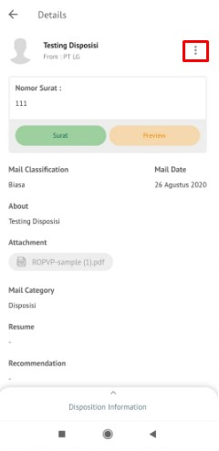 

3. Pilih tombol **Finish** kemudian sistem akan menampilkan pop up konfirmasi dan _user_ harus mengisi komentar disposisi kemudian klik **send**.

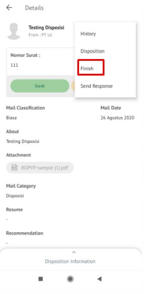 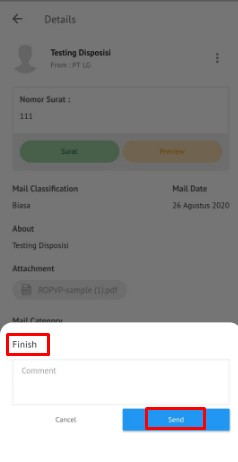  

4. Sistem menyimpan perubahan dan informasi selesai disposisi akan tersimpan di Outbox-disposisi.
