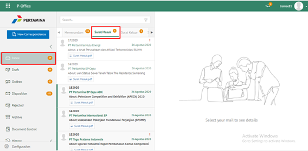
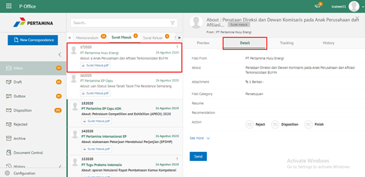
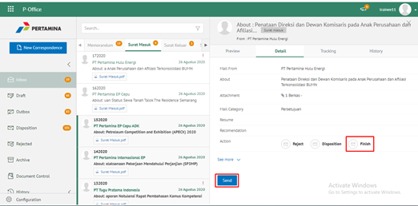
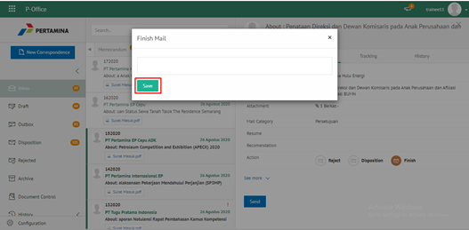
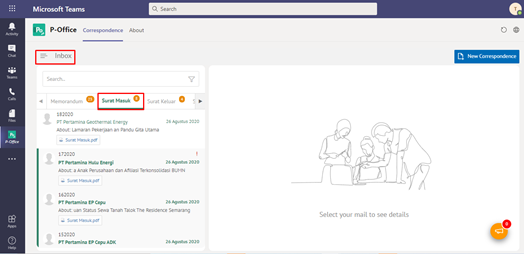
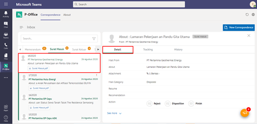
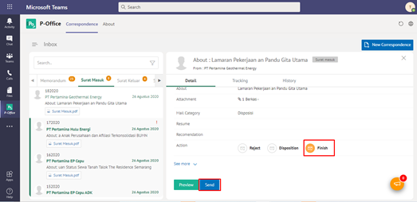
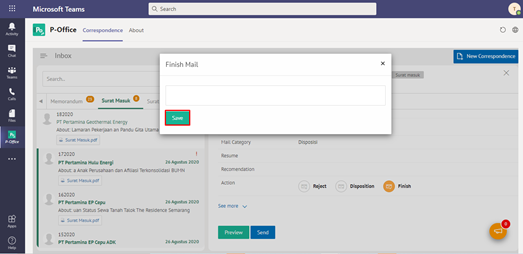

### **Menyelesaikan Surat Masuk**

**Role yang sesuai**

- *Approver User*
- *Reviewer User*
- *Member User* (Pekerja) 

_User_ dapat menyelesaikan surat masuk jika _user_ tidak akan melanjutkan untuk mendisposisikan surat masuk ke pejabat lain atau surat masuk selesai pada _user_ tersebut. Langkah-langkah untuk menyelesaikan surat masuk adalah sebagai berikut:

1.    Klik menu **Inbox** dan pilih tab **Surat masuk**

2.    Pilih surat masuk yang akan diselesaikan kemudian pilih tab **Detail**

3.    Pilih tombol **Finish** kemudian klik **Send**

4.    Sistem menampilkan _pop up_ konfirmasi dan _user_ harus mengisi keterangan selesaikan disposisi kemudian klik **Save**.

5.    Sistem menyimpan perubahan dan informasi selesai disposisi akan tersimpan di detail disposisi.

## **P-Office Versi Teams**

Langkah - langkah untuk selesaikan surat masuk via Teams yaitu :

1.    Klik menu **Inbox** dan pilih tab **Surat masuk**

2.    Pilih surat masuk yang akan diselesaikan kemudian pilih tab **Detail**

3.    Pilih tombol **Finish** kemudian klik **Send**_

4.    Sistem menampilkan pop up konfirmasi dan user harus mengisi keterangan selesaikan disposisi kemudian klik **Save**

5.    Sistem menyimpan perubahan dan informasi selesai disposisi akan tersimpan di detail disposisi.

## **P-Office Versi Android**

Langkah - langkah untuk melakukan pengelolaan akses menu via Android yaitu:

1. 	Klik menu **Inbox** dan pilih tab **Surat masuk**

2. 	Pilih surat masuk yang akan diselesaikan kemudian pilih ikon **tombol button**

3.  Pilih **Finish** maka Sistem menampilkan _pop up_ konfirmasi dan _user_ harus mengisi keterangan selesaikan disposisi kemudian klik **Send** kemudian klik **Send**

4. Sistem menyimpan perubahan dan informasi selesai akan tersimpan di **Outbox-Surat Masuk**.
   