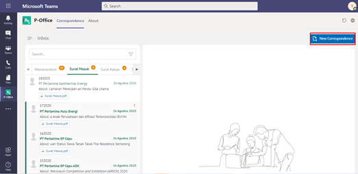
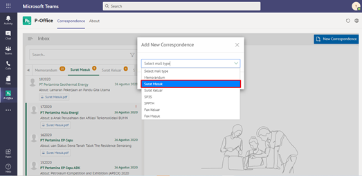
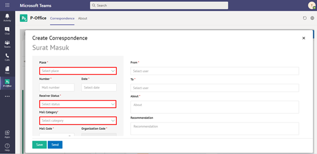
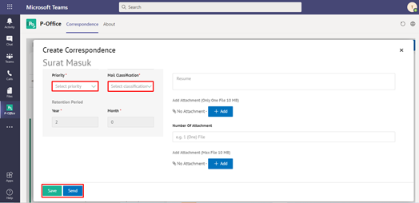

**Role yang sesuai**

- Sekretaris

Sekretaris dapat menambah surat masuk pada aplikasi P-Office. Langkah-langkah untuk menambah surat masuk adalah sebagai berikut.

1.	Klik menu **New Correspondence**

2.	Pilih jenis surat "**Surat Masuk**"

3.	Isi form tambah surat masuk. Klik **Simpan** untuk menyimpan form surat dan surat akan tersimpan di menu "**Draft - Surat Masuk**". Klik **Simpan** untuk mengirim surat masuk dan surat masuk akan tersimpan di menu "**Outbox - Surat Masuk**"

4.  Sistem berhasil menyimpan perubahan

## **P-Office Versi Teams**

Langkah - langkah untuk tambah surat masuk via Teams yaitu :

1.	Klik menu **New Correspondence**

2.	Pilih jenis surat “**Surat Masuk**”

3.	Isi form tambah surat masuk. Klik **Save** untuk menyimpan form surat dan surat akan tersimpan di menu “**Draft – Surat Masuk**”. Klik **Send** untuk mengirim surat masuk dan surat masuk akan tersimpan di menu “**Outbox – Surat Masuk**”

 4.  Sistem berhasil menyimpan perubahan
 