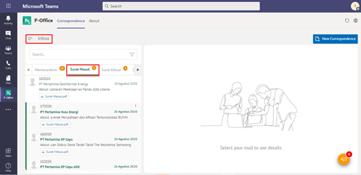
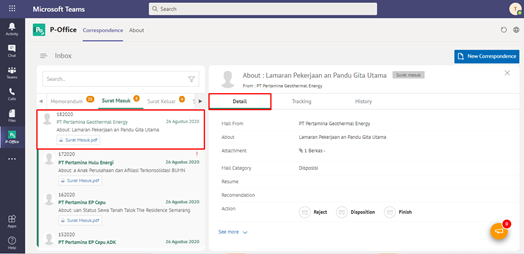
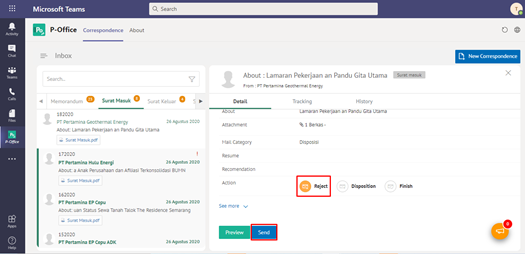
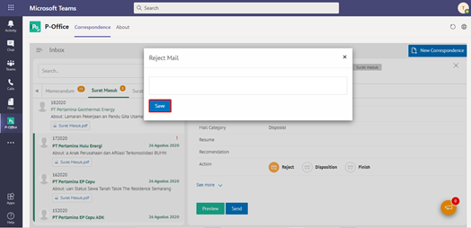

### **Menolak Surat Masuk**

**Role yang sesuai**

- *Approver User*

Langkah-langkah untuk menolak surat masuk adalah sebagai berikut

1.    Klik menu **Inbox** dan pilih tab **Surat Masuk**

2.    Pilih surat masuk yang akan ditolak kemudian pilih tab **Detail**

3.    Klik tombol **Tolak** dan pilih **Send.** Isikan komentar jika diperlukan

4.    Sistem menampilkan _pop up_ konfirmasi dan _user_ harus mengisi keterangan tolak disposisi surat masuk kemudian klik **Tolak Surat**.

5.    Sistem menyimpan perubahan dan informasi tolak surat masuk. Surat masuk yang sudah ditolak akan otomatis terhapus secara _soft delete_

## **P-Office Versi Teams**

Langkah - langkah untuk tolak surat masuk via Teams yaitu :

1.    Klik menu **Inbox** dan pilih tab **Surat Masuk**

2.    Pilih surat masuk yang akan ditolak kemudian pilih tab **Detail**_

3.    Klik tombol **Reject** dan pilih **Send**. Isikan komentar jika diperlukan

4.    Sistem menampilkan pop up konfirmasi dan user harus mengisi keterangan tolak disposisi surat masuk kemudian klik **Save**

5.    Sistem menyimpan perubahan dan informasi tolak surat masuk. Surat masuk yang sudah ditolak akan tersimpan di menu “**Rejected – Memorandum”** user penolak dengan label **Rejected**