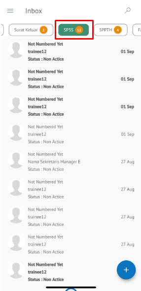

**Role yang sesuai**

- *Approver User*
- *Reviewer User*
- *Member User* (Pekerja)
- Sekretaris

*User* dapat melihat informasi lengkap SP3S termasuk *preview* SP3S, detail SP3S dan *history* SP3S

## **P-Office Versi Web**

Langkah - langkah untuk informasi lengkap SP3S via Web adalah sebagai berikut :

1. Klik menu **Inbox/Draft/Outbox** dan pilih tab **SP3S.** Pilih salah satu SP3S yang akan dilihat informasinya

#### **Preview SP3S**

Pada tab **Preview**, ditampilkan *preview* SP3S yang sudah dibuat. *Preview* SP3S disesuaikan dengan template berdasarkan jenis surat

#### **Detail SP3S**

Pada tab Detai, terdapat informasi nomor SP3S, jabatan PJS, Pejabat pengganti pertama, jangka waktu, pejabat pengganti kedua (jika ada), jangka waktu pejabat pengganti kedua (jika ada), task yang diizinkan dan task pengecualian.

#### **History SP3S**

Pada tab **History**, ditampilkan riwayat SP3S yang terdapat informasi jabatan, tanggal, tindakan dan komentar

## **P-Office Versi Teams**

Langkah - langkah untuk informasi lengkap SP3S via Teams adalah sebagai berikut :

1. Klik menu **Inbox/Draft/Outbox** dan pilih tab **SP3S**. Pilih salah satu SP3S yang akan dilihat informasinya

#### **Preview SP3S**

Pada button **Preview**, ditampilkan preview SP3S yang sudah dibuat. Preview SP3S disesuaikan dengan template berdasarkan jenis surat

#### **Detail SP3S**

Pada tab Detail, terdapat informasi nomor SP3S, jabatan PJS, Pejabat pengganti pertama, jangka waktu, pejabat pengganti kedua (jika ada), jangka waktu pejabat pengganti kedua (jika ada), task yang diizinkan dan task pengecualian

#### **History SP3S**

Pada tab **History**, ditampilkan riwayat SP3S yang terdapat informasi jabatan, tanggal, tindakan dan komentar

## **P-Office Versi Android**

Langkah - langkah untuk informasi lengkap SP3S via Android adalah sebagai berikut :

1. Klik menu **Inbox/Draft/Outbox** dan pilih tab **SP3S.** Pilih salah satu SP3S yang akan dilihat informasinya

 

#### **Detail SP3S**

Pada tab Detail SP3S, terdapat informasi nomor SP3S, jabatan PJS, Pejabat pengganti pertama, jangka waktu, pejabat pengganti kedua (jika ada), jangka waktu pejabat pengganti kedua (jika ada), task yang diizinkan dan task pengecualian.

#### **Preview SP3S**

Pada tab **Preview**, ditampilkan _preview_ SP3S yang sudah dibuat. _Preview_ SP3S disesuaikan dengan template berdasarkan jenis surat.

 

#### **History SP3S**

Pada tab **History**, ditampilkan riwayat SP3S yang terdapat informasi jabatan, tanggal, tindakan dan komentar

 

## **P-Office Versi IOS**

Langkah - langkah untuk informasi lengkap SP3S via IOS adalah sebagai berikut :

1.	Klik menu **Inbox/Draft/Outbox** dan pilih tab **SP3S**. Pilih salah satu SP3S yang akan dilihat informasinya

 

#### **Preview SP3S**

Pada tab **Preview**, ditampilkan preview SP3S yang sudah dibuat. Preview SP3S disesuaikan dengan template berdasarkan jenis surat.

#### **Detail SP3S**

Pada tab Detail, terdapat informasi nomor SP3S, jabatan PJS, Pejabat pengganti pertama, jangka waktu, pejabat pengganti kedua (jika ada), jangka waktu pejabat pengganti kedua (jika ada), task yang diizinkan dan task pengecualian.

#### **History SP3S**

Pada tab **History**, ditampilkan riwayat SP3S yang terdapat informasi jabatan, tanggal, tindakan dan komentar

 