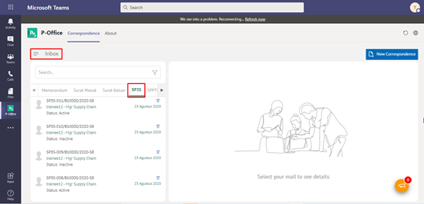

**Role yang sesuai**

- *Approver User*
- *Reviewer User*
- Sekretaris

*User* dapat melihat daftar SP3S pada pada menu **Inbox, Draft atau Outbox** pada masing - masing akun. Langkah - langkah untuk melihat daftar SP3S adalah sebagai berikut

1. Klik menu **Inbox / Draft / Outbox** dan pilih tab **SP3S**

## **P-Office Versi Teams**

Langkah - langkah untuk lihat daftar SP3S via Teams yaitu :

 1.	Klik menu **Inbox / Draft / Outbox** dan pilih tab **SP3S**
 