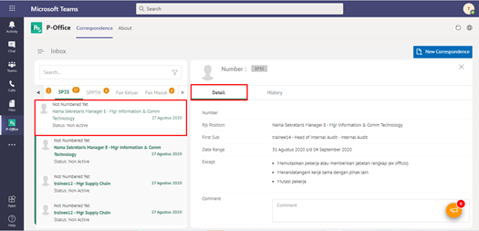

**Role yang sesuai**

- *Approver User*

*User* dapat merevisi SP3S yang sudah dikirimkan oleh konseptor. Langkah - langkah untuk melakukan revisi SP3S adalah sebagai berikut

1. Klik menu **Inbox** dan pilih tab **SP3S**

2. Pilih SP3S yang akan disetujui kemudian pilih tab **Detail**

3. Klik tombol **Revise** dan pilih **Send.** Isikan komentar jika diperlukan

4. Sistem menampilkan *form* **Edit Correspondence**

5. Lakukan perubahan pada *form*. Klik **Simpan** untuk menyimpan perubahan pada *form* SP3S. Surat yang disimpan akan tersimpan di menu **"Draft - SP3S"**

6. Klik **Ubah Isi** untuk mengubah isi SP3S

7. Sistem menampilkan tampilan *preview* SP3S dalam bentuk Word yang dapat di edit. Untuk melakukan *editing* terhadap isi surat klik **Ubah Isi** kemudian sistem akan menampilkan *pop up* konfirmasi **Ubah Word Desktop** atau **Ubah Online**

#### **[Edit] Word Desktop**

Langkah - langkah untuk mengubah isi SP3S melalui Word Desktop adalah sebagai berikut

1. Klik **Ubah di Word** untuk mengubah melalui aplikasi Microsoft Word

2. Lakukan perubahan pada isi surat. Klik **Close** pada aplikasi dan isi surat akan otomatis tersimpan

#### **[Edit] Ubah Online**

Langkah - langkah untuk mengubah isi SP3S secara *online* adalah sebagai berikut

1. Klik **Ubah Online** untuk mengubah isi surat secara *online*

2. Lakukan perubahan pada isi surat. Klik **Close** pada aplikasi

3. Isi surat akan otomatis tersimpan. Jika surat akan disimpan sebagai draft, maka klik **Tutup.**

4. Surat yang sudah selesai diubah maka akan tersimpan di menu **"Draft - SP3S"**

#### **Kirim / Setujui SP3S**

Langkah - langkah untuk menyetujui SP3S adalah sebagai berikut.

1. Pada tampilan *preview* SP3S, klik **Kirim** untuk menyetujui pengajuan SP3S

2. Sistem menyimpan perubahan dan SP3S akan tersimpan di menu **"Outbox - SP3S**"

## **P-Office Versi Teams**

Langkah - langkah untuk Revisi SP3S via Teams yaitu :

1. Klik menu **Inbox** dan pilih tab **SP3S**

2. Pilih SP3S yang akan disetujui kemudian pilih tab **Detail**

3. Klik tombol **Revise** dan pilih **Send**. Isikan komentar jika diperlukan

4.	Sistem menampilkan form **Edit Correspondence**

5.	Lakukan perubahan pada form. Klik **Save** untuk menyimpan perubahan pada form SP3S. Surat yang disimpan akan tersimpan di menu **“Inbox – SP3S”**

6.	Klik **Edit Content** untuk mengubah isi SP3S

7. Sistem menampilkan tampilan preview SP3S dalam bentuk Word yang dapat di edit. Untuk melakukan editing terhadap isi surat klik **Edit Content** kemudian sistem akan menampilkan pop up konfirmasi Ubah Word Desktop atau Ubah Online

#### **[Edit] Word Desktop**

Langkah – langkah untuk mengubah isi surat keluar melalui Word Desktop adalah sebagai berikut :

1.	Klik **Open In Desktop App** untuk mengubah melalui aplikasi Microsoft Word

2.	Lakukan perubahan pada isi surat. Klik **Close** pada aplikasi Isi surat akan otomatis tersimpan

#### **[Edit] Ubah Online**

Langkah – langkah untuk mengubah isi surat keluar secara online adalah sebagai berikut :

1.Ketika Klik button **Edit Content** maka secara otomatis akan membuka dokumen dan bisa mengubah isi surat secara online

2. Lakukan perubahan pada isi surat

3. Isi surat akan otomatis tersimpan. Jika surat akan disimpan sebagai draft, maka klik **Close**

4. Surat yang sudah selesai diubah maka akan tersimpan di menu **“Inbox – Surat SP3S”**