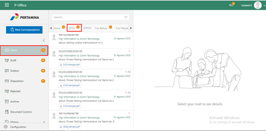
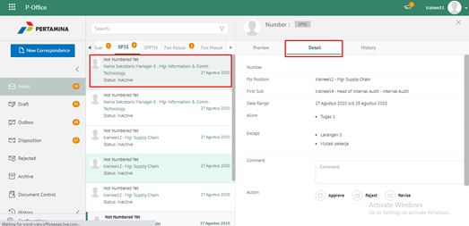
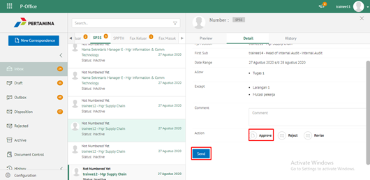
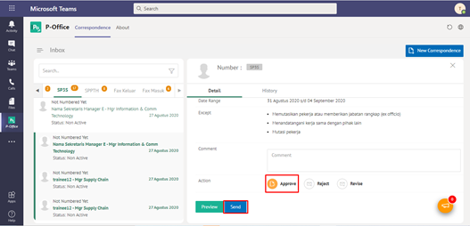

**Role yang sesuai**

- *Approver User*

*User* dapat menyetujui SP3S yang sudah dikirimkan oleh konseptor sehingga nomor SP3S akan ter-*generate* secara otomatis. Langkah - langkah untuk menyetujui SP3S adalah sebagai berikut

1. Klik menu **Inbox** dan pilih tab **SP3S**

2. Pilih SP3S yang akan disetujui kemudian pilih tab **Detail**

3. Klik tombol **Approve** dan pilih **Send.** Isikan komentar jika diperlukan

4. Sistem berhasil menyimpan perubahan. SP3S yang sudah di kirim akan tersimpan di menu **Outbox - SP3S**

## **P-Office Versi Teams**

Langkah - langkah untuk setujui SP3S via Teams yaitu :

1. Klik menu **Inbox** dan pilih tab **SP3S**

2. Pilih SP3S yang akan disetujui kemudian pilih tab **Detail**

3. Klik tombol **Appove** dan pilih **Send**. Isikan komentar jika diperlukan

4. Sistem berhasil menyimpan perubahan. SP3S yang sudah di kirim akan tersimpan di menu **Outbox – SP3S**
