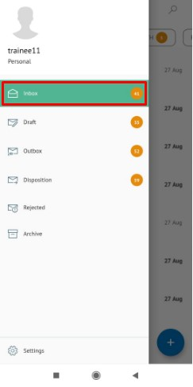
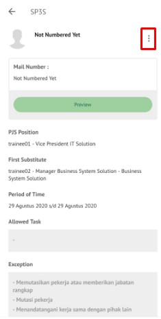
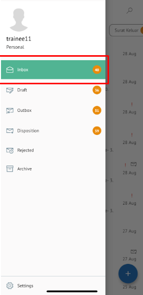

**Role yang sesuai**

- *Approver User*

*User* dapat menyetujui SP3S yang sudah dikirimkan oleh konseptor sehingga nomor SP3S akan ter-*generate* secara otomatis. 

## **P-Office Versi Web**

Langkah - langkah untuk menyetujui SP3S via Web adalah sebagai berikut :

1. Klik menu **Inbox** dan pilih tab **SP3S**

2. Pilih SP3S yang akan disetujui kemudian pilih tab **Detail**

3. Klik tombol **Approve** dan pilih **Send.** Isikan komentar jika diperlukan

4. Sistem berhasil menyimpan perubahan. SP3S yang sudah di kirim akan tersimpan di menu **Outbox - SP3S**

## **P-Office Versi Teams**

Langkah - langkah untuk setujui SP3S via Teams adalah sebagai berikut :

1. Klik menu **Inbox** dan pilih tab **SP3S**

2. Pilih SP3S yang akan disetujui kemudian pilih tab **Detail**

3. Klik tombol **Appove** dan pilih **Send**. Isikan komentar jika diperlukan

4. Sistem berhasil menyimpan perubahan. SP3S yang sudah di kirim akan tersimpan di menu **Outbox – SP3S**

## **P-Office Versi Android**

Langkah - langkah untuk Setujui SP3S via Android adalah sebagai berikut : 

1. Klik menu **Inbox** dan pilih tab **SP3S**
   
 
   
2. Pilih SP3S yang akan disetujui kemudian pilih ikon **tombol button**

 

3. Klik tombol **Approve** kemmudian sistem menampilkan pop up dan user  harus mengisi komentar Approve lalu pilih **Send**

 

4. Sistem berhasil menyimpan perubahan. SP3S yang sudah di kirim akan tersimpan di menu **Outbox – SP3S**

## **P-Office Versi IOS**

Langkah - langkah untuk Setujui SP3S via IOS adalah sebagai berikut : 

1.	Klik menu **Inbox** dan pilih tab **SP3S**

 

2.	Pilih SP3S yang akan disetujui kemudian pilih icon **Option** dan pilih **Approve**

 

3.	Isikan komentar jika diperlukan kemudian klik **Send** untuk menyetujui **SP3S**

4.	Sistem berhasil menyimpan perubahan. SP3S yang sudah di **kirim** akan tersimpan di menu **Outbox – SP3S**
