**Role yang sesuai**

- *Approver User*
- *Reviewer User*
- *Member User* (Pekerja)
- Sekretaris

Konseptor penambahan SP3S adalah sekretaris atau pekerja lain yang diperintahkan untuk membuat SP3S atau pejabat yang akan meninggalkan tempat (melimpahkan wewenang/tugas) tersebut. Konseptor mengirimkan SP3S kepada approver / atasan pejabat yang akan meninggalkan tempat, sehingga draft SP3S akan langsung dikirim kepada atasan pejabat yang akan meninggalkan tempat tanpa melalui *reviewer*. 

## **P-Office Versi Web**

Langkah - langkah untuk menambah SP3S via Web adalah sebagai berikut :

1. Klik menu **New Correspondence**

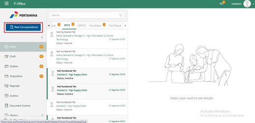

2. Pilih jenis surat **"SP3S"**

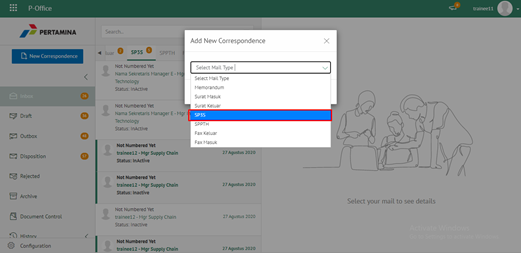

3. Isi *form* tambah SP3S. Terdapat beberapa aksi untuk menindaklanjuti SP3S yang sudah diisi *form*nya yaitu **Save SP3S** dan **Cancel SP3S.**

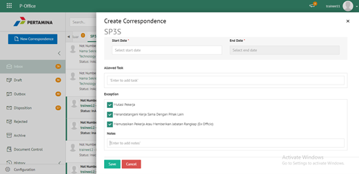

#### **Simpan SP3S**

Langkah - langkah untuk menyimpan SP3S adalah sebagai berikut.

1. Isi *form* SP3S kemudian klik **Save**

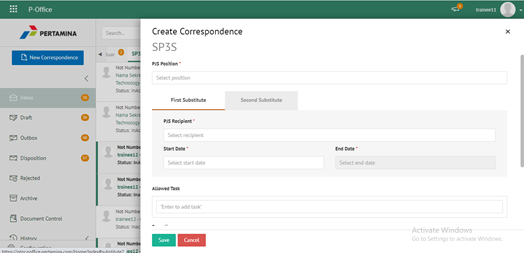

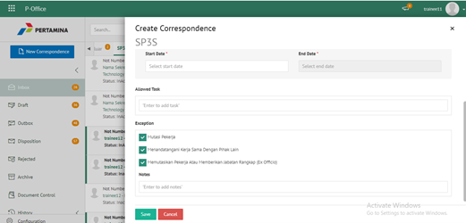

2. Sistem akan menampilkan tampilan *preview* SP3S dalam bentuk Word yang dapat di edit. Untuk melakukan *editing* terhadap isi surat klik **Edit Content** kemudian sistem akan menampilkan *pop up* konfirmasi **Ubah Word Desktop** atau **Ubah Online**

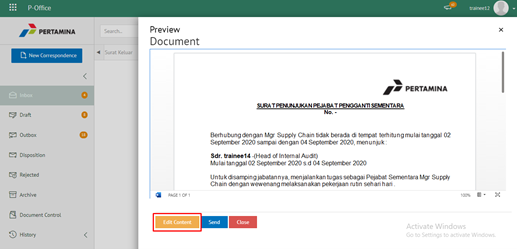

#### **[Edit] Word Desktop**

Langkah - langkah untuk mengubah isi SP3S melalui Word Desktop adalah sebagai berikut

1. Klik **Ubah in Word** untuk mengubah melalui aplikasi Microsoft Word

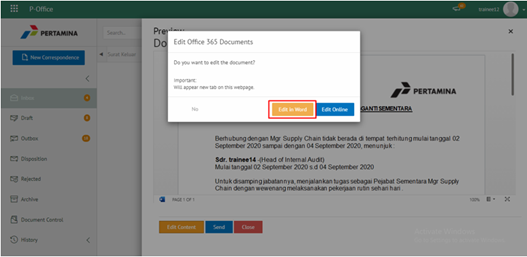

2. Lakukan perubahan pada isi surat. Klik **Close** pada aplikasi dan isi surat akan otomatis tersimpan

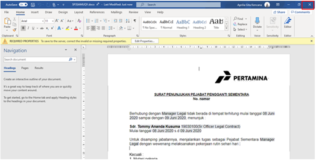

#### **[Edit] Ubah Online**

Langkah - langkah untuk mengubah isi SP3S secara online adalah sebagai berikut.

1. Klik **Edit Online** untuk mengubah isi surat secara online

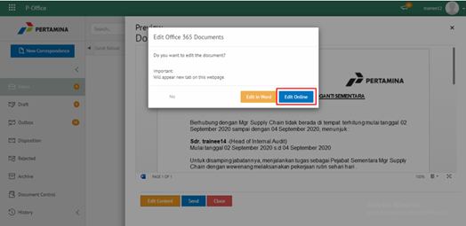

2. Lakukan perubahan pada isi surat. Klik **Close** pada aplikasi

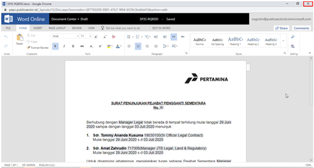

3. Isi surat akan otomatis tersimpan. Jika surat akan disimpan sebagai draft, maka klik **Close.**

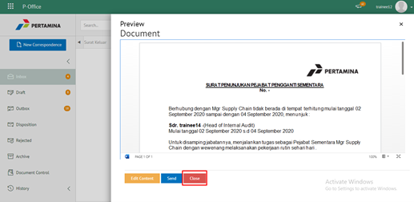

4. Surat yang sudah selesai diubah maka akan tersimpan di menu **"Draft - SP3S"**

#### **Kirim SP3S**

Langkah - langkah untuk mengirim SP3S adalah sebagai berikut.

1. Pada tampilan *preview* SP3S, klik **Kirim** untuk mengirim surat ke pejabat tujuan

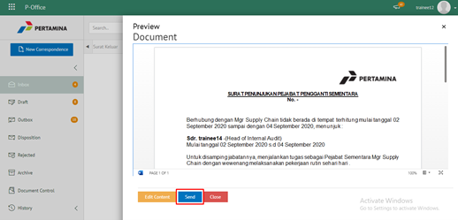

2. Sistem menyimpan perubahan dan SP3S akan tersimpan di menu **"Outbox - SP3S"**

## **P-Office Versi Teams**

Langkah - langkah untuk tambah SP3S via Teams adalah sebagai berikut :

1. Klik menu **New Correspondence**

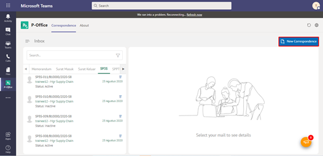

2. Pilih jenis surat **“SP3S”**

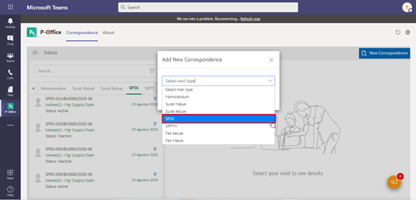

3. Isi form tambah SP3S. Terdapat beberapa aksi untuk menindaklanjuti SP3S yang sudah diisi formnya yaitu **Cancel SP3S** dan **Send SP3S.**

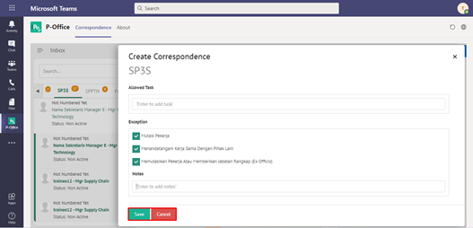

#### **Simpan SP3S**

Langkah – langkah untuk menyimpan SP3S adalah sebagai berikut :

1.	Isi form SP3S kemudian klik **Save**

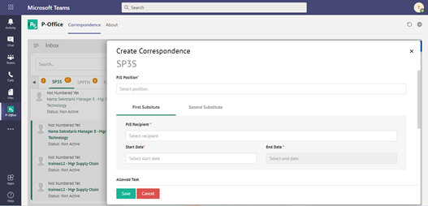

2.	Sistem akan menampilkan tampilan preview SP3S dalam bentuk Word yang dapat di edit. Untuk melakukan editing terhadap isi surat klik **Edit Content** kemudian sistem akan menampilkan pop up konfirmasi Ubah Word Desktop atau Ubah Online

#### **[Edit] Word Desktop**

Langkah – langkah untuk mengubah isi surat keluar melalui Word Desktop adalah sebagai berikut :

1.	Klik **Open In Desktop App** untuk mengubah melalui aplikasi Microsoft Word

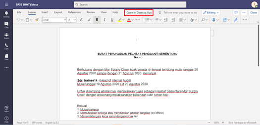

2.	Lakukan perubahan pada isi surat. Klik **Close** pada aplikasi Isi surat akan otomatis tersimpan

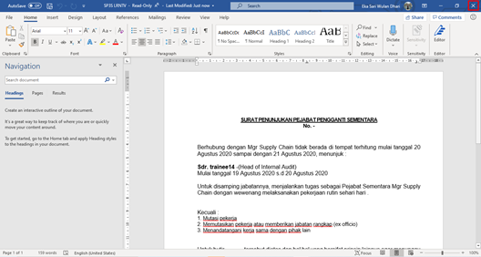

#### **[Edit] Ubah Online**

Langkah – langkah untuk mengubah isi surat keluar secara online adalah sebagai berikut :

1. Ketika Klik button **Edit Content** maka secara otomatis akan membuka dokumen dan bisa mengubah isi surat secara online

2. Lakukan perubahan pada isi surat

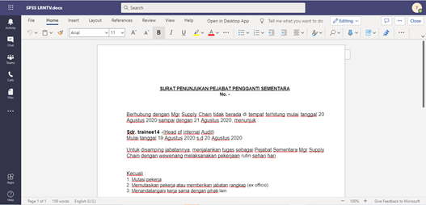

3. Isi surat akan otomatis tersimpan. Jika surat akan disimpan sebagai draft, maka klik **Close**

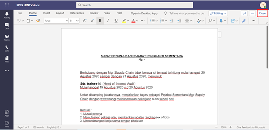

4. Surat yang sudah selesai diubah maka akan tersimpan di menu **“Draft – Surat SP3S”**

#### **Kirim SP3S**

Langkah – langkah untuk mengirim SP3S adalah sebagai berikut :

1.	Pada tampilan preview SP3S, klik **Send** untuk mengirim surat ke pejabat tujuan

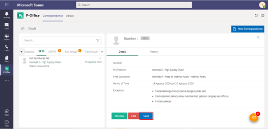

2.	Sistem menyimpan perubahan dan SP3S akan tersimpan di menu **“Outbox - SP3S”**

## **P-Office Versi Android**

Langkah - langkah untuk tambah SP3S via Android adalah sebagai berikut : 

1. Klik ikon **(+)** pada SP3S

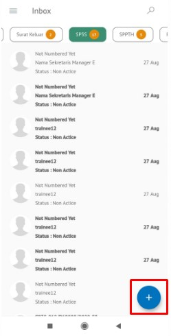 

2. Pilih jenis surat “**SP3S**” lalu **Next**

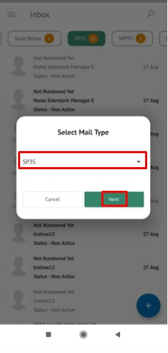

3. Isi _form_ tambah SP3S. Terdapat beberapa aksi untuk menindaklanjuti SP3S yang sudah diisi _form_ nya yaitu **Close** dan **Save**

#### **Simpan SP3S**

Langkah – langkah untuk menyimpan SP3S adalah sebagai berikut :

1. Isi _form_ SP3S kemudian klik **Save**

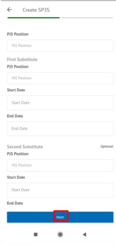 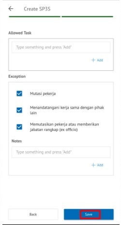

2. Sistem akan menyimpan perubahan dan SP3S akan otomatis tersimpan “**Draft-SP3S**

###### **[Edit] Ubah Online**

Langkah – langkah untuk mengubah isi SP3S secara online adalah sebagai berikut :

1. Klik **Edit Content** untuk mengubah isi surat secara online

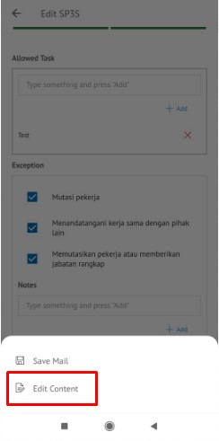

2. Lakukan perubahan pada isi surat. Klik **Close** pada aplikasi

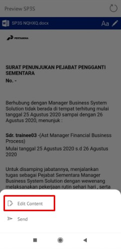

3. Isi surat akan otomatis tersimpan. Jika surat akan disimpan sebagai draft, maka klik **Close.** 

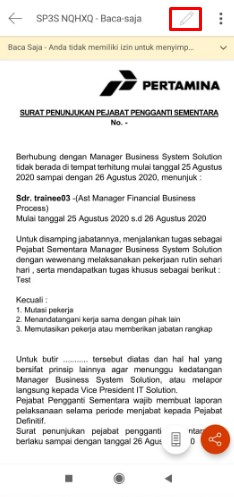 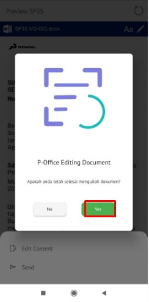 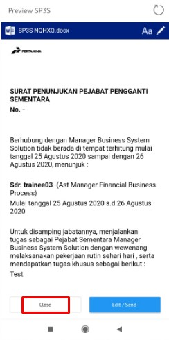

4. Surat yang sudah selesai diubah maka akan tersimpan di menu “**Draft – SP3S”**

#### **Kirim SP3S**

Langkah – langkah untuk mengirim SP3S adalah sebagai berikut :

1. Pada tampilan _preview_ SP3S, klik **Send** untuk mengirim surat ke pejabat tujuan

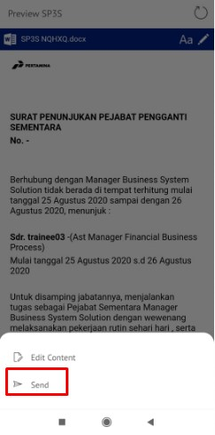

2. Sistem menyimpan perubahan dan SP3S akan tersimpan di menu “**Outbox - SP3S**”

## **P-Office Versi IOS**

Langkah-langkah untuk menambah SP3S via IOS adalah sebagai berikut :

1. Klik ikon **(+)** pada SP3S

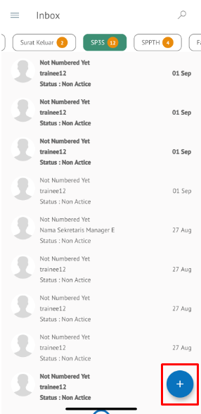

2.	Pilih jenis surat **“SP3S”**

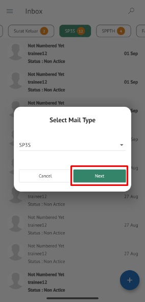

3.	Isi form tambah SP3S. Klik **Next** untuk melanjutkan pengisian form

 

4.	Terdapat beberapa aksi untuk menindaklanjuti SP3S yang sudah diisi formnya yaitu **Save, Edit dan Send SP3S**

#### **Simpan SP3S**

Langkah – langkah untuk menyimpan SP3S adalah sebagai beriku :

1.	Isi form SP3S kemudian klik **Save**

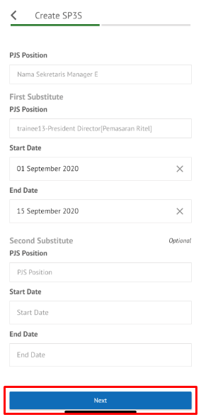 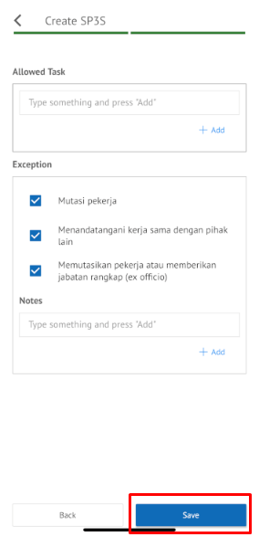

2.	Sistem akan menampilkan tampilan preview SP3S dalam bentuk Word yang dapat di edit. Untuk melakukan editing terhadap isi surat klik Edit/Send 

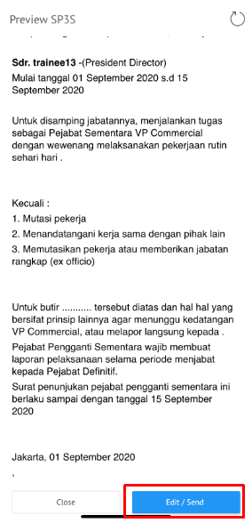

3.	Pilih **Edit Content** untuk melakukan perubahan isi konten, kemudian pada pop up notifikasi Editing Document pilih **Yes** untuk menyelesaikan perubahan

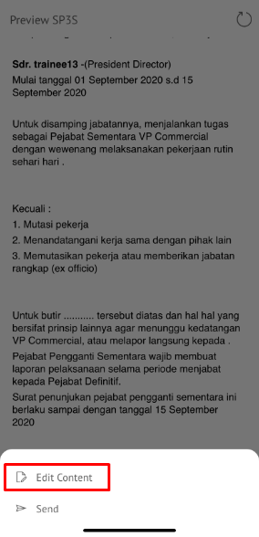 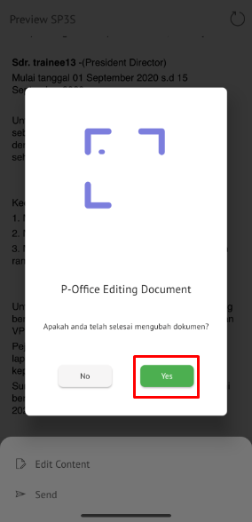

4.	Klik Close untuk menutup editing SP3S, SP3S yang disimpan akan tersimpan di menu **“Draft – SP3S”**

#### **Kirim SP3S**

Langkah – langkah untuk mengirim SP3S adalah sebagai berikut :

1.	Pada tampilan preview SP3S, klik Send untuk mengirim surat ke pejabat tujuan

 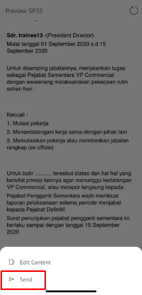

2.	Sistem menyimpan perubahan dan SP3S akan tersimpan di menu **“Outbox - SP3S”**