**Role yang sesuai**

- *Approver User*

*User* dapat menolak SP3S yang sudah dikirimkan oleh konseptor. 

## **P-Office Versi Web**

Langkah - langkah untuk menolak SP3S via Web adalah sebagai berikut :

1. Klik menu **Inbox** dan pilih tab **SP3S**

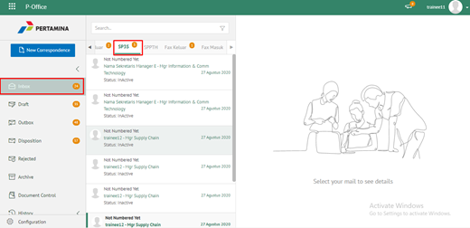

2. Pilih SP3S yang akan disetujui kemudian pilih tab **Detail**

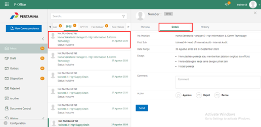

3. Klik tombol **Reject** dan pilih **Send.** Isikan komentar jika diperlukan

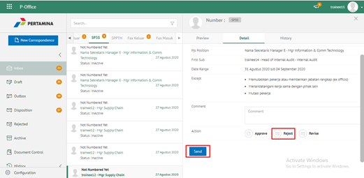

4. Sistem berhasil menyimpan perubahan. SP3S yang sudah di kirim akan akan akan terhapus dari aplikasi akan tersimpan di menu **“Rejected – Memorandum”** user penolak dengan label **Rejected**

## **P-Office Versi Teams**

Langkah - langkah untuk Tolak SP3S via Teams adalah sebagai berikut :

1. Klik menu **Inbox** dan pilih tab **SP3S**

2. Pilih SP3S yang akan disetujui kemudian pilih tab **Detail**

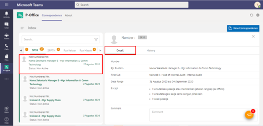

3. Klik tombol **Reject** dan pilih **Send**. Isikan komentar jika diperlukan

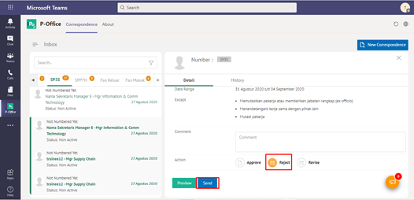

4. Sistem berhasil menyimpan perubahan. SP3S yang sudah di kirim akan akan akan terhapus dari aplikasi akan tersimpan di menu **“Rejected – SP3S”** user penolak dengan label **Rejected**

## **P-Office Versi Android**

Langkah - langkah untuk Tolak SP3S via Android adalah sebagai berikut :

1. Klik menu **Inbox** dan pilih tab **SP3S**

 

2. Pilih SP3S yang akan disetujui kemudian pilih icon **Option**

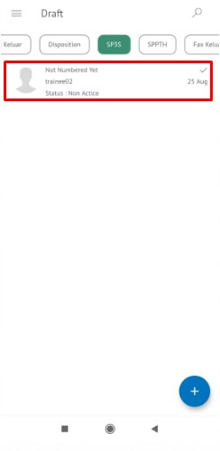 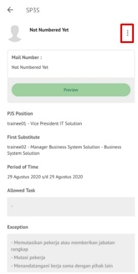

3. Pada button Detail pilih **Reject** kemudian sistem menampilkan pop up dan user pilih **Send.** Isikan komentar jika diperlukan
   
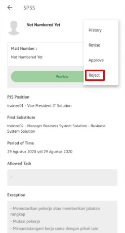 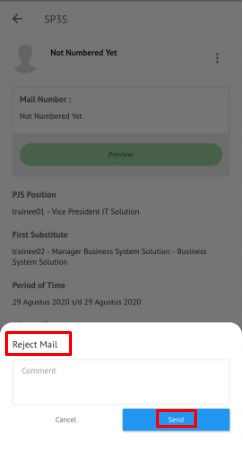

4. Sistem berhasil menyimpan perubahan. SP3S yang sudah di kirim akan tersimpan dimenu “**Rejected- SP3S** user penolak pada label “**Rejected”**.

## **P-Office Versi IOS**

Langkah - langkah untuk Tolak SP3S via IOS adalah sebagai berikut :

1.	Klik menu **Inbox** dan pilih tab **SP3S**

 

2.	Pilih SP3S yang akan disetujui kemudian pilih icon **Option** dan pilih **Reject**

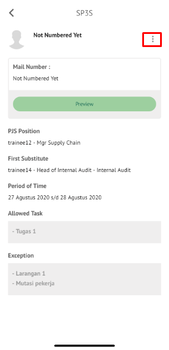 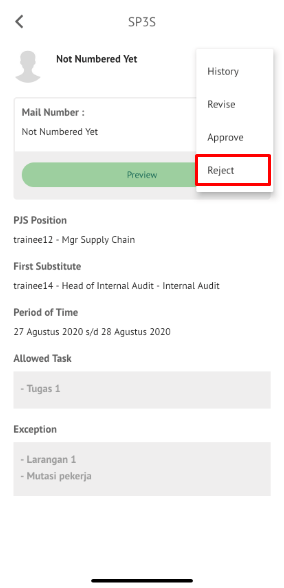

3.	Isikan komentar jika diperlukan kemudian klik **Send** untuk menolak

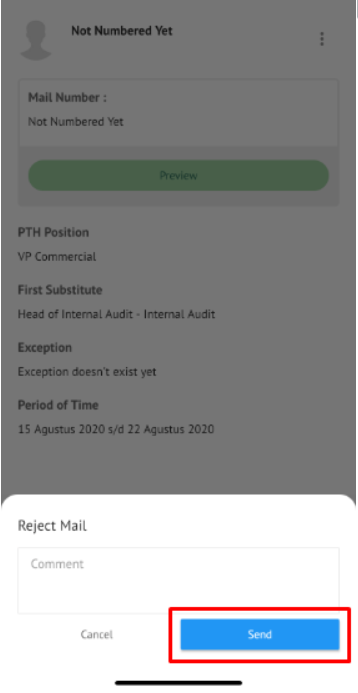

4.	Sistem berhasil menyimpan perubahan. SP3S yang sudah ditolak akan tersimpan di menu **“Rejected – SP3S”** user penolak dengan label **Rejected**