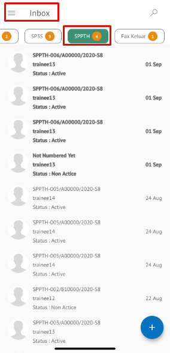

**Role yang sesuai**

- *Approver User*
- *Reviewer User*
- Sekretaris

*User* dapat melihat daftar SPPTH pada pada menu **Inbox, Draft atau Outbox** pada masing - masing akun. 

## **P-Office Versi Web**

Langkah - langkah untuk melihat daftar SPPTH via Web adalah sebagai berikut

1. Klik menu **Inbox / Draft / Outbox** dan pilih tab **SPPTH**

## **P-Office Versi Teams**

Langkah - langkah untuk lihat daftar SPPTH via Teams adalah sebagai berikut :

1. Klik menu **Inbox / Draft / Outbox** dan pilih tab **SPPTH**

## **P-Office Versi Android**

Langkah - langkah untuk lihat daftar SPPTH via Android adalah sebagai berikut :

1. Klik menu **Inbox / Draft / Outbox** dan pilih tab **SPPTH**
   
 

## **P-Office Versi IOS**

Langkah – langkah untuk melihat daftar SPPTH via IOS adalah sebagai berikut :

1.	Klik menu **Inbox / Draft / Outbox** dan pilih tab **SPPTH**

 
