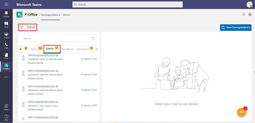
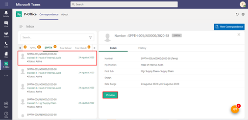
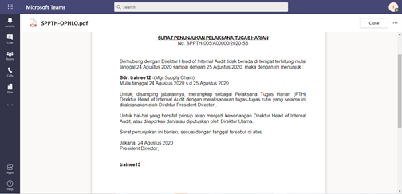
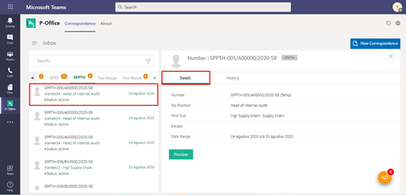
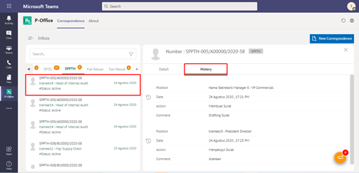

**Role yang sesuai**

- *Approver User*
- *Reviewer User*
- Sekretaris

*User* dapat melihat informasi lengkap SPPTH termasuk *preview* SPPTH, detail SPPTH dan *history* SPPTH. Langkah - langkah untuk melihat informasi SPPTH adalah sebagai berikut

1. Klik menu **Inbox/Draft/Outbox** dan pilih tab **SPPTH.** Pilih salah satu SPPTH yang akan dilihat informasinya

#### **Preview SPPTH**

Pada tab informasi *Preview* SPPTH, ditampilkan *preview* SPPTH yang sudah dibuat. *Preview* SPPTH disesuaikan dengan template berdasarkan jenis surat.

#### **Detail SPPTH**

Pada tab Detail SPPTH, terdapat informasi nomor SPPTH, jabatan PTH, Pejabat pengganti pertama, jangka waktu serta pejabat pengganti kedua (jika ada), jangka waktu pejabat pengganti kedua (jika ada)

#### **History SPPTH**

Pada tab *History* SPPTH, ditampilkan riwayat SPPTH yang terdapat informasi jabatan, tanggal, tindakan dan komentar

## **P-Office Versi Teams**

Langkah - langkah untuk lihat informasi SPPTH via Teams yaitu :

1.    Klik menu **Inbox/Draft/Outbox** dan pilih tab **SPPTH**. Pilih salah satu SPPTH yang akan dilihat informasinya

#### **Preview SPPTH**

Pada button **Preview** SPPTH, ditampilkan preview SPPTH yang sudah dibuat. Preview SPPTH disesuaikan dengan template berdasarkan jenis surat.

#### **Detail SPPTH**

Pada tab Detail SPPTH, terdapat informasi nomor SPPTH, jabatan PTH, Pejabat pengganti pertama, jangka waktu serta pejabat pengganti kedua (jika ada), jangka waktu pejabat pengganti kedua (jika ada)

#### **History SPPTH**

Pada tab **History** SPPTH, ditampilkan riwayat SPPTH yang terdapat informasi jabatan, tanggal, tindakan dan komentar

