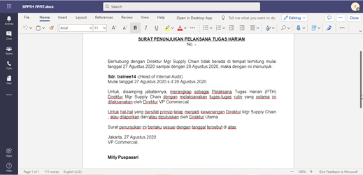

**Role yang sesuai**

- *Approver User*

*User* dapat merevisi SPPTH yang sudah dikirimkan oleh konseptor. Langkah - langkah untuk melakukan revisi SPPTH adalah sebagai berikut

1. Klik menu **Inbox** dan pilih tab **SPPTH**

2. Pilih SPPTH yang akan disetujui kemudian pilih tab **Detail**

3. Klik tombol **Revise** dan pilih **Send.** Isikan komentar jika diperlukan

4. Sistem menampilkan *form* **Edit Correspondence**

5. Lakukan perubahan pada *form*. Klik **Simpan** untuk menyimpan perubahan pada *form* SPPTH. Surat yang disimpan akan tersimpan di menu "**Draft - SPPTH**"

6. Klik **Ubah Isi** untuk mengubah isi SPPTH

7. Sistem menampilkan tampilan *preview* SPPTH dalam bentuk Word yang dapat di edit. Untuk melakukan *editing* terhadap isi surat klik **Ubah Isi** kemudian sistem akan menampilkan *pop up* konfirmasi **Ubah Word Desktop** atau **Ubah Online**

#### **[Edit] Word Desktop**

Langkah - langkah untuk mengubah isi SPPTH melalui Word Desktop adalah sebagai berikut

1. Klik **Ubah di Word** untuk mengubah melalui aplikasi Microsoft Word

2. Lakukan perubahan pada isi surat. Klik **Close** pada aplikasi dan isi surat akan otomatis tersimpan

#### **[Edit] Ubah Online**

Langkah - langkah untuk mengubah isi SPPTH secara *online* adalah sebagai berikut

1. Klik **Ubah Online** untuk mengubah isi surat secara *online*

2. Lakukan perubahan pada isi surat. Klik **Close** pada aplikasi

3. Isi surat akan otomatis tersimpan. Jika surat akan disimpan sebagai draft, maka klik **Tutup.**

4. Surat yang sudah selesai diubah maka akan tersimpan di menu **"Draft - SPPTH"**

#### **Kirim / Setujui SPPTH**

Langkah - langkah untuk menyetujui SPPTH adalah sebagai berikut.

1. Pada tampilan *preview* SPPTH, klik **Kirim** untuk menyetujui SPPTH

2. Sistem menyimpan perubahan dan SPPTH akan tersimpan di menu **"Outbox - SPPTH"**

## **P-Office Versi Teams**

Langkah - langkah untuk revisi SPPTH via Teams yaitu :

1.	Klik menu **Inbox** dan pilih tab **SPPTH**

 
2.	Pilih SPPTH yang akan disetujui kemudian pilih tab **Detail**

 
3.	Klik tombol **Revise** dan pilih **Send**. Isikan komentar jika diperlukan

4.	Sistem menampilkan form **Edit Correspondence**

5.	Lakukan perubahan pada form. Klik **Save** untuk menyimpan perubahan pada form SPPTH. Surat yang disimpan akan tersimpan di menu **“Inbox – SPPTH”**

 
6.	Klik **Edit Content** untuk mengubah isi SPPTH

 
7.	Sistem menampilkan tampilan preview SPPTH dalam bentuk Word yang dapat di edit. Untuk melakukan editing terhadap isi surat klik **Edit Content** kemudian sistem akan menampilkan pop up konfirmasi **Ubah Word Desktop** atau **Ubah Online**

#### **[Edit] Word Desktop**

Langkah – langkah untuk mengubah isi SPPTH melalui Word Desktop adalah sebagai berikut.

1.    Klik **Open In Desktop App** untuk mengubah melalui aplikasi Microsoft Word

2.    Lakukan perubahan pada isi surat. Klik **Close** pada aplikasi dan isi surat akan otomatis tersimpan

#### **[Edit] Ubah Online**

Langkah – langkah untuk mengubah isi SPPTH secara online adalah sebagai berikut.

1.    Ketika Klik button **Edit Content** maka secara otomatis akan membuka dokumen dan bisa mengubah isi surat secara online

2.    Lakukan perubahan pada isi surat.

3.    Isi surat akan otomatis tersimpan. Jika surat akan disimpan sebagai draft, maka klik **Close** 

4.    Surat yang sudah selesai diubah maka akan tersimpan di menu **“Inbox – SPPTH”**

