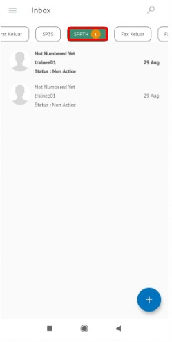

**Role yang sesuai**

- *Approver User*

*User* dapat merevisi SPPTH yang sudah dikirimkan oleh konseptor. Langkah - langkah untuk melakukan revisi SPPTH adalah sebagai berikut

1. Klik menu **Inbox** dan pilih tab **SPPTH**

2. Pilih SPPTH yang akan disetujui kemudian pilih tab **Detail**

3. Klik tombol **Revise** dan pilih **Send.** Isikan komentar jika diperlukan

4. Sistem menampilkan *form* **Edit Correspondence**

5. Lakukan perubahan pada *form*. Klik **Save** untuk menyimpan perubahan pada *form* SPPTH. Surat yang disimpan akan tersimpan di menu "**Draft - SPPTH**"

6. Klik **Edit Content** untuk mengubah isi SPPTH

7. Sistem menampilkan tampilan *preview* SPPTH dalam bentuk Word yang dapat di edit. Untuk melakukan *editing* terhadap isi surat klik **Edit Content** kemudian sistem akan menampilkan *pop up* konfirmasi **Ubah Word Desktop** atau **Ubah Online**

#### **[Edit] Word Desktop**

Langkah - langkah untuk mengubah isi SPPTH melalui Word Desktop adalah sebagai berikut

1. Klik **Edit di Word** untuk mengubah melalui aplikasi Microsoft Word

2. Lakukan perubahan pada isi surat. Klik **Close** pada aplikasi dan isi surat akan otomatis tersimpan

#### **[Edit] Ubah Online**

Langkah - langkah untuk mengubah isi SPPTH secara *online* adalah sebagai berikut

1. Klik **Edit Online** untuk mengubah isi surat secara *online*

2. Lakukan perubahan pada isi surat. Klik **Close** pada aplikasi

3. Isi surat akan otomatis tersimpan. Jika surat akan disimpan sebagai draft, maka klik **Close.**

4. Surat yang sudah selesai diubah maka akan tersimpan di menu **"Draft - SPPTH"**

## **P-Office Versi Teams**

Langkah - langkah untuk revisi SPPTH via Teams adalah sebagai berikut :

1.	Klik menu **Inbox** dan pilih tab **SPPTH**

 
2.	Pilih SPPTH yang akan disetujui kemudian pilih tab **Detail**

 
3.	Klik tombol **Revise** dan pilih **Send**. Isikan komentar jika diperlukan

4.	Sistem menampilkan form **Edit Correspondence**

5.	Lakukan perubahan pada form. Klik **Save** untuk menyimpan perubahan pada form SPPTH. Surat yang disimpan akan tersimpan di menu **“Inbox – SPPTH”**

 
6.	Klik **Edit Content** untuk mengubah isi SPPTH

 
7.	Sistem menampilkan tampilan preview SPPTH dalam bentuk Word yang dapat di edit. Untuk melakukan editing terhadap isi surat klik **Edit Content** kemudian sistem akan menampilkan pop up konfirmasi **Ubah Word Desktop** atau **Ubah Online**

#### **[Edit] Word Desktop**

Langkah – langkah untuk mengubah isi SPPTH melalui Word Desktop adalah sebagai berikut.

1.    Klik **Open In Desktop App** untuk mengubah melalui aplikasi Microsoft Word

2.    Lakukan perubahan pada isi surat. Klik **Close** pada aplikasi dan isi surat akan otomatis tersimpan

#### **[Edit] Ubah Online**

Langkah – langkah untuk mengubah isi SPPTH secara online adalah sebagai berikut.

1.    Ketika Klik button **Edit Content** maka secara otomatis akan membuka dokumen dan bisa mengubah isi surat secara online

2.    Lakukan perubahan pada isi surat.

3.    Isi surat akan otomatis tersimpan. Jika surat akan disimpan sebagai draft, maka klik **Close** 

4.    Surat yang sudah selesai diubah maka akan tersimpan di menu **“Inbox – SPPTH”**

## **P-Office Versi Android**

Langkah - langkah untuk tambah SPPTH via Android adalah sebagai berikut :

1. Klik menu **Inbox** dan pilih tab **SPPTH**

 

2. Pilih SPPTH yang akan disetujui kemudian pilih tombol **button**

3. Pilih button **Revise** kemudian lakukan perubahan pada form. Klik **Save Mail** untuk menyimpan perubahan pada _form_ SPPTH. Surat yang disimpan akan tersimpan di menu “**Inbox – SPPTH”**

  

4. Lakukan perubahan pada _form_. Klik **Save Mail** untuk menyimpan perubahan pada _form_ SPPTH. Surat yang disimpan akan tersimpan di menu “**Draft – SPPTH”**

5. Klik **Edit Content** untuk mengubah isi SPPTH

6. Sistem menampilkan tampilan _preview_ SPPTH dalam bentuk Word yang dapat di edit. Untuk melakukan _editing_ terhadap isi surat klik **Edit Content** kemudian sistem akan menampilkan _pop up_ konfirmasi atau **Ubah Online**

**[Edit] Ubah Online**

Langkah – langkah untuk mengubah isi SPPTH secara _online_ adalah sebagai berikut.

1. Klik **Edit Content** untuk mengubah isi surat secara online
   

2. Lakukan perubahan pada isi surat lalu sistem akan menampilkan pop up P-Office Editing Document pilij **Yes**

 

3. Isi surat akan otomatis tersimpan. Jika surat akan disimpan sebagai draft, maka klik **Close.**
   

4. Surat yang sudah selesai diubah maka akan tersimpan di menu “**Draft – SPPTH”**
